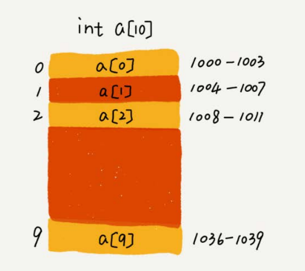

# 数组

数组（Array）是一种**线性表**数据结构。它用一组**连续**的内存空间，来存储一组具有**相同类型**的数据。

数组支持**随机访问**，根据**下标**随机访问的时间复杂度为**O(1)**。

内存块的 首地址为base_address = 1000

计算机会给每个内存单元分配一个地址，计算机通过地址来访问内存中的数据。当计算机需要随机访问数组中的某个元素时，它会首先通过下面的寻址公式，计算出该元素存储的内存地址： 

a[i]_address = base_address + i * data_type_size

**低效**的插入和删除

如果在数组的末尾插入元素，那就不需要移动数据了，这时的时间复杂度为O(1)。但如果在数组的开头插入元素，那所有的数据都需要依次往后移动一位，所以 最坏时间复杂度是O(n)。 因为我们在每个位置插入元素的概率是一样的，所以平均情况时间复杂度为**(1+2+…n)/n=O(n)**。

如果数组中的数据是有序的，我们在某个位置插入一个新的元素时，就必须按照刚才的方法搬移k之后的数据。但是，如果数组中存储的数据**并没有任何规律**，数 组只是被当作一个存储数据的集合。在这种情况下，如果要将某个数组**插入到第k个位置**，为了避免大规模的数据搬移，我们还有一个简单的办法就是，**直接将第k位的数据搬移到数组元素的最后，把新的元素直接放入第k个位置**。

利用这种处理技巧，在特定场景下，在第k个位置插入一个元素的时间复杂度就会降为O(1)。

跟插入数据类似，如果我们要删除第k个位置的数据，为了内存的连续性，也需要搬移数据，不然中间就会出现空洞，内存就不连续了。 和插入类似，如果删除数组末尾的数据，则最好情况时间复杂度为O(1)；如果删除开头的数据，则最坏情况时间复杂度为O(n)；平均情况时间复杂度也为O(n)。 

实际上，在某些特殊场景下，我们**并不一定非得追求数组中数据的连续性**。如果我们**将多次删除操作集中在一起执行**，删除的效率是不是会提高很多呢？

为了避免d，e，f，g，h这几个数据会被搬移三次，我们可以**先记录下已经删除的数据。每次的删除操作并不是真正地搬移数据，只是记录数据已经被删除**。**当数组没有更多空间存储数据时，我们再触发执行一次真正的删除操作**，这样就大大减少了删除操作导致的数据搬移。

为什么大多数编程语言中，数组要从0开始编号，而不是从1开始呢？

从数组存储的内存模型上来看，“下标”最确切的定义应该是“偏移（offset）”。前面也讲到，如果用a来表示数组的首地址，**a[0]就是偏移为0的位置，也就是首地址**，a[k]就表示偏移k个type_size的位置，所以计算a[k]的内存地址只需要用这个公式：

a[k]_address = base_address + k * type_size

但是，如果数组从1开始计数，那我们计算数组元素a[k]的内存地址就会变为：

 a[k]_address = base_address + (k-1)*type_size 

对比两个公式，我们不难发现，从1开始编号，**每次随机访问数组元素都多了一次减法运算**，对于CPU来说，就是多了一次减法指令。

不过可能更多是历史原因，C语言设计者用0开始计数数组下标，之后的Java、JavaScript等高级语言都效仿了C语言，或者说，为了在一定程度上减少C语言程序员学习Java的学习成本，因此 继续沿用了从0开始计数的习惯。