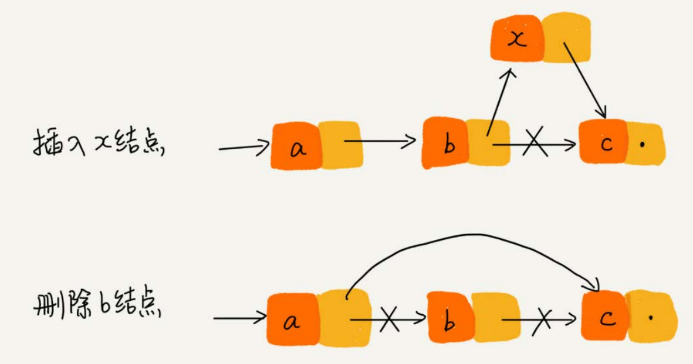
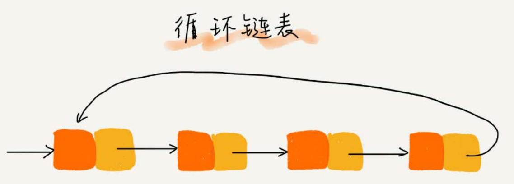
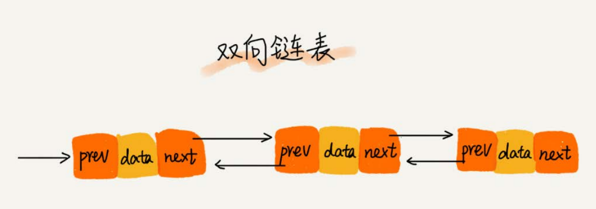
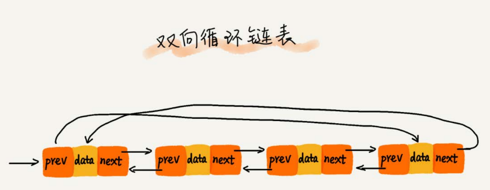
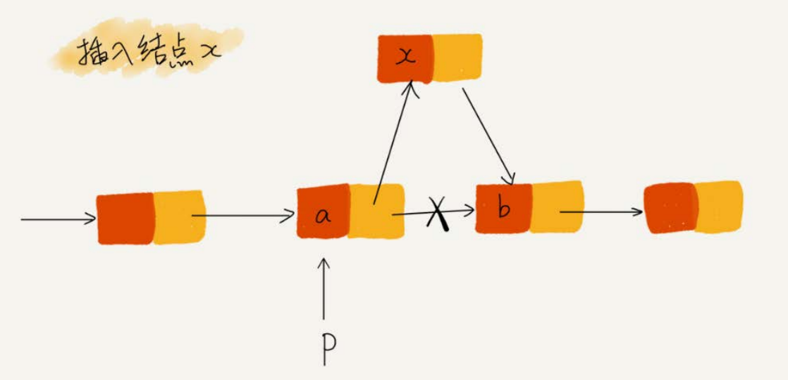
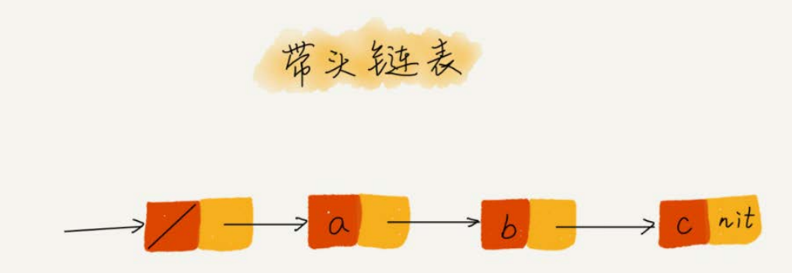

# 链表

**不需要一块连续的内存空间**，它通过“指针”将一组零散的内存块串联起来使用。

如果我们申请一个100MB大小的数组，当内存 中没有连续的、足够大的存储空间时，即便内存的剩余总可用空间大于100MB，数组仍然会申请失败，但是链表却可以。


## 单链表


从单链表图中，你应该可以发现，其中有两个结点是比较特殊的，它们分别是第一个结点和最后一个结点。我们习惯性地把第一个结点叫作头结点，把最 后一个结点叫作尾结点。其中，**头结点用来记录链表的基地址**。有了它，我们就可以遍历得到整条链表。而尾结点特殊的地方是：指针不是指向下一个结点，而是**指向一个空地址NULL**，表示这是链表上最后一个结点。


针对链表的插入和删除操作，我们只需要考虑相邻结点的指针改变，所以对应的时间复杂度是O(1)




链表要想随机访问第k个元素，就没有数组那么高效了。因为链表中的数据并非连续存储的，所以无法像数组那样，根据首地址和下标，通过寻址公式就能直接计算出对应的内存地址，而是需要根据指针一个结点一个结点地依次遍历，直到找到相应的结点。


## 循环链表

循环链表是一种特殊的单链表。实际上，循环链表也很简单。它跟单链表唯一的区别就在尾结点。**循环链表的尾结点指针是指向链表的头结点**。



和单链表相比，循环链表的优点是从链尾到链头比较方便。当要处理的数据具有环型结构特点时，就特别适合采用循环链表。


## 双向链表

双向链表，顾名思义，它支持两个方向，每个结点不止有一个后继指针next指向后面的结 点，还有一个前驱指针prev指向前面的结点。



双向链表需要额外的两个空间来存储后继结点和前驱结点的地址。所以，如果存储同样多的数据，双向链表要比单链表占用更多的内存空间。虽然两个指针比较浪费存储空间，但可以支持双向遍历，这样也带来了双向链表操作的灵活性。

从结构上来看，双向链表可以支持O(1)时间复杂度的情况下找到前驱结点，正是这样的特点，也使双向链表在某些情况下的插入、删除等操作都要比单链表简单、高效。

在实际的软件开发中，从链表中删除一个数据无外乎这两种情况：

+ 删除结点中“值等于某个给定值”的结点；
+  删除给定指针指向的结点。

对于第一种情况，不管是单链表还是双向链表，为了查找到值等于给定值的结点，都需要从头结点开始一个一个依次遍历对比，直到找到值等于给定值的结点， 然后再通过我前面讲的指针操作将其删除。

尽管单纯的删除操作时间复杂度是O(1)，但遍历查找的时间是主要的耗时点，对应的时间复杂度为O(n)。根据时间复杂度分析中的加法法则，删除值等于给定值的 结点对应的链表操作的总时间复杂度为O(n)。

对于第二种情况，我们已经找到了要删除的结点，但是删除某个结点q需要知道其前驱结点，而单链表并不支持直接获取前驱结点，所以，为了找到前驱结点，我 们还是要从头结点开始遍历链表，直到p->next=q，说明p是q的前驱结点。

但是对于双向链表来说，这种情况就比较有优势了。因为双向链表中的结点已经保存了前驱结点的指针，不需要像单链表那样遍历。所以，针对第二种情况，单 链表删除操作需要O(n)的时间复杂度，而双向链表只需要在O(1)的时间复杂度内就搞定了！

同理，如果我们希望在链表的某个指定结点前面插入一个结点，双向链表比单链表有很大的优势。双向链表可以在O(1)时间复杂度搞定，而单向链表需要O(n)的时 间复杂度。你可以参照我刚刚讲过的删除操作自己分析一下。

除了插入、删除操作有优势之外，对于一个**有序链表**，双向链表的按值查询的效率也要比单链表高一些。因为，我们可以记录上次查找的位置p，每次查询时，**根据要查找的值与p的大小关系，决定是往前还是往后查找**，所以平均只需要查找一半的数据。

实际上，这里有一个更加重要的知识点需要你掌握，那就是用空间换时间的设计思想。当内存空间充足的时候，如果我们更加追求代码的执行速度，我们就可以 选择空间复杂度相对较高、但时间复杂度相对很低的算法或者数据结构。相反，如果内存比较紧缺，比如代码跑在手机或者单片机上，这个时候，就要反过来用 时间换空间的设计思路。

缓存实际上就是利用了空间换时间的设计思想。如果我们把数据存储在硬盘上，会比较节省内存，但每次查找数据都要询问一次硬盘，会 比较慢。但如果我们通过缓存技术，事先将数据加载在内存中，虽然会比较耗费内存空间，但是每次数据查询的速度就大大提高了。


## 双向循环链表




## 数组和链表的对比

数组简单易用，在实现上使用的是连续的内存空间，可以借助CPU的缓存机制，预读数组中的数据，所以访问效率更高。而链表在内存中并不是连续存储，所以 对CPU缓存不友好，没办法有效预读。

 **数组**的缺点是**大小固定**，一经声明就要占用整块连续内存空间。如果声明的数组过大，系统可能没有足够的连续内存空间分配给它，导致“内存不足（out of memory）”。如果声明的数组过小，则可能出现不够用的情况。这时只能再申请一个更大的内存空间，把原数组拷贝进去，非常费时。**链表**本身没有大小的限制， **天然地支持动态扩容**，我觉得这也是它与数组最大的区别。


# 如何轻松写出正确的链表代码


## 理解指针或引用的含义

我们知道，有些语言有“指针”的概念，比如C语言；有些语言没有指针，取而代之的是“引用”，比如Java、Python。不管是“指针”还是“引用”，实际上，它们的意思都是一样的，都是**存储所指对象的内存地址**。

**将某个变量赋值给指针，实际上就是将这个变量的地址赋值给指针，或者反过来说，指针中存储了这个变量的内存地址，指向了这个变量，通过指针就能找到这个变量。**

在编写链表代码的时候，我们经常会有这样的代码：p->next=q。这行代码是说，p结点中的next指针存储了q结点的内存地址。

还有一个更复杂的，也是我们写链表代码经常会用到的：p->next=p->next->next。这行代码表示，p结点的next指针存储了p结点的下下一个结点的内存地址。


## 警惕指针丢失和内存泄漏



如图所示，我们希望在结点a和相邻的结点b之间插入结点x，假设当前指针p指向结点a。如果我们将代码实现变成下面这个样子，就会发生指针丢失和内存泄露。

```c
p->next = x; // 将p的next指针指向x结点；

x->next = p->next; // 将x的结点的next指针指向b结点；
```


初学者经常会在这儿犯错。p->next指针在完成第一步操作之后，已经不再指向结点b了，而是指向结点x。第2行代码相当于将x赋值给x->next，自己指向自己。因 此，整个链表也就断成了两半，从结点b往后的所有结点都无法访问到了。

对于有些语言来说，比如C语言，内存管理是由程序员负责的，如果没有手动释放结点对应的内存空间，就会产生内存泄露。所以，我们插入结点时，一定要注意操作的顺序，要先将结点x的next指针指向结点b，再把结点a的next指针指向结点x，这样才不会丢失指针，导致内存泄漏。所以，对于刚刚的插入代码，我们只需要把第1行和第2行代码的顺序颠倒一下就可以了。 

同理，删除链表结点时，也一定要记得手动释放内存空间，否则，也会出现内存泄漏的问题。当然，对于像Java这种虚拟机自动管理内存的编程语言来说，就不需要考虑这么多了。


## 利用哨兵简化实现难度

首先，我们先来回顾一下单链表的插入和删除操作。如果我们在结点p后面插入一个新的结点，只需要下面两行代码就可以搞定。

new_node->next = p->next;

 p->next = new_node;

但是，当我们要向一个空链表中插入第一个结点，刚刚的逻辑就不能用了。我们需要进行下面这样的特殊处理，其中head表示链表的头结点。所以，从这段代 码，我们可以发现，对于单链表的插入操作，第一个结点和其他结点的插入逻辑是不一样的。

if (head == null) { head = new_node; }

我们再来看单链表结点删除操作。如果要删除结点p的后继结点，我们只需要一行代码就可以搞定。

 p->next = p->next->next; 

但是，如果我们要删除链表中的最后一个结点，前面的删除代码就不work了。跟插入类似，我们也需要对于这种情况特殊处理。写成代码是这样子的：

 if (head->next == null) { head = null; }

从前面的一步一步分析，我们可以看出，针对链表的插入、删除操作，需要对插入第一个结点和删除最后一个结点的情况进行特殊处理。这样代码实现起来就会很繁琐，不简洁，而且也容易因为考虑不全而出错。如何来解决这个问题呢？

哨兵是解决“边界问题”的，不直接参与业务逻辑。

如果我们引入哨兵结点，在任何时候，**不管链表是不是空，head指针都会一直指向这个哨兵结点**。我们也把这种有哨兵结点的链表叫带头链表。相反，没有哨兵结点的链表就叫作不带头链表。



**哨兵结点是不存储数据的。因为哨兵结点一直存在，所以插入第一个结点和插入其他结点，删除最后一个结点和删除其他结点，都可以统一为相同的代码实现逻辑了。**

```c
// 在数组a中，查找key，返回key所在的位置
// 其中，n表示数组a的长度
int find(char* a, int n, char key) {
 // 边界条件处理，如果a为空，或者n<=0，说明数组中没有数据，就不用while循环比较了
 	if(a == null || n <= 0) {
 		return -1;
 	}

 	int i = 0;
 	// 这里有两个比较操作：i<n和a[i]==key.
 	while (i < n) {
 		if (a[i] == key) {
 			return i;
 		}
		 ++i;
 	}

 	return -1;
}


// 在数组a中，查找key，返回key所在的位置
// 其中，n表示数组a的长度
// 我举2个例子，你可以拿例子走一下代码
// a = {4, 2, 3, 5, 9, 6} n=6 key = 7
// a = {4, 2, 3, 5, 9, 6} n=6 key = 6
int find(char* a, int n, char key) {
 	if(a == null || n <= 0) {
 		return -1;
	 }

	 // 这里因为要将a[n-1]的值替换成key，所以要特殊处理这个值
 	if (a[n-1] == key) {
		 return n-1;
	 }

 	// 把a[n-1]的值临时保存在变量tmp中，以便之后恢复。tmp=6。
	 // 之所以这样做的目的是：希望find()代码不要改变a数组中的内容
 	char tmp = a[n-1];
	 // 把key的值放到a[n-1]中，此时a = {4, 2, 3, 5, 9, 7}
 	a[n-1] = key;

 	int i = 0;
 	// while 循环比起代码一，少了i<n这个比较操作
	 while (a[i] != key) {
 		++i;
	 }

 	// 恢复a[n-1]原来的值,此时a= {4, 2, 3, 5, 9, 6}
 	a[n-1] = tmp;

 	if (i == n-1) {
 		// 如果i == n-1说明，在0...n-2之间都没有key，所以返回-1
 		return -1;
 	} else {
 		// 否则，返回i，就是等于key值的元素的下标
 		return i;
 	}
}
```

对比两段代码，在字符串a很长的时候，比如几万、几十万，你觉得哪段代码运行得更快点呢？答案是代码二，因为两段代码中执行次数最多就是while循环那一部 分。第二段代码中，我们**通过一个哨兵a[n-1] = key，成功省掉了一个比较语句i < n**，不要小看这一条语句，当累积执行万次、几十万次时，累积的时间就很明显了。 

当然，这只是为了举例说明哨兵的作用，你写代码的时候千万不要写第二段那样的代码，因为可读性太差了。大部分情况下，我们并不需要如此追求极致的性能。


### 链表中的哨兵结点

```java
public class Sentry {
    
//    哨兵节点可以简化创建或删除链表头节点操作的代码
    public ListNode append1(ListNode head,int value){
        ListNode newNode = new ListNode(value);
        if (head==null){
            return newNode;
        }
        ListNode node = head;
        while (node.next !=null){
            node = node.next;
        }
        node.next = newNode;
        return head;
    }
//    由于新创建的一个哨兵节点当作链表的头结点，链表无论如何也不会为空，因此不需要使用if语句单独处理
//    输入头节点head为null的情况，哨兵节点简化了代码的逻辑。
    public ListNode append2(ListNode head,int value){
        ListNode dummy = new ListNode(0);
        dummy.next = head;
        ListNode newNode= new ListNode(value);
        ListNode node = dummy;
        while (node.next !=null){
            node = node.next;
        }
        node.next = newNode;
        return dummy.next;
    }
    public ListNode delete1(ListNode head,int value){
        if (head == null){
            return head;
        }
        if (head.val == value){
            return head.next;
        }
        ListNode node = head;
        while (node.next != null){
            if (node.next.val == value){
                node.next = node.next.next;
                break;
            }
            node = node.next;
        }
        return head;
    }
    public ListNode delete2(ListNode head,int value){
        ListNode dummpy = new ListNode(0);
        dummpy.next = head;
        ListNode node = dummpy;
        while (node.next != null){
            if (node.next.val == value){
                node.next = node.next.next;
                break;
            }
            node = node.next;
        }
        return dummpy.next;
    }

}
```


## 重点留意边界条件处理

我经常用来检查链表代码是否正确的边界条件有这样几个：

+ 如果链表为空时，代码是否能正常工作？
+ 如果链表只包含一个结点时，代码是否能正常工作？如果链表只包含两个结点时，代码是否能正常工作？
+ 代码逻辑在处理头结点和尾结点的时候，是否能正常工作？


# 栈


栈是一种“操作受限”的线性表，**只允许在一端插入和删除数据**，**先进后出**。


