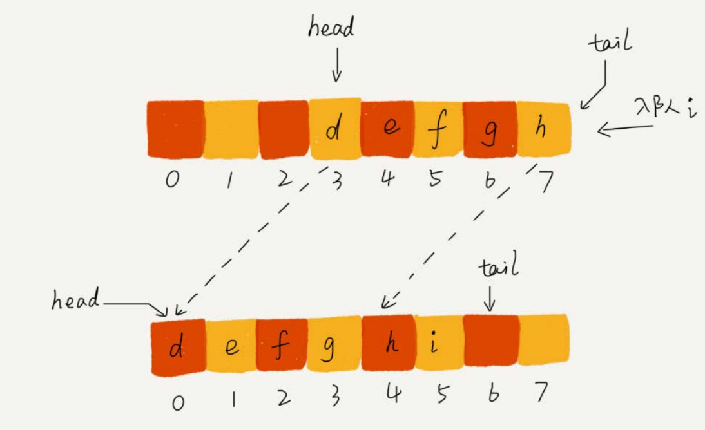
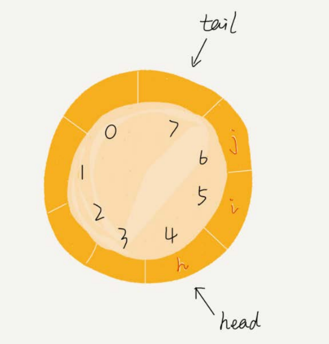
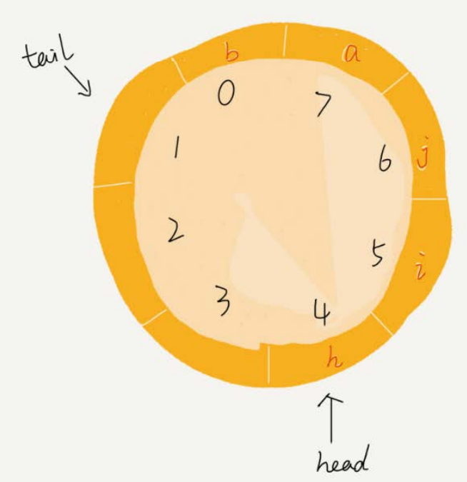
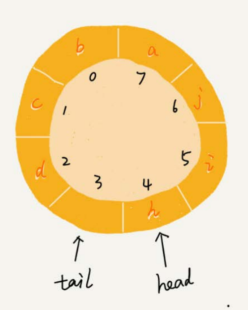

# 队列


队列跟栈一样，也是一种**操作受限的线性表数据结构**。

具有先进先出的特性，支持在队尾插入元素，在队头删除元素

## 顺序队列和链式队列

队列可以用数组来实现，也可以用链表来实现。用数组实现的队列叫作顺序队列， 用链表实现的队列叫作链式队列。

```java
// 用数组实现的队列
public class ArrayQueue {
    // 数组：items，数组大小：n
    private String[] items;
    private int n = 0;
    // head表示队头下标，tail表示队尾下标
    private int head = 0;
    private int tail = 0;

    // 申请一个大小为capacity的数组
    public ArrayQueue(int capacity) {
        items = new String[capacity];
        n = capacity;
    }

    // 入队
    public boolean enqueue(String item) {
        // 如果tail == n 表示队列已经满了
        if (tail == n) {
            return false;
        }
        items[tail] = item;
        ++tail;
        return true;
    }

    // 出队
    public String dequeue() {
        // 如果head == tail 表示队列为空
        if (head == tail) {
            return null;
        }
        // 为了让其他语言的同学看的更加明确，把--操作放到单独一行来写了
        String ret = items[head];
        ++head;
        return ret;
    }
}
```

我们在出队时可以不用搬移数据。如果没有空闲空间了，我们只需要在入队时，再**集中触发一次数据的搬移操作**。借助这个思想，出队函数dequeue()保 持不变，我们稍加改造一下入队函数enqueue()的实现

```java
// 入队操作，将item放入队尾
public boolean enqueue(String item) {
    // tail == n表示队列末尾没有空间了
    if (tail == n) {
        // tail ==n && head==0，表示整个队列都占满了
        if (head == 0) {
            return false;
        }
        // 数据搬移
        for (int i = head; i < tail; ++i) {
            items[i-head] = items[i];
        }
        // 搬移完之后重新更新head和tail
        tail -= head;
        head = 0;
    }
    items[tail] = item;
    ++tail;
    return true;
}
```



这种实现思路中，**出队操作的时间复杂度仍然是O(1)**。


## 循环队列



图中这个队列的大小为8，当前head=4，tail=7。当有一个新的元素a入队时，我们放入下标为7的位置。但这个时候，我们并不把tail更新为8，而是将其在**环中后移一位**，到下标为0的位置。当再有一个元素b入队时，我们将b放入下标为0的位置，然后tail加1更新为1。所以，在a，b依次入队之后，循环队列中 的元素就变成了下面的样子：



要想写出没有bug的循环队列 的实现代码，我个人觉得，最关键的是，**确定好队空和队满的判定条件**。

在用数组实现的循环队列中，队列为空的判断条件仍然是head == tail。但队列满的判断条件就稍微有点复杂了。



**当队满时，(tail+1)%n=head。**

**当队列满时，图中的tail指向的位置实际上是没有存储数据的。所以，循环队列会浪费一个数组的存储空间。**

这个空的存储空间就是一个哨兵位，作用如下：

+ 区分队列是满的还是空的。当队列中没有元素时，队头指针和队尾指针都指向哨兵位置。当队列中有元素入队时，队尾指针向前移动，当队尾指针到达队列尾部时，如果队列还有空余位置，队尾指针将回到队列的开头，继续存储元素。当队列中只有一个空位置时，队头指针和队尾指针相遇，此时队列被认为是满的。因此，哨兵位置可以方便地区分队列是满的还是空的。
+ 简化队列的实现。如果没有哨兵位置，在循环队列中需要特殊处理队列是满的情况，否则队列会发生溢出。有了哨兵位置，可以将队列的长度定义为实际存储元素的最大数量加一，这样就可以避免队列溢出的情况，同时也简化了循环队列的实现。

```java
public class CircularQueue {
    // 数组：items，数组大小：n
    private String[] items;
    private int n = 0;
    // head表示队头下标，tail表示队尾下标
    private int head = 0;
    private int tail = 0;

    // 申请一个大小为capacity的数组
    public CircularQueue(int capacity) {
        items = new String[capacity];
        n = capacity;
    }

    // 入队
    public boolean enqueue(String item) {
        // 队列满了
        if ((tail + 1) % n == head) {
            return false;
        }
        items[tail] = item;
        tail = (tail + 1) % n;
        return true;
    }

    // 出队
    public String dequeue() {
        // 如果head == tail 表示队列为空
        if (head == tail) {
            return null;
        }
        String ret = items[head];
        head = (head + 1) % n;
        return ret;
    }
}
```


## 阻塞队列和并发队列

