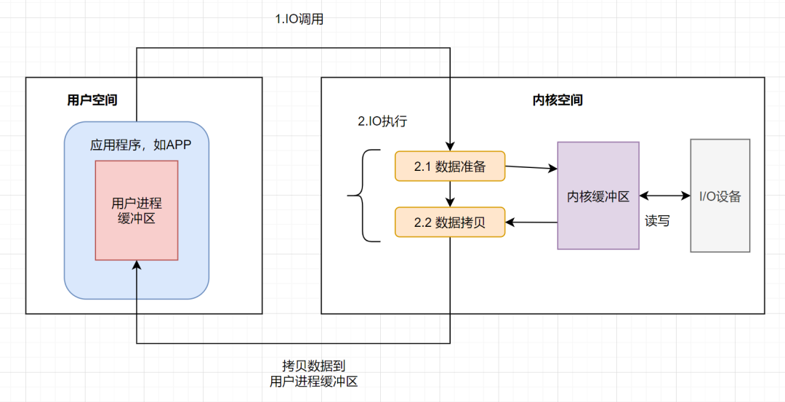
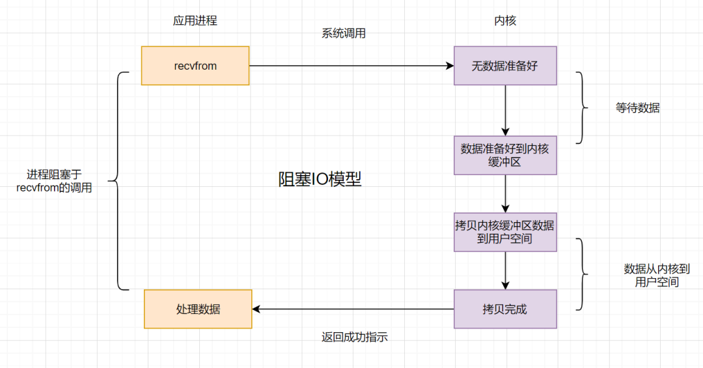
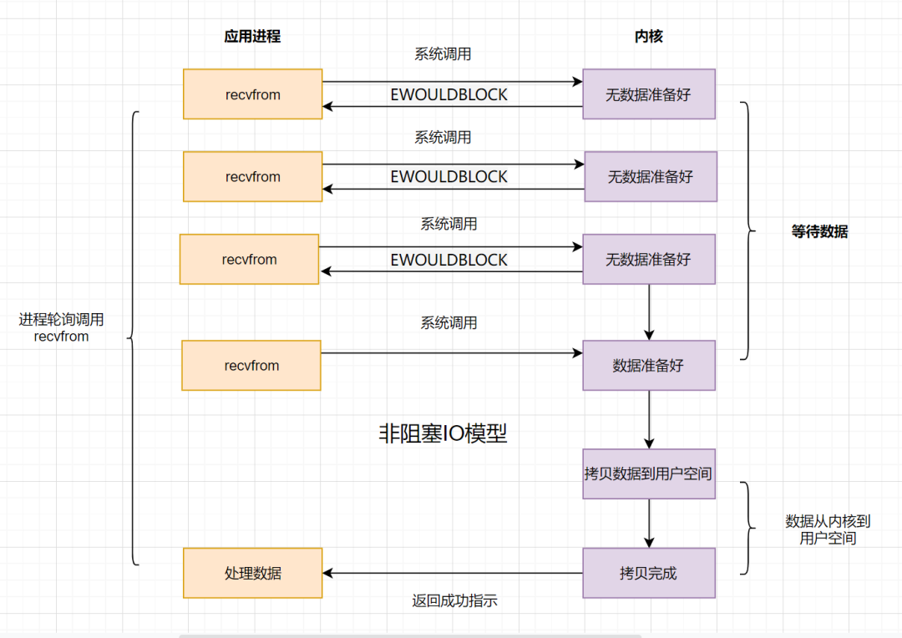
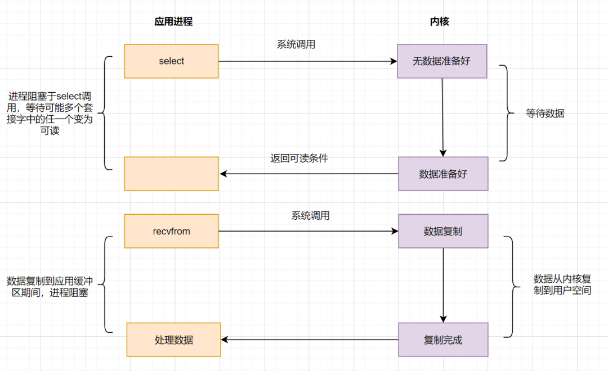

# I/O 是什么？

I/O 其实就是 input 和 output 的缩写，即输入/输出。

## 什么是输入输出？

比如我们用键盘来敲代码其实就是输入，那显示器显示图案就是输出，这其实就是  I/O。

而我们时常关心的磁盘 I/O 指的是硬盘和内存之间的输入输出。 

读取本地文件的时候，要将磁盘的数据拷贝到内存中，修改本地文件的时候，需要把修改后的数据拷贝到磁盘中。 

网络 I/O 指的是网卡与内存之间的输入输出。 

当网络上的数据到来时，网卡需要将数据拷贝到内存中。当要发送数据给网络上的其他人时，需要将数据从内存拷贝到网卡里。

## 为什么都要和内存交互？

我们的指令最终是由 CPU 执行的，究其原因是 **CPU 与内存交互的速度远高于 CPU 和这些外部设备直接交互的速度**。

因此都是和内存交互，当然假设没有内存，让 CPU 直接和外部设备交互，那也算 I/O。

总结下：I/O 就是指内存与外部设备之间的交互（**数据拷贝**）。

 

# 操作系统的I/O

我们要将内存中的数据写入到磁盘的话，主体会是什么呢？主体可能是一个应用程序，比如一个 Go 进程（假设网络传来二进制流，一个 Go 进程可以把它写入到磁盘）。

**操作系统**负责计算机的资源管理和进程的调度。我们电脑上跑着的应用程序，其实是需要经过**操作系统**，才能做一下特殊操作，如**磁盘文件读写、内存的读写**等等。因为这些都是比较危险的操作，不可以由应用程序乱来，只能交给底层操作系统来。也就是说，**你的应用程序要把数据写入磁盘，只能通过调用操作系统开放出来的API来操作**。

> 什么是用户空间？什么是内核空间?
>
> 以32位操作系统为例，它为每一个进程都分配了4G(2的32次方)的内存空间。这4G可访问的内存空间分为二部分，一部分是用户空间，一部分是内核空间。内核空间是操作系统内核访问的区域，是受保护的内存空间，需要**通过系统调用等方式间接访问**。而用户空间是用户应用程序**直接访问**的内存区域。

我们应用程序是跑在用户空间的，它**不存在实质的IO过程，真正的IO是在操作系统执行的**。即应用程序的IO操作分为两种动作：**IO调用和IO执行**。IO调用是由进程（应用程序的运行态）发起，而IO执行是**操作系统内核**的工作。此时所说的IO是应用程序对操作系统IO功能的一次触发，即IO调用。

## 操作系统的一次 I/O 过程

应用程序发起的一次IO操作包含两个阶段：

- IO调用：应用程序进程向操作系统**内核**发起调用。
- IO执行：操作系统内核完成IO操作。

操作系统内核完成IO操作还包括连个两个过程：

- 准备数据阶段：内核等待I/O设备准备好数据
- 拷贝数据阶段：将数据从**内核缓冲区拷贝到用户空间缓冲区**

用户进程缓冲区、内核缓冲区都是内存。

其实IO不就是把进程的内部数据转移到外部设备，或者把外部设备的数据迁移到进程内部。外部设备一般指硬盘、socket通讯的网卡。一个完整的**IO过程**包括以下几个步骤：

+ 应用程序进程向操作系统发起**IO调用请求**
+ 操作系统**准备数据**，把IO外部设备的数据，加载到**内核缓冲区**
+ 操作系统拷贝数据，即将内核缓冲区的数据，拷贝到进程缓冲区

# 阻塞 IO 模型

假设应用程序的进程发起**IO调用**，但是如果**内核的数据还没准备好**的话，那应用程序进程就一直在**阻塞等待**，一直等到内核数据准备好了，从内核拷贝到用户空间，才返回成功提示，此次IO操作，称之为**阻塞IO**。

- 阻塞IO比较经典的应用就是**阻塞socket、Java BIO**。
- 阻塞IO的缺点就是：如果内核数据一直没准备好，那用户进程将一直阻塞，**浪费性能**，可以使用**非阻塞IO**优化

**在Go语言中，所有的I/O操作都是阻塞的。**

当一个线程被阻塞时，它会进入等待状态，不再占用CPU资源。操作系统的调度器可以**选择任何一个准备好运行的线程（或进程）并给它分配CPU时间**。这个被选中的线程可能是同一个进程中的其他线程，也可能是其他进程的线程，这取决于操作系统的调度策略和当前的系统负载。

# 非阻塞 IO 模型

如果内核数据还没准备好，可以先返回错误信息给用户进程，让它不需要等待，而是**通过轮询的方式再来请求**。这就是非阻塞IO，流程图如下：

非阻塞IO的流程如下：

- 应用进程向操作系统内核，发起 recvfrom 读取数据。
- 操作系统内核数据没有准备好，立即返回 EWOULDBLOCK 错误码。
- 应用程序进程轮询调用，继续向操作系统内核发起 recvfrom 读取数据。
- 操作系统内核数据准备好了，从内核缓冲区拷贝到用户空间。
- 完成调用，返回成功提示。

当你在代码中调用一个 recvfrom  操作，如果数据还没有准备好，**操作系统并不会把CPU的控制权交给其他进程，而是立即返回给当前线程**，让它继续执行后面的代码。这就是所谓的非阻塞：调用read操作后，线程不会被阻塞，而是可以继续执行其他的任务。

非阻塞IO模型，简称**NIO**，Non-Blocking IO。它相对于阻塞IO，虽然大幅提升了性能，但是它依然存在**性能问题**，即**频繁的轮询**，导致频繁的系统调用，同样会消耗大量的CPU资源。可以考虑**IO复用模型**，去解决这个问题。

虽然在 Go 中，所有的 I/O 都是阻塞，但是当一个goroutine在进行I/O操作并被阻塞时，Go的运行时系统会自动将CPU切换到另一个可以运行的goroutine，这样就能够避免阻塞整个程序。这也类似于 NIO。

# IO 多路复用模型

既然**NIO**无效的轮询会导致CPU资源消耗，我们等到内核数据准备好了，主动通知应用进程再去进行系统调用，那不就好了嘛？

**文件描述符fd**(File Descriptor),它是计算机科学中的一个术语，形式上是一个**非负整数**。当程序打开一个现有文件或者创建一个新文件时，**内核向进程返回一个文件描述符**。

IO复用模型核心思路：系统给我们提供**一类函数**（如我们耳濡目染的**select、poll、epoll**函数），它们可以同时监控多个**fd** 的操作，任何一个返回内核数据就绪，应用进程再发起 **recvfrom** 系统调用。

## select

应用进程通过调用**select**函数，可以同时监控多个 **fd**，在 **select** 函数监控的 fd 中，只要有任何一个数据状态准备就绪了，select 函数就会返回可读状态，这时应用进程再发起 recvfrom 请求去读取数据。

 