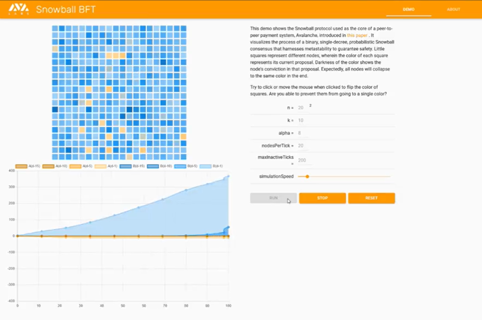

摘抄原文：[雪崩DEX开发者为你详解Avalanche共识机制](https://www.theblockbeats.info/news/28137)

首先，什么是共识？

它是确保分布式系统中的多个节点做出相同决定的机制，对于区块链而言，最重要的决策是判定哪个区块应该成为链上的新区块。

在 Avalanche 的共识机制问世前，有两大系列的共识算法：Classical（经典式）和 Nakamoto（中本聪式）。

Classical 的共识是通过**多轮投票**来实现的。网络中的每个节点都要与其他节点进行通信，把自己的决定广播出去。由于节点需要和整个网络内的其他节点进行交流，因此，**网络节点的成员需要一个准确的协议成员列表**。

Classical 共识算法在节点数量较少时很有效，但该算法的时间复杂度 O(n^2 ) 特别高，导致节点网络的运营成本巨大（往往与节点数量 n 的二次方成正比）。同时，这种算法无法扩展到支持用户流动的大型去中心化网络。

第二大类共识算法派系是 Nakamoto 共识。这就是比特币及许多其他种类的加密货币所采用的。它采用「**最长链原则**」，默认消耗工作量最大的那条链有权威的历史数据记录。矿工不参与投票验证，他们只进行哈希计算并将工作成果对外分发。

**Nakamoto 共识算法的优势在于，它可以扩展到大量的用户而不损失性能。但问题在于，性能本来就不是很好。**

任意数量的矿工节点可以随意的参与或退出爆块过程，这导致出块的速度缓慢，并且随时可进行区块重组，导致链上存储内容可变更。

你可能听说过，比特币网络上的一笔交易在新出 6 个区块后，就完成了最终确定。但这只是概率达 99% 的高概率事件，仅仅基于置信估计。

 一个新区块及其所在的链被网络节点确认的次数越多，就越不可能有更长的链条分叉来取代之。但这并不能确保更长的链条分叉不会出现。

**Avalanche 的共识机制。这是一类全新的共识算法，通过随机二次抽样（random subsampling）来实现。**

> 假设有 1000 名会议参与者需要共同决定午餐吃什么：披萨还是三明治。每个人都有一个最初的偏好，但他们需要在最终方案上达成一致。
>
> 作为参与者，你进行了一次小的随机采样，问了 10 位参与者，他们想吃什么。7 个人说披萨。看起来大多数人都想吃披萨，所以现在若有人问你，你也会回答说想吃披萨。
>
> 接下来，你执行另一轮随机采样。你询问另一组随机抽到的 10 个人，如果大多数人回答三明治，你就改变自己的偏好；而如果大多数人回答比萨，你会再次回答说想吃披萨。这样下来，你在两次抽样调查后，得到的结果是一致的。
>
> 您可以继续迭代此过程，直到连续 100 次获得相同的结果。此时，你认为最终决定已经完成。
>
> 由于节点在每轮抽样调查中，只与固定数量的少量节点进行通信，所以单轮抽样中消息传递的时间复杂度为 O(1)（往往为常数级别）。与 Classical 共识算法不同，消息传递的复杂度不会随节点数量 n 的增加而增加。
>
> 但是，需要多少轮随机抽样才能得到最终结果呢？这取决于网络的大小。然而，它的复杂度是一个可控的 **O(log n)**（与对数函数成正比，数量级低于一次函数）。
>
> 雪崩共识是**基于概率统计**的。一个节点可能只对少量节点进行重复采样，并得出错误的结论。但该协议是可调参的。我们可以使这种情况发生的概率变为极小，比如低于 0.0000000001%。
>
> 由于这种高度的可预见性，Avalanche 具有最终性。一旦网络内的交易被决定，它们就被永远锁定在链上。Avalanche 上**不会有区块重组**。

[这是 Avalanche 共识机制的可视化效果展示。](https://twitter.com/das_connor/status/1470147125870841861)

如果你仔细观察，会发现抽取到某些节点后，多轮抽样的最终结果便不可能逆转。这就好像移动的雪花变为雪崩一样。雪崩协议 Avalanche 由此得名。

**该协议具有较高的运转效率，限制因素主要在于消息延迟和网络带宽。**

这意味着您可以在低配的硬件上接入 Avalanche 网络，不需要专门的挖矿设备，中间层的服务器就可以了. 一些用户甚至在树莓派微型计算机（Raspberry Pi）上运行 Avalanche 验证节点。

**该协议是静态的，只在有工作需要处理的时候运行，没有像工作量证明（POW）机制那样的 "浪费 "。**

**Avalanche 共识算法的执行速度很快，在模拟实验及实践中，Avalanche 每秒可以处理 4500 笔交易，并在 1-2 秒内完成最终确定。**

Avalanche 可以使用任何形式的 Sybil 保护机制。您可能听说过 Avalanche 是一个采用权益证明（POS）的区块链。但 POS 不是共识算法，这只是一种针对女巫攻击（Sybil Attack）的保护机制。

Sybil 保护机制可以防止单个用户操纵多个节点并伪装成多个用户。要运行多个验证节点（validators），您需要拥有大量权益（stake），我们认为 stake 是一种稀缺资源。

尽管 Avalanche 协议需要 Sybil 保护机制，但您也可以采用其他的任何方法。例如，您可以使用工作量证明（pow）重建 Avalanche。

Avalanche 共识机制是具备可配置性的（系统能够根据运行需要而被配置）。它实际上是一个全新的共识协议，没有固定的代码实现。

在 Avalanche 区块链中，我们对网络进行了调整，使其高度安全。与针对比特币的「51% 攻击」不同，入侵 Avalanche 需要 80% 的节点串谋。

比特币的「51% 攻击」看起来像是一个中心化组织篡改历史，并压制少数派。而在 Avalanche 中，80% 的节点串谋引发的安全故障，会导致网络不同部分的节点做出不同的决策。Avalanch 对安全性与活跃度进行了均衡考虑。如果 1/3 的网络节点离线，网络运转进程将放缓或停止，直到恢复到阈值（临界点）水平。

