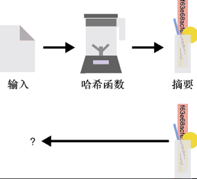
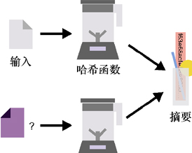
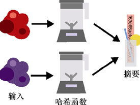

# 什么是哈希函数

哈希函数(Hash Function)可以给任何数据生成一个全局唯一的标识符。非正式地说，哈希函数以任意值为输入，并输出一个唯一的字节串。给定相同的输入，哈希函数总是产生相同的字节串。

哈希函数的输出通常被称为摘要(Digest)或哈希值(Hash)。

哈希函数的安全性质——**抗第二原像性**。这个术语意味着从一个哈希函数的长输出f63e...中，我们无法推断出另一个文件也可以通过相同的哈希函数得到相同的输出f63e...。

> 上面的字符串f63e...采用的是十六进制（Base16编码，使用从0到9的数字和从a到f的字母来表示任意数据）表示形式。我们本可以用包含0和1的二进制编码方法表示哈希函数的输出，但这样会占用更多空间。十六进制编码允许我们将8比特（1字节）数编码成2个字符。这种编码方式具有可读性强、占用的空间少的优点。我们还可以使用其他的编码方法将二进制数据编码成可读字符，但十六进制编码和Base64编码是使用最多的两种编码方式。在Base系列编码中，基越大，编码二进制数据需要的字符数就越多。当然，如果用的基过大，我们可能就无法用已有的可读字符编码二进制数据。

**哈希函数的输入可以是任意大小，甚至可以是空值，而它的输出的长度总是固定的，且具有确定性：给定相同的输入，哈希函数总是产生相同的输出。**

# 哈希函数的安全属性

哈希函数的第一个属性是**抗第一原像性**(Pre-image Resistance)。这一属性表示**无法根据哈希函数的输出恢复其对应的输入**。



> 如果输入值很小，那是否就能找到原始输入呢？假设输入的可取值是oui或non，那么攻击者很容易对所有可能的3个字母的单词进行哈希并找出输入值。所以，当输入空间很小时，我们就需要对输入的变体计算哈希值。此外，当需要计算哈希值的内容是一个句子时，因此，抗第一原像性有一个明显的前提：**输入空间不能太小且要具有不可预测性**。

哈希函数的第二个属性是**抗第二原像性**(Second Pre-image Resistance)。该性质说明如下：给定一个输入和它的哈希值，**无法找到**一个**不同于**该输入的新输入，使得这两个输入产生**一样的哈希值**。



哈希函数的第三个属性是**抗碰撞性**(Collision Resistance)。这个性质保证**不能够产生哈希值相同的两个不同的输入**。



> 随机预言机(Random Oracle)
>
> 我们认为**哈希函数的输出是不可预测且随机的**。这样的性质对证明协议的安全性非常有用，这一切都要归功于哈希函数具有的安全性质（例如抗碰撞性）。密码学中的许多协议都在随机预言机模型下被证明是安全的，证明过程中使用了一个**虚构的理想参与者，即随机预言机**。在这种类型的协议中，人们可以将任何输入作为请求发送到该随机预言机，它会返回完全随机的输出，且与哈希函数一样，对于两次相同的输入返回相同的输出。
>
> 用这样的模型证明算法的安全性有时会引起争议，因为我们不确定在实践中是否存在能够替换这些随机预言机的哈希函数。不过，许多合法协议已经被证明在随机预言机模型下是安全的，其中所使用的哈希函数比真实函数更理想。

# 哈希函数的安全性考量

哈希函数输出的摘要大小对其安全性也很重要，但这不仅仅是哈希函数的特性。所有密码算法在实践中都必须关心其参数的大小。**在实践中会要求哈希函数的输出长度不能低于256比特**。对于这么大的输出空间，除非在实际计算方面有所突破，否则几乎不可能发生碰撞。

那这个数字(256)是怎么得来的？在现实世界的密码学中，算法的安全级别不能低于128比特。这意味着想要破坏算法（提供128位安全性的算法）的攻击者必须执行大约$2^{128}$次操作（算法的输入长度为128比特，尝试所有可能的输入字符串将需要$2^{128}$次操作）。为了满足前面提到的3个安全属性，哈希函数的安全级别至少要是128比特。对哈希函数最简单的攻击通常是找到由于生日界限引起的碰撞。

## 生日界限（Birthday Bound）

生日界限源于概率论，其中生日问题（一个房间里至少需要多少人，才能使得两个人生日相同的概率至少达到50%）揭示了一些不直观的结论。事实证明，**随机抽取23个人，他们中有两个人生日相同的概率就足以达到50%！**这确实是个很奇怪的现象。

这个现象被称为生日悖论。实际上，当我们从$2^{N}$种可能性的空间中随机生成字符串时，在已经生成大约$2^{N/2}$个字符串后，发现碰撞的概率为50%。

如果哈希函数产生256比特的随机输出，那么所有输出的空间大小为2256。这意味着，在生成了2128个摘要后（由于生日界限），发现碰撞的概率就很高了。但2128就是我们想要达到安全目标所需要的最大操作次数。这就是哈希函数至少要提供256比特输出的原因。

受某些因素的限制，有时会促使开发者通过截断(Truncating)的方式（删除一些字节）减少摘要的长度。在理论上这是可行的，但是会大大降低哈希函数的安全性。为了实现128比特安全性这个最低的安全目标，在以下情况下不能截断摘要：

+ 为了满足抗碰撞性，摘要长度至少是256比特
+ 为了满足抗第一原像性和抗第二原像性，摘要长度至少是128比特。

# 哈希函数的实际应用

## 承诺

想象一下，如果我们知道了市场上的一只股票会增值，并在未来一个月达到50美元/股，虽然我们不能在当时告诉朋友（也许是出于某种法律原因），却还是希望可以在事后告诉朋友我们早知道这件事了。那么，我们就可以对一句话生成一个承诺，如计算“股票X下个月将达到50美元/股”这句话的哈希值，并把输出结果交给朋友。一个月后当我们公开这句话时，朋友将能够通过计算这句话的哈希值，然后与我们一个月前公开的哈希值进行比较，从而判断我们所说的真伪。这就是承诺方案。密码学中的承诺需要具备以下两种性质。

+ 隐蔽性(Hiding)：承诺必须隐蔽基础值。
+ 绑定性(Binding)：承诺必须只隐藏一个值。换句话说，如果给定一个值x的承诺，那么之后无法公开另一个可以通过承诺验证的值y。

## 子资源完整性

网页导入外部JavaScript文件的时候需要用哈希函数来验证子资源的完整性。例如，很多网站使用内容分发网络(Content Delivery Network，CDN)将JavaScript库或网络框架相关的文件导入网页中。这种CDN被部署在重要位置以便迅速将这些文件传递给访问者。然而，如果CDN不守规矩，故意为访问者提供恶意的JavaScript文件，则可能造成严重的问题。为了解决这个问题，网页可以使用子资源完整性(Subresource Integrity)的功能，允许在导入标签中包含一个摘要：

```xml
<script src=”https://code.jquery.com/jquery-2.1.4.min.js”
   integrity=”sha256-8WqyJLuWKRBVhxXIL1jBDD7SDxU936oZkCnxQbWwJVw=”></script>
```

一旦检索到JavaScript文件，浏览器就会计算它的哈希值（使用SHA-256算法），并核实它是否与页面中硬编码的摘要一致。如果一致，则可以通过完整性验证，该JavaScript文件就会被执行。

## 比特流

世界各地的用户使用比特流(BitTorrent)协议，在彼此之间直接分享文件（这种方式称为Peer-to-Peer）。为了分发一个文件，首先将文件切割成块，每个块都被单独计算哈希值。之后这些哈希值作为共享的信任源，代表要下载的文件。

比特流协议有几种机制，使得一个Peer可以从不同的Peer中获得一个文件不同的块。最后，整个文件的完整性将通过以下方式得到验证：在将文件从块中重新组合之前，对每个块进行哈希运算，并将输出结果与各自已知的摘要进行比对。例如，下面的例子代表Ubuntu操作系统的19.04版本。它是通过对文件的元数据以及所有块的摘要进行哈希运算得到的一个摘要（用十六进制表示）：

```ruby
magnet:?xt=urn:btih:b7b0fbab74a85d4ac170662c645982a862826455
```

## 洋葱路由

洋葱路由(Tor)浏览器出现的目的是使个人可以匿名浏览互联网。它的另一个特点是，人们可以创建隐藏的网页，即网站的物理位置难以追踪。我们可以通过一个使用网页公钥的协议来保证与这些网页的安全连接。（第9章讨论会话加密时将列举更多关于该协议的工作原理）例如，毒品交易网站在被FBI查封之前，可以在Tor浏览器中通过silkroad6ownowfk.onion进行访问。这个Base32字符串实际上代表了丝绸之路网站公钥的哈希值。因此，可以通过洋葱路由地址来验证隐藏网页的公钥，并确定当前访问的网页是正确的（而不是一个冒名顶替者）。

# 标准化的哈希函数

MD5和SHA-1这类流行的哈希函数，现在被认为是有缺陷的。虽然在20世纪90年代，MD5和SHA-1就已经标准化并且成为应用很广泛的哈希函数，但它们却分别在2004年和2016年被证明是有缺陷的，因为一些科研团队发布了在这些函数中找到攻击方法。这些攻击之所以成功，一部分是因为计算能力的进步，但主要还是因为在哈希函数的设计方式中发现了缺陷。