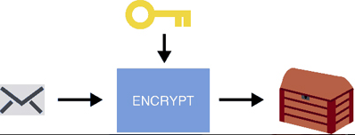
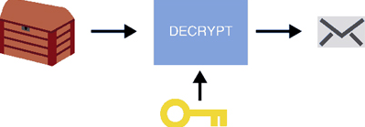
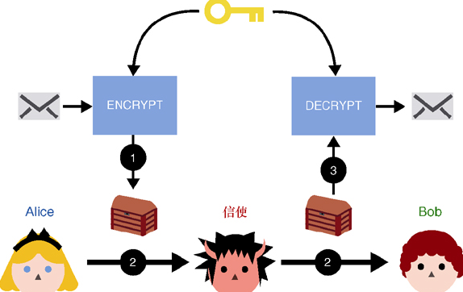
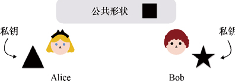
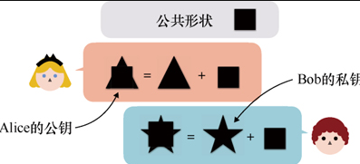
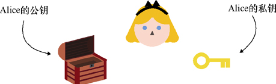
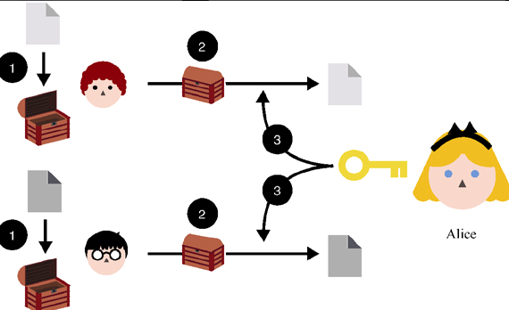

# 密码学使协议安全

**密码学的目标：密码学是一门旨在保护协议免受攻击者破坏的科学。**

**协议是一个人（或者多个人）为了完成某件事情而必须遵循的一系列步骤。**

# 对称密码：对称加密概述

想象这样一个情景：Alice需要给住在城堡外的Bob寄送一封信件。如图1.1所示，Alice要求她忠实的信使(Messenger)骑上他的骏马，穿越前方危险的土地，向Bob传递重要消息。然而，Alice对信使很是怀疑；尽管这位忠实的信使为她效劳多年，但她仍希望此次传递的消息对包括信使在内的所有被动观察者均保密。试想一下，这封信可能包含一些关于王国的流言蜚语。

Alice需要的是一个协议，它能模拟Alice亲自将消息传递给Bob的过程。这是一个在现实中不可能解决的问题，除非我们采用密码学（或隐形传输）技术。这就要用到密码学家多年前发明的一种新型加密算法，常称为对称加密算法(Symmetric Encryption Algorithm)。

> 顺便说一下，**密码学算法通常也被称为密码学原语**。我们可以将密码学原语视为密码学中一种最小的算法构造，它通常与其他原语一起用于构造新的协议。

接下来，让我们看看如何使用这个对称加密算法向信使隐藏Alice的真实消息。现在，假设这个密码学原语是一个提供了以下两个函数的黑盒子（我们无法看到它的内部构造）。

+ ENCRYPT
+ DECRYPT

第一个函数ENCRYPT以密钥(Secret Key)和消息(Message)为输入，它输出一系列看起来像是随机选择的数字，如果我们愿意的话，它也可以输出像噪声一样的数据。我们把这个函数的输出称为加密消息。

第二个函数DECRYPT是第一个函数ENCRYPT的逆函数，它以ENCRYPT输入的密钥和输出的加密消息为输入，输出原始消息。

为了使用这个新的密码学原语，Alice和Bob不得不在现实世界中先会面一次，商定他们将要使用的密钥。之后，Alice可以使用商定的密钥和函数ENCRYPT去保护她的消息。接着，她将加密的消息交给信使，并由信使转交给Bob。Bob收到加密的消息后，使用与Alice相同的密钥和函数DECRYPT恢复出原始消息。具体过程如图所示。

在该消息传递过程中，信使拥有的都是看起来随机的消息，这不会对他获得隐藏的消息提供任何有意义的帮助。借助密码学技术，我们有效地将不安全的协议转变为安全协议。新协议使得Alice可以在没有任何人（除Bob外）知道消息内容的情况下向Bob传递一封机密信件。

在密码学中，使一个协议变得安全的常见做法就是：**使用密钥将消息转变成噪声，使经过变换后的消息与随机数字序列无法区分开来。**

# Kerckhoff 原则：只有密钥保密

数百年后，依靠信件传递消息的Alice和Bob已经成为历史，纸质信件不再是我们的主要交流方式，取而代之的是更好、更实用的通信技术。如今，我们可以使用功能强大的计算机和互联网。当然，这意味着我们以前面临的恶意信使也变得更加强大。恶意信使无处不在：它可以是咖啡店里的Wi-Fi发射器，也可以是组成互联网并转发信息的服务器，还可以是运行我们算法的计算机。我们的敌手（恶意信使）现在也有能力观察到更多的信息，例如向网站发出的每一个请求都可能通过错误的线路传递，并在几纳秒内被更改或复制，而这一切可能不会有人察觉到。

> 攻破一个密码算法的方法有很多种。对于加密算法，我们可以通过以下方法来攻击这个算法：将密钥泄露给攻击者、在没有密钥的情况下解密消息、仅仅通过观察加密的消息就可以知道消息本身等。任何对算法假设的削弱也可以认为算法被攻破。

**为了对密码学原语的安全性获得足够的信心，每个密码原语必须由密码专家对其进行公开分析。**

以公开方式构造密码算法标准的思路与Kerckhoff原则有关，该原则可以理解为：依靠保密算法来实现安全是不明智的，因为敌手很容易知道我们所使用的密码算法。因此，我们会选择公开密码算法。

如果Alice和Bob的敌手知道他们加密信息的算法，那么他们的加密算法还怎么保证安全呢？答案是密钥。**协议的安全依赖密钥，而与算法本身是否保密无关。**无论是我们将要学习的密码算法，还是在现实世界中使用的密码算法，我们通常都可以自由地进行研究和使用，这是本书涉及的密码算法的共性。只有作为这些算法输入的密钥才需要保密。

# 非对称加密：两个密钥优于一个密钥

## 密钥交换

我们学习的第一个**非对称密码原语是密钥交换**(Secret Key Exchange)。DH密钥交换算法是密码学家提出的第一个公钥密码算法，该算法以其提出者（Diffie和Hellman）的名字的首字母命名。DH密钥交换算法的主要目的是为通信双方生成一个共享的秘密。这个双方共享的秘密可以用于不同的目的，例如作为对称加密原语的密钥。

在本小节我们使用一个简单的类比来解释密钥交换。与大多数密码算法一样，在密钥交换算法执行前，参与者也必须获得一组公共参数。在类比说明中，我们用正方形■表示Alice和Bob协商好的公共参数（公共形状）。接下来，他们各自找到一个秘密地点，并随机选择一个形状。假设Alice选择的形状是三角形▲，而Bob选择的是星形★，同时他们会不惜一切代价地保密自己所选的形状。这些随机选择的形状就是他们各自的私钥(Private Key)。

DH密钥协商的第一步，双方生成私钥。

当Alice和Bob选择完私钥后，他们就各自将他们随机选择的形状与他们起初协商的公共形状（正方形）结合起来。这些组合会产生唯一的新形状，每个新形状表示一个公钥(Public Key)。公钥属于公开信息，因此Alice和Bob可以相互交换他们的公钥。

DH密钥协商的第二步，双方交换公钥。双方通过将公共形状和私钥结合在一起来生成公钥

现在我们来思考这个算法为什么属于公钥密码算法。这是因为此类密码算法的密钥由一个公钥和一个私钥组成。DH密钥交换算法的最后一步相当简单，即Alice和Bob分别将对方的公钥和自己的私钥结合在一起。最终，双方得到完全相同的结果（形状）。

DH密钥协商的最后一步：双方生成共享密钥。为了生成这个密钥，双方都将对方的公钥和自己的私钥结合在一起，而且仅仅通过两个公钥无法生成共享密钥。

之后，协议的参与者可以使用这个共享密钥。本书也包含许多共享密钥使用场景的例子。例如，Alice和Bob可以将共享密钥当作对称加密算法的密钥，进而使用这个对称加密原语去加密消息。

DH密钥交换的整个过程概括如下：

1. Alice和Bob交换掩盖了他们各自私钥的公钥；
2. 双方均使用对方的公钥和己方的私钥计算出共享密钥；
3. 敌手通过观察公钥不能获得私钥的任何信息，更不能计算出共享密钥。

实际上，DH密钥交换是非常不安全的。你能花上几秒找出其不安全的原因吗？

这是因为Alice接收任何来自Bob的公钥，所以我可以拦截Bob发向Alice的公钥，并用我的公钥替换掉Bob的公钥，这样我就可以冒充Bob（反之，我也可以向Bob冒充Alice）。这样的中间人(Man-in-the-Middle，MITM)攻击者方法可以成功地攻击该密钥交换协议。那么如何修复协议的这个漏洞呢？修复该协议有两种方法，即用另一个加密原语增强这个密钥交换协议，或者提前知道Bob的公钥。但这不就意味着我们又回到了原点，即如何在协议开始之前确定双方公钥？

先前我们提到，Alice和Bob需要知道一个共同的密钥；现在，我们又要求，Alice和Bob需要事先知道彼此的公钥。双方如何才能知道对方的公钥呢？这不就是一个先有鸡还是先有蛋的问题吗？是的，的确如此。正如我们将看到的一样，在实践中，公钥密码并不能解决信任问题，它只是简化了信任的建立难度（特别是参与者数量有很多时）。

## 非对称加密

在DH密钥交换算法提出后不久，密码学家Ron Rivest、Adi Shamir和Leonard Adleman又提出了一个新的密码算法，该算法也以他们的名字命名，称为RSA算法。RSA算法包含两类不同的密码学原语：**公钥加密（或非对称加密）算法和（数字）签名算法**。这两个密码算法属于非对称密码中两类不同的密码学原语。在本小节中，我们将解释这些原语的功能以及它们在密码协议里发挥的作用。对于非对称加密，其功能与我们前面讨论的对称加密算法类似：它通过加密消息来保证机密性。不过，对称加密中两个参与方使用相同的密钥加密和解密消息，但在非对称加密中加密和解密消息的方式则完全不同：

+ **非对称加密有两个密钥，分别称为公钥和私钥；**
+ **任何人都可以使用公钥加密消息，但是只有私钥拥有者才可以解密消息。**

我们再次从我们的老朋友Alice谈起，假设她持有私钥及其对应的公钥。我们把她的公钥想象成一个打开的盒子，它向公众敞开，任何人均可使用它。

任何人都可以使用Alice的公钥加密发向她的消息。在类比说明中，我们将加密消息想象成把消息放到打开的盒子里并关上它。一旦盒子关上，除了Alice，任何人都没法打开放有消息的盒子。这个盒子有效地保证了消息的机密性，避免第三方获得消息本身。Alice收到关闭的盒子（加密的消息）后，她可以用只有自己知道的私钥打开盒子（解密消息），获得消息。

## 数字签名：与手写签名作用一样

RSA算法还能实现数字签名。数字签名原语能够有效地帮助Alice和Bob建立起信任，它的作用与手写签名十分类似。例如，当租赁公寓时，我们需要在租住合同上签字。

我们可能会产生这样的疑问：如果他们伪造我的签名怎么办？确实，手写签名在现实世界中并不能提供足够的安全性。密码上的签名也可能伪造，但是密码签名还会提供一个带有签名者姓名的密码证书。这能保证密码签名不可伪造，进而让别人很容易验证签名。与在支票上写的古老签名相比，密码签名更加有用！

我们想象这样一个场景：Alice想向David证明她信任Bob。这是一个在多方环境中建立信任以及非对称密码技术使用场景的典型例子。Alice通过在一张写有“Alice信任Bob”的纸上签名来表明立场，并告诉David：Bob是可以信任的。如果David信任Alice和她的签名算法，那么他也可以选择信任Bob。

任何人都可以通过以下信息验证这个签名：

+ Alice公钥；
+ 待签消息；
+ 消息的签名。

# 密码算法分类和抽象化

我们将密码算法分为两大类。

+ 对称密码（密钥密码）——算法只有一个密钥。如果多个参与者都知道该密钥，该密钥也称为共享密钥。
+ 非对称密码（公钥密码）——参与者对密钥的可见性是非对称的。例如，一些参与者仅知道公钥，而另一些参与者同时知道公钥和私钥。

另一种划分密码学原语的方式如下。

+ 基于数学理论构造——这种密码算法的构造都建立在诸如因子分解之类的数学困难问题上。基于RSA算法的数字签名和非对称加密就属于这种构造。
+ 基于启发式构造——这种算法的构造依赖于密码分析者的观察和统计分析。AES算法就是这种构造的典型案例。

