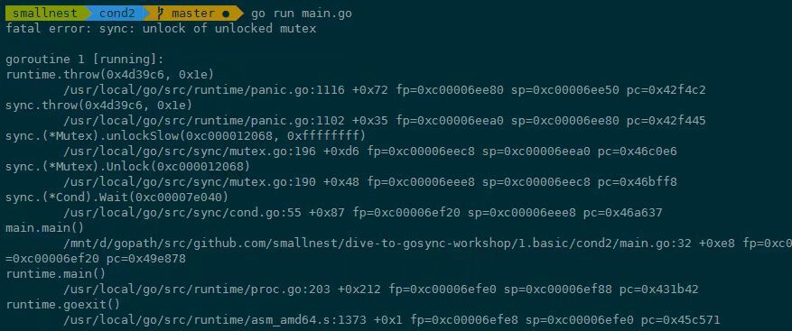

Go 标准库提供 Cond 原语的目的是，为**等待 / 通知**场景下的并发问题提供支持。Cond 通常应用于等待某个条件的一组 goroutine，等条件变为 true 的时候，其中一个 goroutine 或者所有的 goroutine 都会被唤醒执行。

顾名思义，Cond 是**和某个条件相关**，这个条件需要一组 goroutine 协作共同完成，在条件还没有满足的时候，所有等待这个条件的 goroutine 都会被阻塞住，只有这一组 goroutine 通过协作达到了这个条件，等待的 goroutine 才可能继续进行下去。

那这里等待的条件是什么呢？等待的条件，可以是某个变量达到了某个阈值或者某个时间点，也可以是一组变量分别都达到了某个阈值，还可以是某个对象的状态满足了特定的条件。总结来讲，**等待的条件是一种可以用来计算结果是 true 还是 false 的条件**。

从开发实践上，我们真正使用 Cond 的场景比较少，因为一旦遇到需要使用 Cond 的场景，我们更多地会使用 Channel 的方式，因为那才是更地道的 Go 语言的写法，甚至 Go 的开发者有个“把 Cond 从标准库移除”的提议（[issue 21165](https://github.com/golang/go/issues/21165)）。

# Cond 的基本用法

```go
type Cond struct {
	noCopy noCopy

	// L is held while observing or changing the condition
	L Locker

	notify  notifyList
	checker copyChecker
}

  func NeWCond(l Locker) *Cond
  func (c *Cond) Broadcast()
  func (c *Cond) Signal()
  func (c *Cond) Wait()
```

标准库中的 Cond 并发原语初始化的时候，需要关联一个 Locker 接口的实例，一般我们使用 Mutex 或者 RWMutex。

**Signal 方法**，允许调用者 Caller 唤醒一个等待此 Cond 的 goroutine。如果此时没有等待的 goroutine，显然无需通知 waiter；如果 Cond 等待队列中有一个或者多个等待的 goroutine，则需要从等待队列中移除第一个 goroutine 并把它唤醒。在其他编程语言中，比如 Java 语言中，Signal 方法也被叫做 notify 方法。

调用 Signal 方法时，不强求你一定要持有 c.L 的锁。

**Broadcast 方法**，允许调用者 Caller 唤醒所有等待此 Cond 的 goroutine。如果此时没有等待的 goroutine，显然无需通知 waiter；如果 Cond 等待队列中有一个或者多个等待的 goroutine，则清空所有等待的 goroutine，并全部唤醒。在其他编程语言中，比如 Java 语言中，Broadcast 方法也被叫做 notifyAll 方法。

同样地，调用 Broadcast 方法时，也不强求你一定持有 c.L 的锁。

**Wait 方法**，会把调用者 Caller 放入 Cond 的等待队列中并阻塞，直到被 Signal 或者 Broadcast 的方法从等待队列中移除并唤醒。

**调用 Wait 方法时必须要持有 c.L 的锁。**

我们通过一个百米赛跑开始时的例子，来学习下 Cond 的使用方法。10 个运动员进入赛场之后需要先做拉伸活动活动筋骨，向观众和粉丝招手致敬，在自己的赛道上做好准备；等所有的运动员都准备好之后，裁判员才会打响发令枪。每个运动员做好准备之后，将 ready 加一，表明自己做好准备了，同时调用 Broadcast 方法通知裁判员。因为裁判员只有一个，所以这里可以直接替换成 Signal 方法调用。调用 Broadcast 方法的时候，我们并没有请求 c.L 锁，只是在更改等待变量的时候才使用到了锁。裁判员会等待运动员都准备好（第 22 行）。虽然每个运动员准备好之后都唤醒了裁判员，但是裁判员被唤醒之后需要检查等待条件是否满足（运动员都准备好了）。可以看到，裁判员被唤醒之后一定要检查等待条件，如果条件不满足还是要继续等待。

```go
func main() {
    c := sync.NewCond(&sync.Mutex{})
    var ready int

    for i := 0; i < 10; i++ {
        go func(i int) {
            time.Sleep(time.Duration(rand.Int63n(10)) * time.Second)

            // 加锁更改等待条件
            c.L.Lock()
            ready++
            c.L.Unlock()

            log.Printf("运动员#%d 已准备就绪\n", i)
            // 广播唤醒所有的等待者
            c.Broadcast()
        }(i)
    }

    c.L.Lock()
    for ready != 10 {
        c.Wait()
        log.Println("裁判员被唤醒一次")
    }
    c.L.Unlock()

    //所有的运动员是否就绪
    log.Println("所有运动员都准备就绪。比赛开始，3，2，1, ......")
}
```

它的复杂在于：一，这段代码有时候需要加锁，有时候可以不加；二，Wait 唤醒后需要检查条件；三，等待条件的更改，其实是需要原子操作或者互斥锁保护的。

# Cond 的实现原理

```go
type Cond struct {
    noCopy noCopy

    // 当观察或者修改等待条件的时候需要加锁
    L Locker

    // 等待队列
    notify  notifyList
    checker copyChecker
}

func NewCond(l Locker) *Cond {
    return &Cond{L: l}
}

func (c *Cond) Wait() {
    c.checker.check()
    // 增加到等待队列中
    t := runtime_notifyListAdd(&c.notify)
    c.L.Unlock()
    // 阻塞休眠直到被唤醒
    runtime_notifyListWait(&c.notify, t)
    c.L.Lock()
}

func (c *Cond) Signal() {
    c.checker.check()
    runtime_notifyListNotifyOne(&c.notify)
}

func (c *Cond) Broadcast() {
    c.checker.check()
    runtime_notifyListNotifyAll(&c.notify）
}
```

runtime_notifyListXXX 是运行时实现的方法，实现了一个等待 / 通知的队列。如果你想深入学习这部分，可以再去看看 runtime/sema.go 代码中。

copyChecker 是一个辅助结构，可以在运行时检查 Cond 是否被复制使用。

Signal 和 Broadcast 只涉及到 notifyList 数据结构，不涉及到锁。

**Wait 把调用者加入到等待队列时会释放锁，在被唤醒之后还会请求锁。在阻塞休眠期间，调用者是不持有锁的，这样能让其他 goroutine 有机会检查或者更新等待变量。**


# 常见错误

## 调用 Wait 的时候没有加锁

在调用 cond.Wait 时，把前后的 Lock/Unlock 注释掉，如下面的代码中的第 20 行和第 25 行：

```go
func main() {
    c := sync.NewCond(&sync.Mutex{})
    var ready int

    for i := 0; i < 10; i++ {
        go func(i int) {
            time.Sleep(time.Duration(rand.Int63n(10)) * time.Second)

            // 加锁更改等待条件
            c.L.Lock()
            ready++
            c.L.Unlock()

            log.Printf("运动员#%d 已准备就绪\n", i)
            // 广播唤醒所有的等待者
            c.Broadcast()
        }(i)
    }

    // c.L.Lock()  第 20 行
    for ready != 10 {
        c.Wait()
        log.Println("裁判员被唤醒一次")
    }
    // c.L.Unlock()  第 25 行

    //所有的运动员是否就绪
    log.Println("所有运动员都准备就绪。比赛开始，3，2，1, ......")
}
```

再运行程序，就会报释放未加锁的 panic：



出现这个问题的原因在于，cond.Wait 方法的实现是，把当前调用者加入到 notify 队列之中后会释放锁（如果不释放锁，其他 Wait 的调用者就没有机会加入到 notify 队列中了），然后一直等待；等调用者被唤醒之后，又会去争抢这把锁。如果调用 Wait 之前不加锁的话，就有可能 Unlock 一个未加锁的 Locker。所以切记，**调用 cond.Wait 方法之前一定要加锁。**

## 只调用了一次 Wait

使用 Cond 的另一个常见错误是，只调用了一次 Wait，没有检查等待条件是否满足，结果条件没满足，程序就继续执行了。出现这个问题的原因在于，误以为 Cond 的使用，就像 WaitGroup 那样调用一下 Wait 方法等待那么简单。比如下面的代码中，把第 21 行和第 24 行注释掉：

```go
func main() {
    c := sync.NewCond(&sync.Mutex{})
    var ready int

    for i := 0; i < 10; i++ {
        go func(i int) {
            time.Sleep(time.Duration(rand.Int63n(10)) * time.Second)

            // 加锁更改等待条件
            c.L.Lock()
            ready++
            c.L.Unlock()

            log.Printf("运动员#%d 已准备就绪\n", i)
            // 广播唤醒所有的等待者
            c.Broadcast()
        }(i)
    }

    c.L.Lock()
    // for ready != 10 {  第 21 行
    c.Wait()
    log.Println("裁判员被唤醒一次")
    // }  第 24 行
    c.L.Unlock()

    //所有的运动员是否就绪
    log.Println("所有运动员都准备就绪。比赛开始，3，2，1, ......")
}
```

运行这个程序，你会发现，可能只有几个运动员准备好之后程序就运行完了，而不是我们期望的所有运动员都准备好才进行下一步。原因在于，每一个运动员准备好之后都会唤醒所有的等待者，也就是这里的裁判员，比如第一个运动员准备好后就唤醒了裁判员，结果这个裁判员傻傻地没做任何检查，以为所有的运动员都准备好了，就继续执行了。

所以，我们一定要记住，**waiter goroutine 被唤醒不等于等待条件被满足**，只是有 goroutine 把它唤醒了而已，等待条件有可能已经满足了，也有可能不满足，我们需要进一步检查。你也可以理解为，等待者被唤醒，只是得到了一次检查的机会而已。

到这里，我们小结下。如果你想在使用 Cond 的时候避免犯错，只要时刻记住**调用 cond.Wait 方法之前一定要加锁，以及 waiter goroutine 被唤醒不等于等待条件被满足**这两个知识点。


## 

https://stackoverflow.com/questions/36857167/how-to-correctly-use-sync-cond

# 总结

Cond 的使用场景很少。先前的标准库内部有几个地方使用了 Cond，比如 io/pipe.go 等，后来都被其他的并发原语（比如 Channel）替换了，sync.Cond 的路越走越窄。但是，还是有一批忠实的“粉丝”坚持在使用 Cond，原因在于 Cond 有三点特性是 Channel 无法替代的：

+ Cond 和一个 Locker 关联，可以利用这个 Locker 对相关的依赖条件更改提供保护。
+ Cond 可以同时支持 Signal 和 Broadcast 方法，而 Channel 只能同时支持其中一种。
+ Cond 的 Broadcast 方法可以被重复调用。等待条件再次变成不满足的状态后，我们又可以调用 Broadcast 再次唤醒等待的 goroutine。这也是 Channel 不能支持的，Channel 被 close 掉了之后不支持再 open。