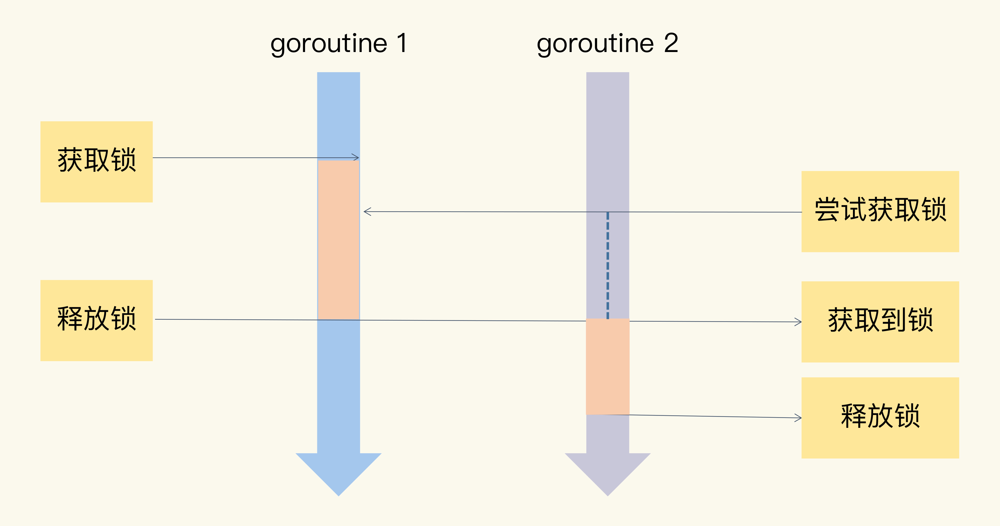
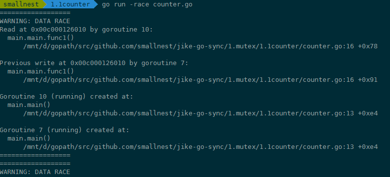
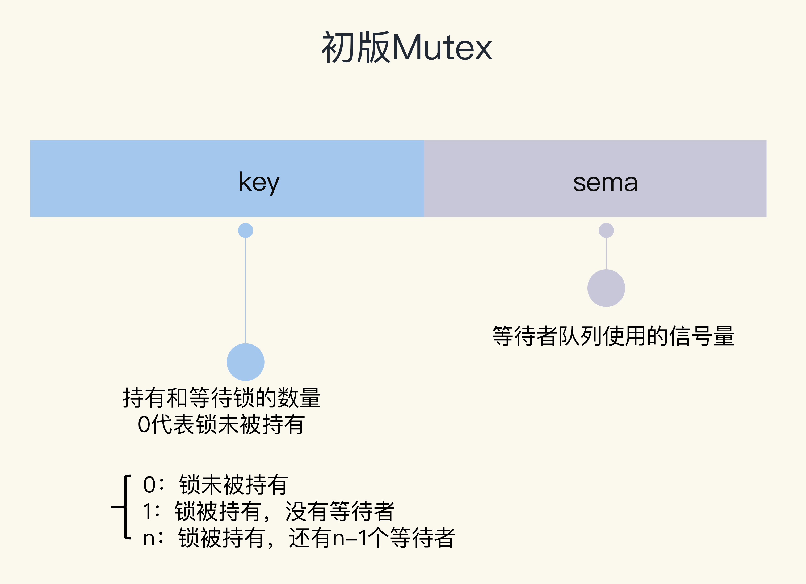
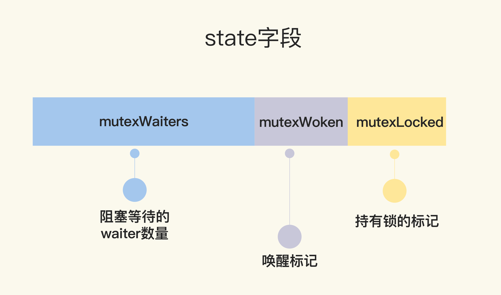
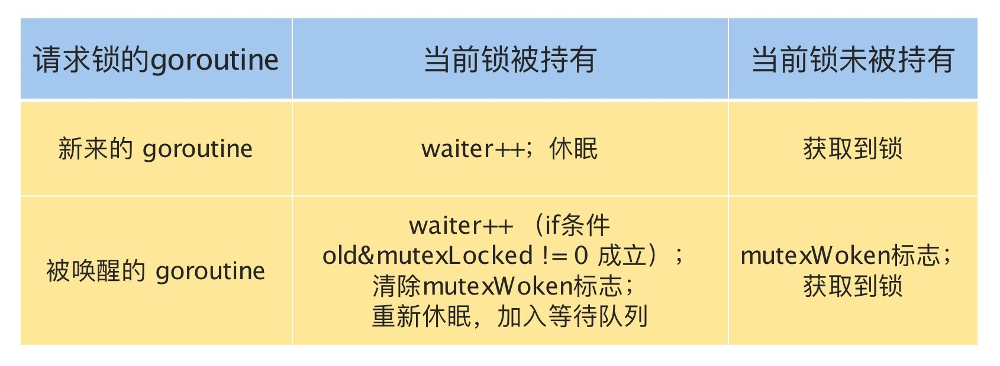
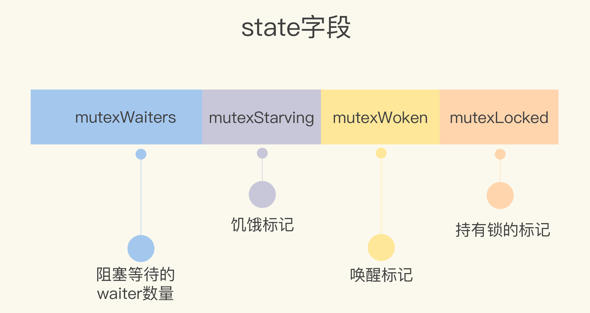
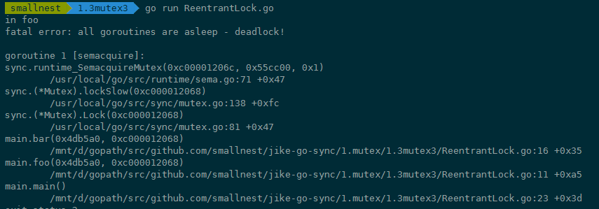
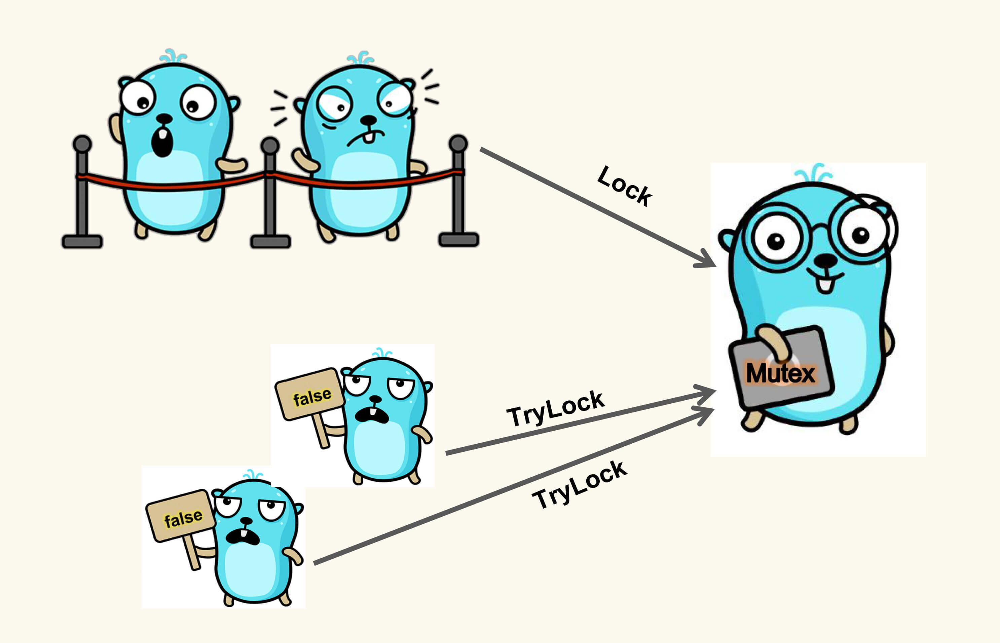
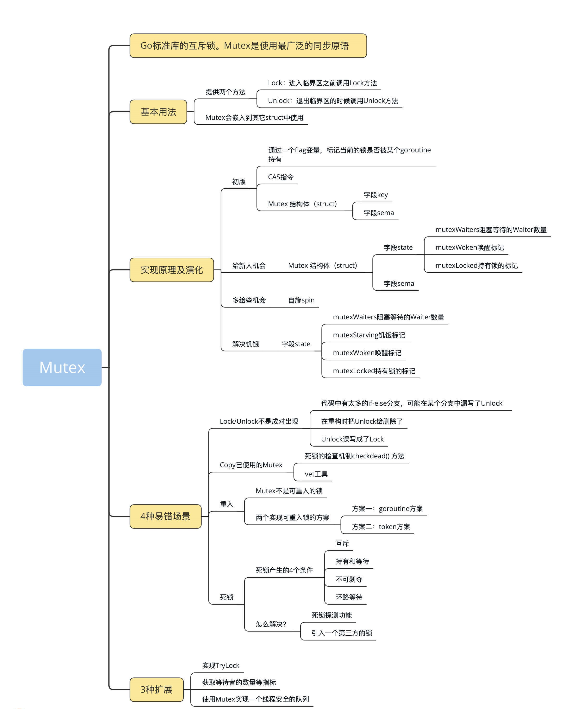

# 互斥锁的实现机制

在并发编程中，如果程序中的一部分会被并发访问或修改，那么，为了避免并发访问导致的意想不到的结果，这部分程序需要被保护起来，这部分被保护起来的**程序**，就叫做**临界区**。

可以说，临界区就是一个被共享的资源，或者说是一个整体的一组共享资源，比如对数据库的访问、对某一个共享数据结构的操作、对一个 I/O 设备的使用、对一个连接池中的连接的调用，等等。

如果很多线程同步访问临界区，就会造成访问或操作错误，这当然不是我们希望看到的结果。所以，我们可以**使用互斥锁，限定临界区只能同时由一个线程持有**。

当临界区由一个线程持有的时候，其它线程如果想进入这个临界区，就会返回失败，或者是等待。直到持有的线程退出临界区，这些等待线程中的某一个才有机会接着持有这个临界区。

当临界区由一个线程持有的时候，其它线程如果想进入这个临界区，就会返回失败，或者是等待。直到持有的线程退出临界区，这些等待线程中的某一个才有机会接着持有这个临界区。




+ **共享资源。并发地读写共享资源，会出现数据竞争（data race）的问题，所以需要 Mutex、RWMutex 这样的并发原语来保护。**
+ **任务编排。需要 goroutine 按照一定的规律执行，而 goroutine 之间有相互等待或者依赖的顺序关系，我们常常使用 WaitGroup 或者 Channel 来实现。**
+ **消息传递。信息交流以及不同的 goroutine 之间的线程安全的数据交流，常常使用 Channel 来实现。**


# Mutex 的基本使用方法

在 Go 的标准库中，package sync 提供了锁相关的一系列同步原语，这个 package 还定义了一个 Locker 的接口，Mutex 就实现了这个接口。

Locker 的接口定义了锁同步原语的方法集：

```go
// A Locker represents an object that can be locked and unlocked.
type Locker interface {
	Lock()
	Unlock()
}
```

这个接口在实际项目应用得不多，因为我们一般会直接使用具体的同步原语，而不是通过接口。

**互斥锁 Mutex 就提供两个方法 Lock 和 Unlock：进入临界区之前调用 Lock 方法，退出临界区的时候调用 Unlock 方法**

```go
  func(m *Mutex)Lock()
  func(m *Mutex)Unlock()
```

**当一个 goroutine 通过调用 Lock 方法获得了这个锁的拥有权后， 其它请求锁的 goroutine 就会阻塞在 Lock 方法的调用上，直到锁被释放并且自己获取到了这个锁的拥有权。**

在这个例子中，我们创建了 10 个 goroutine，同时不断地对一个变量（count）进行加 1 操作，每个 goroutine 负责执行 10 万次的加 1 操作，我们期望的最后计数的结果是 10 * 100000 = 1000000 (一百万)。

```go
 import (
        "fmt"
        "sync"
    )
    
    func main() {
        var count = 0
        // 使用WaitGroup等待10个goroutine完成
        var wg sync.WaitGroup
        wg.Add(10)
        for i := 0; i < 10; i++ {
            go func() {
                defer wg.Done()
                // 对变量count执行10次加1
                for j := 0; j < 100000; j++ {
                    count++
                }
            }()
        }
        // 等待10个goroutine完成
        wg.Wait()
        fmt.Println(count)
    }

```

但是，每次运行，你都可能得到不同的结果，基本上不会得到理想中的一百万的结果。

这是因为，count++ 不是一个原子操作，它至少包含几个步骤，比如读取变量 count 的当前值，对这个值加 1，把结果再保存到 count 中。因为不是原子操作，就可能有并发的问题。

比如，10 个 goroutine 同时读取到 count 的值为 9527，接着各自按照自己的逻辑加 1，值变成了 9528，然后把这个结果再写回到 count 变量。但是，实际上，此时我们增加的总数应该是 10 才对，这里却只增加了 1，好多计数都被“吞”掉了。这是并发访问共享数据的常见错误。

```go
 // count++操作的汇编代码
    MOVQ    "".count(SB), AX
    LEAQ    1(AX), CX
    MOVQ    CX, "".count(SB)
```

Go 提供了一个检测并发访问共享资源是否有问题的工具： [race detector](https://go.dev/blog/race-detector)，它可以帮助我们自动发现程序有没有 data race 的问题。

Go race detector 是基于 Google 的 C/C++ [sanitizers](https://github.com/google/sanitizers) 技术实现的，编译器通过探测所有的内存访问，加入代码能监视对这些内存地址的访问（读还是写）。在代码运行的时候，race detector 就能监控到对共享变量的非同步访问，出现 race 的时候，就会打印出警告信息。

**在编译（compile）、测试（test）或者运行（run）Go 代码的时候，加上 race 参数，就有可能发现并发问题。**比如在上面的例子中，我们可以加上 race 参数运行，检测一下是不是有并发问题。如果你 go run -race counter.go，就会输出警告信息。



这个警告不但会告诉你有并发问题，而且还会告诉你哪个 goroutine 在哪一行对哪个变量有写操作，同时，哪个 goroutine 在哪一行对哪个变量有读操作，就是这些并发的读写访问，引起了 data race。

例子中的 goroutine 10 对内存地址 0x00c000126010 有读的操作（counter.go 文件第 16 行），同时，goroutine 7 对内存地址 0x00c000126010 有写的操作（counter.go 文件第 16 行）。而且还可能有多个 goroutine 在同时进行读写，所以，警告信息可能会很长。

虽然这个工具使用起来很方便，但是，因为它的实现方式，**只能通过真正对实际地址进行读写访问的时候才能探测**，所以它并不能在编译的时候发现 data race 的问题。而且，在运行的时候，只有在触发了 data race 之后，才能检测到，如果碰巧没有触发（比如一个 data race 问题只能在 2 月 14 号零点或者 11 月 11 号零点才出现），是检测不出来的。

而且，把开启了 race 的程序部署在线上，还是比较影响性能的。运行 go tool compile -race -S counter.go，可以查看计数器例子的代码，重点关注一下 count++ 前后的编译后的代码：

```bash
0x002a 00042 (counter.go:13)    CALL    runtime.racefuncenter(SB)
       ......
        0x0061 00097 (counter.go:14)    JMP     173
        0x0063 00099 (counter.go:15)    MOVQ    AX, "".j+8(SP)
        0x0068 00104 (counter.go:16)    PCDATA  $0, $1
        0x0068 00104 (counter.go:16)    MOVQ    "".&count+128(SP), AX
        0x0070 00112 (counter.go:16)    PCDATA  $0, $0
        0x0070 00112 (counter.go:16)    MOVQ    AX, (SP)
        0x0074 00116 (counter.go:16)    CALL    runtime.raceread(SB)
        0x0079 00121 (counter.go:16)    PCDATA  $0, $1
        0x0079 00121 (counter.go:16)    MOVQ    "".&count+128(SP), AX
        0x0081 00129 (counter.go:16)    MOVQ    (AX), CX
        0x0084 00132 (counter.go:16)    MOVQ    CX, ""..autotmp_8+16(SP)
        0x0089 00137 (counter.go:16)    PCDATA  $0, $0
        0x0089 00137 (counter.go:16)    MOVQ    AX, (SP)
        0x008d 00141 (counter.go:16)    CALL    runtime.racewrite(SB)
        0x0092 00146 (counter.go:16)    MOVQ    ""..autotmp_8+16(SP), AX
       ......
        0x00b6 00182 (counter.go:18)    CALL    runtime.deferreturn(SB)
        0x00bb 00187 (counter.go:18)    CALL    runtime.racefuncexit(SB)
        0x00c0 00192 (counter.go:18)    MOVQ    104(SP), BP
        0x00c5 00197 (counter.go:18)    ADDQ    $112, SP
```

在编译的代码中，增加了 runtime.racefuncenter、runtime.raceread、runtime.racewrite、runtime.racefuncexit 等检测 data race 的方法。通过这些插入的指令，Go race detector 工具就能够成功地检测出 data race 问题了。

总结一下，**通过在编译的时候插入一些指令，在运行时通过这些插入的指令检测并发读写从而发现 data race 问题，就是这个工具的实现机制。**

我们知道，这里的共享资源是 count 变量，临界区是 count++，只要在临界区前面获取锁，在离开临界区的时候释放锁，就能完美地解决 data race 的问题了。

```go
package main
    import (
        "fmt"
        "sync"
    )
    func main() {
        // 互斥锁保护计数器
        var mu sync.Mutex
        // 计数器的值
        var count = 0
        
        // 辅助变量，用来确认所有的goroutine都完成
        var wg sync.WaitGroup
        wg.Add(10)

        // 启动10个gourontine
        for i := 0; i < 10; i++ {
            go func() {
                defer wg.Done()
                // 累加10万次
                for j := 0; j < 100000; j++ {
                    mu.Lock()
                    count++
                    mu.Unlock()
                }
            }()
        }
        wg.Wait()
        fmt.Println(count)
    }
```

这里有一点需要注意：**Mutex 的零值是还没有 goroutine 等待的未加锁的状态，所以你不需要额外的初始化**，直接声明变量（如 var mu sync.Mutex）即可。

很多情况下，**Mutex 会嵌入到其它 struct 中使用**，比如下面的方式：

```go
type Counter struct {
    mu    sync.Mutex
    Count uint64
}
```

**在初始化嵌入的 struct 时，也不必初始化这个 Mutex 字段，不会因为没有初始化出现空指针或者是无法获取到锁的情况。**

有时候，我们还可以**采用嵌入字段的方式**。通过嵌入字段，你可以在这个 struct 上直接调用 Lock/Unlock 方法。

```go

func main() {
    var counter Counter
    var wg sync.WaitGroup
    wg.Add(10)
    for i := 0; i < 10; i++ {
        go func() {
            defer wg.Done()
            for j := 0; j < 100000; j++ {
                counter.Lock()
                counter.Count++
                counter.Unlock()
            }
        }()
    }
    wg.Wait()
    fmt.Println(counter.Count)
}


type Counter struct {
    sync.Mutex
    Count uint64
}
```

**如果嵌入的 struct 有多个字段，我们一般会把 Mutex 放在要控制的字段上面，然后使用空格把字段分隔开来。**即使你不这样做，代码也可以正常编译，只不过，用这种风格去写的话，逻辑会更清晰，也更易于维护。

甚至，你还可以把**获取锁、释放锁、计数加一的逻辑封装成一个方法**，对外不需要暴露锁等逻辑：

```go

func main() {
    // 封装好的计数器
    var counter Counter

    var wg sync.WaitGroup
    wg.Add(10)

    // 启动10个goroutine
    for i := 0; i < 10; i++ {
        go func() {
            defer wg.Done()
            // 执行10万次累加
            for j := 0; j < 100000; j++ {
                counter.Incr() // 受到锁保护的方法
            }
        }()
    }
    wg.Wait()
    fmt.Println(counter.Count())
}

// 线程安全的计数器类型
type Counter struct {
    CounterType int
    Name        string

    mu    sync.Mutex
    count uint64
}

// 加1的方法，内部使用互斥锁保护
func (c *Counter) Incr() {
    c.mu.Lock()
    c.count++
    c.mu.Unlock()
}

// 得到计数器的值，也需要锁保护
func (c *Counter) Count() uint64 {
    c.mu.Lock()
    defer c.mu.Unlock()
    return c.count
}
```


# Mutex 实现

“初版”的 Mutex 使用一个 flag 来表示锁是否被持有，实现比较简单；后来照顾到新来的 goroutine，所以会让新的 goroutine 也尽可能地先获取到锁，这是第二个阶段，我把它叫作“给新人机会”；那么，接下来就是第三阶段“多给些机会”，照顾新来的和被唤醒的 goroutine；但是这样会带来饥饿问题，所以目前又加入了饥饿的解决方案，也就是第四阶段“解决饥饿”。


## 初版的互斥锁

可以通过一个 flag 变量，标记当前的锁是否被某个 goroutine 持有。如果这个 flag 的值是 1，就代表锁已经被持有，那么，其它竞争的 goroutine 只能等待；如果这个 flag 的值是 0，就可以通过 CAS（compare-and-swap，或者 compare-and-set）将这个 flag 设置为 1，标识锁被当前的这个 goroutine 持有了。

```go

   // CAS操作，当时还没有抽象出atomic包
    func cas(val *int32, old, new int32) bool
    func semacquire(*int32)
    func semrelease(*int32)
    // 互斥锁的结构，包含两个字段
    type Mutex struct {
        key  int32 // 锁是否被持有的标识
        sema int32 // 信号量专用，用以阻塞/唤醒goroutine
    }
    
    // 保证成功在val上增加delta的值
    func xadd(val *int32, delta int32) (new int32) {
        for {
            v := *val
            if cas(val, v, v+delta) {
                return v + delta
            }
        }
        panic("unreached")
    }
    
    // 请求锁
    func (m *Mutex) Lock() {
        if xadd(&m.key, 1) == 1 { //标识加1，如果等于1，成功获取到锁 （第24行）
            return
        }
        semacquire(&m.sema) // 否则阻塞等待 （第27行）
    }
    
    func (m *Mutex) Unlock() {
        if xadd(&m.key, -1) == 0 { // 将标识减去1，如果等于0，则没有其它等待者 （第31行）
            return
        }
        semrelease(&m.sema) // 唤醒其它阻塞的goroutine （第34行）
    }    
```

CAS 指令将**给定的值**和**一个内存地址中的值**进行比较，如果它们是同一个值，就使用新值替换内存地址中的值，这个操作是原子性的。那啥是原子性呢？如果你还不太理解这个概念，那么在这里只需要明确一点就行了，那就是**原子性保证这个指令总是基于最新的值进行计算，如果同时有其它线程已经修改了这个值，那么，CAS 会返回失败**。

> CAS有三个操作数：内存值val、预期值old、要修改的值new，当且仅当预期值old和内存值val相同时，才将内存值修改为new，否则什么都不做。最后返回现在的val值。用大白话说就是：我认为val的值应该是old，如果是的话那我就把它改成new，如果不是old（说明被别人修改过了），那我就不修改了。

Mutex 结构体包含两个字段：

+ 字段 key：是一个 flag，用来标识这个排外锁是否被某个 goroutine 所持有，如果 key 大于等于 1，说明这个排外锁已经被持有；
+ 字段 sema：是个信号量变量，用来控制等待 goroutine 的阻塞休眠和唤醒。



调用 Lock 请求锁的时候，通过 xadd 方法进行 CAS 操作（第24行），xadd 方法通过循环执行 CAS 操作直到成功，保证对 key 加 1 的操作成功完成。如果比较幸运，锁没有被别的 goroutine 持有，那么，Lock 方法成功地将 key 设置为 1，这个 goroutine 就持有了这个锁；如果锁已经被别的 goroutine 持有了，那么，当前的 goroutine 会把 key 加 1，而且还会调用 semacquire 方法（第27行），**使用信号量将自己休眠**，等锁释放的时候，信号量会将它唤醒。

> TODO：信号量

持有锁的 goroutine 调用 Unlock 释放锁时，它会将 key 减 1（第31行）。如果当前没有其它等待这个锁的 goroutine，这个方法就返回了。但是，如果还有等待此锁的其它 goroutine，那么，它会调用 semrelease 方法（第34行），利用信号量唤醒等待锁的其它 goroutine 中的一个。

**初版的 Mutex 利用 CAS 原子操作，对 key 这个标志量进行设置。key 不仅仅标识了锁是否被 goroutine 所持有，还记录了当前持有和等待获取锁的 goroutine 的数量。**

**Unlock 方法可以被任意的 goroutine 调用释放锁，即使是没持有这个互斥锁的 goroutine，也可以进行这个操作。这是因为，Mutex 本身并没有包含持有这把锁的 goroutine 的信息，所以，Unlock 也不会对此进行检查。Mutex 的这个设计一直保持至今。**

这就带来了一个有趣而危险的功能。为什么这么说呢？

你看，其它 goroutine 可以强制释放锁，这是一个非常危险的操作，因为在临界区的 goroutine 可能不知道锁已经被释放了，还会继续执行临界区的业务操作，这可能会带来意想不到的结果，因为这个 goroutine 还以为自己持有锁呢，有可能导致 data race 问题。

所以，我们在使用 Mutex 的时候，必须要保证 goroutine 尽可能**不去释放自己未持有的锁**，一定要遵循“**谁申请，谁释放**”的原则。在真实的实践中，我们使用互斥锁的时候，很少在一个方法中单独申请锁，而在另外一个方法中单独释放锁，**一般都会在同一个方法中获取锁和释放锁**。

但是，初版的 Mutex 实现有一个问题：请求锁的 goroutine 会**排队等待**获取互斥锁。虽然这貌似很公平，但是从性能上来看，却不是最优的。因为如果我们能够**把锁交给正在占用 CPU 时间片的 goroutine 的话**，那就不需要做上下文的切换，在高并发的情况下，可能会有更好的性能。

## 给新人机会

```go

   type Mutex struct {
        state int32
        sema  uint32
    }


    const (
        mutexLocked = 1 << iota // mutex is locked
        mutexWoken
        mutexWaiterShift = iota
    )
```

虽然 Mutex 结构体还是包含两个字段，但是第一个字段已经改成了 state，它的含义也不一样了。



state 是一个复合型的字段，一个字段包含多个意义，这样可以通过尽可能少的内存来实现互斥锁。这个字段的第一位（最小的一位）来表示这个锁是否被持有，第二位代表是否有唤醒的 goroutine，剩余的位数代表的是等待此锁的 goroutine 数。所以，state 这一个字段被分成了三部分，代表三个数据。

请求锁的方法 Lock 也变得复杂了。复杂之处不仅仅在于对字段 state 的操作难以理解，而且代码逻辑也变得相当复杂。

```go

   func (m *Mutex) Lock() {
        // Fast path: 幸运case，能够直接获取到锁
        if atomic.CompareAndSwapInt32(&m.state, 0, mutexLocked) { //（第3行）
            return
        }

        awoke := false
        for {
            old := m.state
            new := old | mutexLocked // 新状态加锁 （第10行）
            if old&mutexLocked != 0 {
                new = old + 1<<mutexWaiterShift //等待者数量加一
            }
            if awoke {
                // goroutine是被唤醒的，
                // 新状态清除唤醒标志
                new &^= mutexWoken
            }
            if atomic.CompareAndSwapInt32(&m.state, old, new) {//设置新状态 （第19行）
                if old&mutexLocked == 0 { // 锁原状态未加锁 （第20行）
                    break
                }
                runtime.Semacquire(&m.sema) // 请求信号量
                awoke = true
            }
        }
    }
```

首先是通过 CAS 检测 state 字段中的标志（第3行），如果没有 goroutine 持有锁，也没有等待持有锁的 gorutine，那么，当前的 goroutine 就很幸运，可以直接获得锁，这也是注释中的 Fast path 的意思。

如果不够幸运，state 不是零值，那么就通过一个循环进行检查。接下来的这段代码虽然只有几行，但是理解起来却要费一番功夫，因为涉及到对 state 不同标志位的操作。这里的位操作以及操作后的结果和数值比较，并没有明确的解释，有时候你需要根据后续的处理进行推断。所以说，如果你充分理解了这段代码，那么对最新版的 Mutex 也会比较容易掌握了，因为你已经清楚了这些位操作的含义。

我们先前知道，如果想要获取锁的 goroutine 没有机会获取到锁，就会进行休眠，但是在锁释放唤醒之后，它并不能像先前一样直接获取到锁（初版是FIFO队列，所以早前休眠的在初版的设计中可以优先拿到锁），还是要和正在请求锁的 goroutine 进行竞争。这会给后来请求锁的 goroutine 一个机会，也让 CPU 中正在执行的 goroutine 有更多的机会获取到锁，在一定程度上提高了程序的性能。

for 循环是不断尝试获取锁，如果获取不到，就通过 runtime.Semacquire(&m.sema) 休眠，休眠醒来之后 awoke 置为 true，尝试争抢锁。

代码中的第 10 行将当前的 flag 设置为加锁状态，如果能成功地通过 CAS 把这个新值赋予 state（第 19 行和第 20 行），就代表抢夺锁的操作成功了。

不过，需要注意的是，如果成功地设置了 state 的值，但是之前的 state 是有锁的状态，那么，state 只是清除 mutexWoken 标志或者增加一个 waiter 而已。

请求锁的 goroutine 有两类，一类是新来请求锁的 goroutine，另一类是被唤醒的等待请求锁的 goroutine。锁的状态也有两种：加锁和未加锁。我用一张表格，来说明一下 goroutine 不同来源不同状态下的处理逻辑。



刚刚说的都是获取锁，接下来，我们再来看看释放锁。释放锁的 Unlock 方法也有些复杂，我们来看一下。

```go

   func (m *Mutex) Unlock() {
        // Fast path: drop lock bit.
       new := atomic.AddInt32(&m.state, -mutexLocked) //去掉锁标志 （第3行）
        if (new+mutexLocked)&mutexLocked == 0 { //本来就没有加锁
            panic("sync: unlock of unlocked mutex")
        }
    
        old := new
        for {
            if old>>mutexWaiterShift == 0 || old&(mutexLocked|mutexWoken) != 0 { // 没有等待者，或者有唤醒的waiter，或者锁原来已加锁
                return
            }
            new = (old - 1<<mutexWaiterShift) | mutexWoken // 新状态，准备唤醒goroutine，并设置唤醒标志
            if atomic.CompareAndSwapInt32(&m.state, old, new) {
                runtime.Semrelease(&m.sema)
                return
            }
            old = m.state
        }
    }
```

第 3 行是尝试将持有锁的标识设置为未加锁的状态，这是通过减 1 而不是将标志位置零的方式实现。第 4 到 6 行还会检测原来锁的状态是否已经未加锁的状态，如果是 Unlock 一个未加锁的 Mutex 会直接 panic。

不过，即使将加锁置为未加锁的状态，这个方法也不能直接返回，还需要一些额外的操作，因为还可能有一些等待这个锁的 goroutine（有时候我也把它们称之为 waiter）需要通过信号量的方式唤醒它们中的一个。所以接下来的逻辑有两种情况。

第一种情况，如果没有其它的 waiter，说明对这个锁的竞争的 goroutine 只有一个，那就可以直接返回了；如果这个时候有唤醒的 goroutine，或者是又被别人加了锁，那么，无需我们操劳，其它 goroutine 自己干得都很好，当前的这个 goroutine 就可以放心返回了。

第二种情况，如果有等待者，并且没有唤醒的 waiter，那就需要唤醒一个等待的 waiter。在唤醒之前，需要将 waiter 数量减 1，并且将 mutexWoken 标志设置上，这样，Unlock 就可以返回了。

通过这样复杂的检查、判断和设置，我们就可以安全地将一把互斥锁释放了。

**相对于初版的设计，这次的改动主要就是，新来的 goroutine 也有机会先获取到锁，甚至一个 goroutine 可能连续获取到锁，打破了先来先得的逻辑。但是，代码复杂度也显而易见。**

## 多给些机会

在 2015 年 2 月的改动中，**如果新来的 goroutine 或者是被唤醒的 goroutine 首次获取不到锁，它们就会通过自旋（spin，通过循环不断尝试，spin 的逻辑是在 [runtime](https://github.com/golang/go/blob/846dce9d05f19a1f53465e62a304dea21b99f910/src/runtime/proc.go#L5580) 实现的）的方式，尝试检查锁是否被释放。在尝试一定的自旋次数后，再执行原来的逻辑**。

```go

   func (m *Mutex) Lock() {
        // Fast path: 幸运之路，正好获取到锁
        if atomic.CompareAndSwapInt32(&m.state, 0, mutexLocked) {
            return
        }

        awoke := false
        iter := 0
        for { // 不管是新来的请求锁的goroutine, 还是被唤醒的goroutine，都不断尝试请求锁 （第9行）
            old := m.state // 先保存当前锁的状态
            new := old | mutexLocked // 新状态设置加锁标志
            if old&mutexLocked != 0 { // 锁还没被释放
                if runtime_canSpin(iter) { // 还可以自旋   （第13行）
                    if !awoke && old&mutexWoken == 0 && old>>mutexWaiterShift != 0 &&
                        atomic.CompareAndSwapInt32(&m.state, old, old|mutexWoken) {
                        awoke = true
                    }
                    runtime_doSpin()
                    iter++
                    continue // 自旋，再次尝试请求锁
                }  // （第21行）
                new = old + 1<<mutexWaiterShift
            }
            if awoke { // 唤醒状态
                if new&mutexWoken == 0 {
                    panic("sync: inconsistent mutex state")
                }
                new &^= mutexWoken // 新状态清除唤醒标记
            }
            if atomic.CompareAndSwapInt32(&m.state, old, new) {
                if old&mutexLocked == 0 { // 旧状态锁已释放，新状态成功持有了锁，直接返回
                    break
                }
                runtime_Semacquire(&m.sema) // 阻塞等待
                awoke = true // 被唤醒
                iter = 0
            }
        }
    }
```

这次的优化，增加了第 13 行到 21 行、第 25 行到第 27 行以及第 36 行。

如果可以 spin 的话，第 9 行的 for 循环会重新检查锁是否释放。对于**临界区代码执行非常短**的场景来说，这是一个非常好的优化。因为临界区的代码耗时很短，锁很快就能释放，而抢夺锁的 goroutine 不用通过休眠唤醒方式等待调度，直接 spin 几次，可能就获得了锁。

## 解决饥饿

新来的 goroutine 也参与竞争，有可能每次都会被新来的 goroutine 抢到获取锁的机会，在极端情况下，等待中的 goroutine 可能会一直获取不到锁，这就是饥饿问题。

2016 年 Go 1.9 中 Mutex 增加了饥饿模式，让锁变得更公平，不公平的等待时间限制在 1 毫秒，并且修复了一个大 Bug：总是把唤醒的 goroutine 放在等待队列的尾部，会导致更加不公平的等待时间。

2018 年，Go 开发者将 fast path 和 slow path 拆成独立的方法，以便内联，提高性能。2019 年也有一个 Mutex 的优化，虽然没有对 Mutex 做修改，但是，对于 Mutex 唤醒后持有锁的那个 waiter，调度器可以有更高的优先级去执行，这已经是很细致的性能优化了。

现在的 Mutex 代码已经复杂得接近不可读的状态了，而且代码也非常长，删减后占了几乎三页纸。



**Mutex 绝不容忍一个 goroutine 被落下，永远没有机会获取锁。不抛弃不放弃是它的宗旨，而且它也尽可能地让等待较长的 goroutine 更有机会获取到锁。**

```go

   type Mutex struct {
        state int32
        sema  uint32
    }
    
    const (
        mutexLocked = 1 << iota // mutex is locked
        mutexWoken
        mutexStarving // 从state字段中分出一个饥饿标记  （第9行）
        mutexWaiterShift = iota
    
        starvationThresholdNs = 1e6 // （第12行）
    )
    
func (m *Mutex) Lock() {  // （第15行）
        // Fast path: 幸运之路，一下就获取到了锁
        if atomic.CompareAndSwapInt32(&m.state, 0, mutexLocked) {
            return
        }
        // Slow path：缓慢之路，尝试自旋竞争或饥饿状态下饥饿goroutine竞争
        m.lockSlow()
    }
    
    func (m *Mutex) lockSlow() {  // （第24行）
        var waitStartTime int64
        starving := false // 此goroutine的饥饿标记
        awoke := false // 唤醒标记
        iter := 0 // 自旋次数
        old := m.state // 当前的锁的状态
        for {  //  （第30行）
            // 锁是非饥饿状态，锁还没被释放，尝试自旋
            if old&(mutexLocked|mutexStarving) == mutexLocked && runtime_canSpin(iter) {
                if !awoke && old&mutexWoken == 0 && old>>mutexWaiterShift != 0 &&
                    atomic.CompareAndSwapInt32(&m.state, old, old|mutexWoken) {
                    awoke = true
                }
                runtime_doSpin()
                iter++
                old = m.state // 再次获取锁的状态，之后会检查是否锁被释放了
                continue
            }
            new := old    // （第42行）
            if old&mutexStarving == 0 {
                new |= mutexLocked // 非饥饿状态，加锁
            }
            if old&(mutexLocked|mutexStarving) != 0 {
                new += 1 << mutexWaiterShift // waiter数量加1
            }
            if starving && old&mutexLocked != 0 {
                new |= mutexStarving // 设置饥饿状态
            }
            if awoke {    // （第52行）
                if new&mutexWoken == 0 {
                    throw("sync: inconsistent mutex state")
                }
                new &^= mutexWoken // 新状态清除唤醒标记
            }
            // 成功设置新状态     （第58行）
            if atomic.CompareAndSwapInt32(&m.state, old, new) {
                // 原来锁的状态已释放，并且不是饥饿状态，正常请求到了锁，返回
                if old&(mutexLocked|mutexStarving) == 0 {
                    break // locked the mutex with CAS
                }
                // 处理饥饿状态

                // 如果以前就在队列里面，加入到队列头
                queueLifo := waitStartTime != 0    // （第67行）
                if waitStartTime == 0 {
                    waitStartTime = runtime_nanotime()
                }
                // 阻塞等待
                runtime_SemacquireMutex(&m.sema, queueLifo, 1)
                // 唤醒之后检查锁是否应该处于饥饿状态   //  （第73行）
                starving = starving || runtime_nanotime()-waitStartTime > starvationThresholdNs
                old = m.state
                // 如果锁已经处于饥饿状态，直接抢到锁，返回   （第76行）
                if old&mutexStarving != 0 {
                    if old&(mutexLocked|mutexWoken) != 0 || old>>mutexWaiterShift == 0 {
                        throw("sync: inconsistent mutex state")
                    }
                    // 有点绕，加锁并且将waiter数减1  （第81行）
                    delta := int32(mutexLocked - 1<<mutexWaiterShift)
                    if !starving || old>>mutexWaiterShift == 1 {
                        delta -= mutexStarving // 最后一个waiter或者已经不饥饿了，清除饥饿标记
                    }
                    atomic.AddInt32(&m.state, delta)
                    break
                }
                awoke = true
                iter = 0
            } else {
                old = m.state
            }
        }
    }
    
    func (m *Mutex) Unlock() {    //  （第97行）
        // Fast path: drop lock bit.
        new := atomic.AddInt32(&m.state, -mutexLocked)
        if new != 0 {
            m.unlockSlow(new)
        }
    }
    
    func (m *Mutex) unlockSlow(new int32) {   // （第105行）
        if (new+mutexLocked)&mutexLocked == 0 {
            throw("sync: unlock of unlocked mutex")
        }
        if new&mutexStarving == 0 {  // （第109行）
            old := new
            for {
                if old>>mutexWaiterShift == 0 || old&(mutexLocked|mutexWoken|mutexStarving) != 0 {
                    return
                }
                new = (old - 1<<mutexWaiterShift) | mutexWoken
                if atomic.CompareAndSwapInt32(&m.state, old, new) {
                    runtime_Semrelease(&m.sema, false, 1)
                    return
                }
                old = m.state   // （第120行）
            }
        } else {
            runtime_Semrelease(&m.sema, true, 1)
        }
    }
```

第 12 行将饥饿模式的最大等待时间阈值设置成了 1 毫秒，这就意味着，一旦等待者等待的时间超过了这个阈值，Mutex 的处理就有可能进入饥饿模式，优先让等待者先获取到锁。

通过加入饥饿模式，可以避免把机会全都留给新来的 goroutine，保证了请求锁的 goroutine 获取锁的公平性，对于我们使用锁的业务代码来说，不会有业务一直等待锁不被处理。

## 饥饿模式和正常模式

Mutex 可能处于两种操作模式下：正常模式和饥饿模式。

请求锁时调用的 Lock 方法中一开始是 fast path，这是一个幸运的场景，当前的 goroutine 幸运地获得了锁，没有竞争，直接返回，否则就进入了 lockSlow 方法。这样的设计，方便编译器对 Lock 方法进行内联。

正常模式下，waiter 都是进入先入先出队列，被唤醒的 waiter 并不会直接持有锁，而是要和新来的 goroutine 进行竞争。新来的 goroutine 有先天的优势，它们正在 CPU 中运行，可能它们的数量还不少，所以，在高并发情况下，被唤醒的 waiter 可能比较悲剧地获取不到锁，这时，它会被插入到队列的前面。如果 waiter 获取不到锁的时间超过阈值 1 毫秒，那么，这个 Mutex 就进入到了饥饿模式。

在饥饿模式下，Mutex 的拥有者将直接把锁交给队列最前面的 waiter。新来的 goroutine 不会尝试获取锁，即使看起来锁没有被持有，它也不会去抢，也不会 spin，它会**乖乖地加入到等待队列的尾部**。

如果拥有 Mutex 的 waiter 发现下面两种情况的其中之一，它就会把这个 Mutex 转换成正常模式:

+ 此 waiter 已经是队列中的最后一个 waiter 了，没有其它的等待锁的 goroutine 了；
+ 此 waiter 的等待时间小于 1 毫秒。

正常模式拥有更好的性能，因为即使有等待抢锁的 waiter，goroutine 也可以连续多次获取到锁。

饥饿模式是对公平性和性能的一种平衡，它避免了某些 goroutine 长时间的等待锁。在饥饿模式下，优先对待的是那些一直在等待的 waiter。

我们从请求锁（lockSlow）的逻辑看起。

第 9 行对 state 字段又分出了一位，用来标记锁是否处于饥饿状态。现在一个 state 的字段被划分成了阻塞等待的 waiter 数量、饥饿标记、唤醒标记和持有锁的标记四个部分。

第 25 行记录此 goroutine 请求锁的初始时间，第 26 行标记是否处于饥饿状态，第 27 行标记是否是唤醒的，第 28 行记录 spin 的次数。

第 31 行到第 40 行和以前的逻辑类似，只不过加了一个不能是饥饿状态的逻辑。它会对正常状态抢夺锁的 goroutine 尝试 spin，和以前的目的一样，就是在临界区耗时很短的情况下提高性能。

第 42 行到第 44 行，非饥饿状态下抢锁。怎么抢？就是要把 state 的锁的那一位，置为加锁状态，后续 CAS 如果成功就可能获取到了锁。

第 46 行到第 48 行，如果锁已经被持有或者锁处于饥饿状态，我们最好的归宿就是等待，所以 waiter 的数量加 1。

第 49 行到第 51 行，如果此 goroutine 已经处在饥饿状态，并且锁还被持有，那么，我们需要把此 Mutex 设置为饥饿状态。

第 52 行到第 57 行，是清除 mutexWoken 标记，因为不管是获得了锁还是进入休眠，我们都需要清除 mutexWoken 标记。

第 59 行就是尝试使用 CAS 设置 state。如果成功，第 61 行到第 63 行是检查原来的锁的状态是未加锁状态，并且也不是饥饿状态的话就成功获取了锁，返回。

第 67 行判断是否第一次加入到 waiter 队列。到这里，你应该就能明白第 25 行为什么不对 waitStartTime 进行初始化了，我们需要利用它在这里进行条件判断。

第 72 行将此 waiter 加入到队列，如果是首次，加入到队尾，先进先出。如果不是首次，那么加入到队首，这样等待最久的 goroutine 优先能够获取到锁。此 goroutine 会进行休眠。

第 74 行判断此 goroutine 是否处于饥饿状态。注意，执行这一句的时候，它已经被唤醒了。

第 77 行到第 88 行是对锁处于饥饿状态下的一些处理。

第 82 行设置一个标志，这个标志稍后会用来加锁，而且还会将 waiter 数减 1。

第 84 行，设置标志，在没有其它的 waiter 或者此 goroutine 等待还没超过 1 毫秒，则会将 Mutex 转为正常状态。

第 86 行则是将这个标识应用到 state 字段上。

释放锁（Unlock）时调用的 Unlock 的 fast path 不用多少，所以我们主要看 unlockSlow 方法就行。

如果 Mutex 处于饥饿状态，第 123 行直接唤醒等待队列中的 waiter。

如果 Mutex 处于正常状态，如果没有 waiter，或者已经有在处理的情况了，那么释放就好，不做额外的处理（第 112 行到第 114 行）。

否则，waiter 数减 1，mutexWoken 标志设置上，通过 CAS 更新 state 的值（第 115 行到第 119 行）。


# 易错场景

## Lock/Unlock 不是成对出现

Lock/Unlock 没有成对出现，就意味着会出现死锁的情况，或者是因为 Unlock 一个未加锁的 Mutex 而导致 panic。

我们先来看看缺少 Unlock 的场景，常见的有三种情况：

+ 代码中有太多的 if-else 分支，可能在某个分支中漏写了 Unlock；
+ 在重构的时候把 Unlock 给删除了；
+ Unlock 误写成了 Lock。

在这种情况下，锁被获取之后，就不会被释放了，这也就意味着，其它的 goroutine 永远都没机会获取到锁。

我们再来看缺少 Lock 的场景，这就很简单了，一般来说就是误操作删除了 Lock。直接 Unlock 一个未加锁的 Mutex 会 panic：

## Copy 已使用的 Mutex

**Package sync 的同步原语在使用后是不能复制的**。

原因在于，**Mutex 是一个有状态的对象**，它的 state 字段记录这个锁的状态。如果你要复制一个已经加锁的 Mutex 给一个新的变量，那么新的刚初始化的变量居然被加锁了，这显然不符合你的期望，因为你期望的是一个零值的 Mutex。关键是在并发环境下，你根本不知道要复制的 Mutex 状态是什么，因为要复制的 Mutex 是由其它 goroutine 并发访问的，状态可能总是在变化。

```go

type Counter struct {
    sync.Mutex
    Count int
}


func main() {
    var c Counter
    c.Lock()
    defer c.Unlock()
    c.Count++
    foo(c) // 复制锁   （第12行）
}

// 这里Counter的参数是通过复制的方式传入的
func foo(c Counter) {
    c.Lock()
    defer c.Unlock()
    fmt.Println("in foo")
}
```

第 12 行在调用 foo 函数的时候，调用者会复制 Mutex 变量 c 作为 foo 函数的参数，不幸的是，复制之前已经使用了这个锁，这就导致，复制的 Counter 是一个带状态 Counter。

Go 在运行时，有死锁的检查机制（[checkdead()](https://go.dev/src/runtime/proc.go?h=checkdead#L4345) 方法），它能够发现死锁的 goroutine。这个例子中因为复制了一个使用了的 Mutex，导致锁无法使用，程序处于死锁的状态。程序运行的时候，死锁检查机制能够发现这种死锁情况并输出错误信息，如下图中错误信息以及错误堆栈：


那么如何能够及时发现问题呢？而不是在运行时候才发现这个问题。可以使用 **vet 工具**，把检查写在 Makefile 文件中，在持续集成的时候跑一跑，这样可以及时发现问题，及时修复。我们可以使用 go vet 检查这个 Go 文件：


使用这个工具就可以发现 Mutex 复制的问题，错误信息显示得很清楚，是在调用 foo 函数的时候发生了 lock value 复制的情况，还告诉我们出问题的代码行数以及 copy lock 导致的错误。

那么，vet 工具是怎么发现 Mutex 复制使用问题的呢？

检查是通过[copylock](https://github.com/golang/tools/blob/master/go/analysis/passes/copylock/copylock.go)分析器静态分析实现的。这个分析器会分析函数调用、range 遍历、复制、声明、函数返回值等位置，有没有锁的值 copy 的情景，以此来判断有没有问题。可以说，只要是实现了 Locker 接口，就会被分析。下面的代码就是确定什么类型会被分析，其实就是实现了 Lock/Unlock 两个方法的 Locker 接口：

```go

var lockerType *types.Interface
  
  // Construct a sync.Locker interface type.
  func init() {
    nullary := types.NewSignature(nil, nil, nil, false) // func()
    methods := []*types.Func{
      types.NewFunc(token.NoPos, nil, "Lock", nullary),
      types.NewFunc(token.NoPos, nil, "Unlock", nullary),
    }
    lockerType = types.NewInterface(methods, nil).Complete()
  }
```

## 重入

可重入锁：当一个线程获取锁时，如果没有其它线程拥有这个锁，那么，这个线程就成功获取到这个锁。之后，如果其它线程再请求这个锁，就会处于阻塞等待的状态。但是，如果拥有这把锁的线程再请求这把锁的话，不会阻塞，而是成功返回，所以叫可重入锁（有时候也叫做递归锁）。只要你拥有这把锁，你可以可着劲儿地调用，比如通过递归实现一些算法，调用者不会阻塞或者死锁。

**Mutex 不是可重入的锁**。

因为 Mutex 的实现中没有记录哪个 goroutine 拥有这把锁。理论上，任何 goroutine 都可以随意地 Unlock 这把锁，所以没办法计算重入条件。

```go

func foo(l sync.Locker) {
    fmt.Println("in foo")
    l.Lock()
    bar(l)
    l.Unlock()
}


func bar(l sync.Locker) {
    l.Lock()
    fmt.Println("in bar")
    l.Unlock()
}


func main() {
    l := &sync.Mutex{}
    foo(l)
}
```

写完这个 Mutex 重入的例子后，运行一下，你会发现类似下面的错误。程序一直在请求锁，但是一直没有办法获取到锁，结果就是 Go 运行时发现死锁了，没有其它地方能够释放锁让程序运行下去，你通过下面的错误堆栈信息就能定位到哪一行阻塞请求锁：




如何实现可重入锁

+ 方案一：通过 hacker 的方式获取到 goroutine id，记录下获取锁的 goroutine id，它可以实现 Locker 接口。
+ 方案二：调用 Lock/Unlock 方法时，由 goroutine 提供一个 token，用来标识它自己，而不是我们通过 hacker 的方式获取到 goroutine id，但是，这样一来，就不满足 Locker 接口了。

**方案一：goroutine id**

这个方案的关键第一步是获取 goroutine id，方式有两种，分别是简单方式和 hacker 方式。

简单方式，就是通过 runtime.Stack 方法获取栈帧信息，栈帧信息里包含 goroutine id。你可以看看上面 panic 时候的贴图，goroutine id 明明白白地显示在那里。runtime.Stack 方法可以获取当前的 goroutine 信息，第二个参数为 true 会输出所有的 goroutine 信息，信息的格式如下：

```
goroutine 1 [running]:
main.main()
        ....../main.go:19 +0xb1
```

第一行格式为 goroutine xxx，其中 xxx 就是 goroutine id，你只要解析出这个 id 即可。解析的方法可以采用下面的代码：

```go

func GoID() int {
    var buf [64]byte
    n := runtime.Stack(buf[:], false)
    // 得到id字符串
    idField := strings.Fields(strings.TrimPrefix(string(buf[:n]), "goroutine "))[0]
    id, err := strconv.Atoi(idField)
    if err != nil {
        panic(fmt.Sprintf("cannot get goroutine id: %v", err))
    }
    return id
}
```

了解了简单方式，接下来我们来看 hacker 的方式，这也是我们方案一采取的方式。

首先，我们获取运行时的 g 指针，反解出对应的 g 的结构。每个运行的 goroutine 结构的 g 指针保存在当前 goroutine 的一个叫做 TLS 对象中。

第一步：我们先获取到 TLS 对象；

第二步：再从 TLS 中获取 goroutine 结构的 g 指针；

第三步：再从 g 指针中取出 goroutine id。

需要注意的是，不同 Go 版本的 goroutine 的结构可能不同，所以需要根据 Go 的[不同版本](https://github.com/golang/go/blob/89f687d6dbc11613f715d1644b4983905293dd33/src/runtime/runtime2.go#L412)进行调整。当然了，如果想要搞清楚各个版本的 goroutine 结构差异，所涉及的内容又过于底层而且复杂，学习成本太高。怎么办呢？我们可以重点关注一些库。我们没有必要重复发明轮子，直接使用第三方的库来获取 goroutine id 就可以了。如 [petermattis/goid](https://github.com/petermattis/goid)。

知道了如何获取 goroutine id，接下来就是最后的关键一步了，我们实现一个可以使用的可重入锁：

```go

// RecursiveMutex 包装一个Mutex,实现可重入
type RecursiveMutex struct {
    sync.Mutex
    owner     int64 // 当前持有锁的goroutine id
    recursion int32 // 这个goroutine 重入的次数
}

func (m *RecursiveMutex) Lock() {
    gid := goid.Get()
    // 如果当前持有锁的goroutine就是这次调用的goroutine,说明是重入
    if atomic.LoadInt64(&m.owner) == gid {
        m.recursion++
        return
    }
    m.Mutex.Lock()
    // 获得锁的goroutine第一次调用，记录下它的goroutine id,调用次数加1
    atomic.StoreInt64(&m.owner, gid)
    m.recursion = 1
}

func (m *RecursiveMutex) Unlock() {
    gid := goid.Get()
    // 非持有锁的goroutine尝试释放锁，错误的使用
    if atomic.LoadInt64(&m.owner) != gid {
        panic(fmt.Sprintf("wrong the owner(%d): %d!", m.owner, gid))
    }
    // 调用次数减1
    m.recursion--
    if m.recursion != 0 { // 如果这个goroutine还没有完全释放，则直接返回
        return
    }
    // 此goroutine最后一次调用，需要释放锁
    atomic.StoreInt64(&m.owner, -1)
    m.Mutex.Unlock()
}
```

它相当于给 Mutex 打一个补丁，解决了记录锁的持有者的问题。可以看到，我们用 owner 字段，记录当前锁的拥有者 goroutine 的 id；recursion 是辅助字段，用于记录重入的次数。

尽管拥有者可以多次调用 Lock，但是也必须调用相同次数的 Unlock，这样才能把锁释放掉。这是一个合理的设计，可以保证 Lock 和 Unlock 一一对应。

**方案二：token**

方案一是用 goroutine id 做 goroutine 的标识，我们也可以让 goroutine 自己来提供标识。不管怎么说，Go 开发者不期望你利用 goroutine id 做一些不确定的东西，所以，他们没有暴露获取 goroutine id 的方法。

下面的代码是第二种方案。调用者自己提供一个 token，获取锁的时候把这个 token 传入，释放锁的时候也需要把这个 token 传入。通过用户传入的 token 替换方案一中 goroutine id，其它逻辑和方案一一致。

```go

// Token方式的递归锁
type TokenRecursiveMutex struct {
    sync.Mutex
    token     int64
    recursion int32
}

// 请求锁，需要传入token
func (m *TokenRecursiveMutex) Lock(token int64) {
    if atomic.LoadInt64(&m.token) == token { //如果传入的token和持有锁的token一致，说明是递归调用
        m.recursion++
        return
    }
    m.Mutex.Lock() // 传入的token不一致，说明不是递归调用
    // 抢到锁之后记录这个token
    atomic.StoreInt64(&m.token, token)
    m.recursion = 1
}

// 释放锁
func (m *TokenRecursiveMutex) Unlock(token int64) {
    if atomic.LoadInt64(&m.token) != token { // 释放其它token持有的锁
        panic(fmt.Sprintf("wrong the owner(%d): %d!", m.token, token))
    }
    m.recursion-- // 当前持有这个锁的token释放锁
    if m.recursion != 0 { // 还没有回退到最初的递归调用
        return
    }
    atomic.StoreInt64(&m.token, 0) // 没有递归调用了，释放锁
    m.Mutex.Unlock()
}

```


## 死锁

死锁：两个或两个以上的进程（或线程，goroutine）在执行过程中，因争夺共享资源而处于一种互相等待的状态，如果没有外部干涉，它们都将无法推进下去，此时，我们称系统处于死锁状态或系统产生了死锁。

+ 互斥： 至少一个资源是被排他性独享的，其他线程必须处于等待状态，直到资源被释放。
+ 持有和等待：goroutine 持有一个资源，并且还在请求其它 goroutine 持有的资源。
+ 不可剥夺：资源只能由持有它的 goroutine 来释放。
+ 环路等待：一般来说，存在一组等待进程，P={P1，P2，…，PN}，P1 等待 P2 持有的资源，P2 等待 P3 持有的资源，依此类推，最后是 PN 等待 P1 持有的资源，这就形成了一个环路等待的死结。

举个例子。有一次我去派出所开证明，派出所要求物业先证明我是本物业的业主，但是，物业要我提供派出所的证明，才能给我开物业证明，结果就陷入了死锁状态。你可以把派出所和物业看成两个 goroutine，派出所证明和物业证明是两个资源，双方都持有自己的资源而要求对方的资源，而且自己的资源自己持有，不可剥夺。

```go

package main


import (
    "fmt"
    "sync"
    "time"
)


func main() {
    // 派出所证明
    var psCertificate sync.Mutex
    // 物业证明
    var propertyCertificate sync.Mutex


    var wg sync.WaitGroup
    wg.Add(2) // 需要派出所和物业都处理


    // 派出所处理goroutine
    go func() {
        defer wg.Done() // 派出所处理完成


        psCertificate.Lock()
        defer psCertificate.Unlock()


        // 检查材料
        time.Sleep(5 * time.Second)
        // 请求物业的证明
        propertyCertificate.Lock()
        propertyCertificate.Unlock()
    }()


    // 物业处理goroutine
    go func() {
        defer wg.Done() // 物业处理完成


        propertyCertificate.Lock()
        defer propertyCertificate.Unlock()


        // 检查材料
        time.Sleep(5 * time.Second)
        // 请求派出所的证明
        psCertificate.Lock()
        psCertificate.Unlock()
    }()


    wg.Wait()
    fmt.Println("成功完成")
}
```

Go 死锁探测工具只能探测整个程序是否因为死锁而冻结了，不能检测出一组 goroutine 死锁导致的某一块业务冻结的情况。你还可以通过 Go 运行时自带的死锁检测工具，或者是第三方的工具（比如[go-deadlock](https://github.com/sasha-s/go-deadlock)、[go-tools](https://github.com/dominikh/go-tools)）进行检查，这样可以尽早发现一些死锁的问题。不过，有些时候，死锁在某些特定情况下才会被触发，所以，如果你的测试或者短时间的运行没问题，不代表程序一定不会有死锁问题。

并发程序最难跟踪调试的就是很难重现，因为并发问题不是按照我们指定的顺序执行的，由于计算机调度的问题和事件触发的时机不同，死锁的 Bug 可能会在极端的情况下出现。通过搜索日志、查看日志，我们能够知道程序有异常了，比如某个流程一直没有结束。这个时候，可以通过 Go pprof 工具分析，它提供了一个 block profiler 监控阻塞的 goroutine。除此之外，我们还可以查看全部的 goroutine 的堆栈信息，通过它，你可以查看阻塞的 groutine 究竟阻塞在哪一行哪一个对象上了。

# 拓展功能

比如，如果互斥锁被某个 goroutine 获取了，而且还没有释放，那么，其他请求这把锁的 goroutine，就会阻塞等待，直到有机会获得这把锁。**有时候阻塞并不是一个很好的主意**，比如你请求锁更新一个计数器，如果获取不到锁的话没必要等待，大不了这次不更新，我下次更新就好了，如果阻塞的话会导致业务处理能力的下降。

再比如，如果我们要监控锁的竞争情况，一个监控指标就是，等待这把锁的 goroutine 数量。我们可以把这个指标推送到时间序列数据库中，再通过一些监控系统（比如 Grafana）展示出来。要知道，**锁是性能下降的“罪魁祸首”之一，所以，有效地降低锁的竞争，就能够很好地提高性能。因此，监控关键互斥锁上等待的 goroutine 的数量，是我们分析锁竞争的激烈程度的一个重要指标**。

实际上，不论是不希望锁的 goroutine 继续等待，还是想监控锁，我们都可以基于标准库中 Mutex 的实现，通过 Hacker 的方式，为 Mutex 增加一些额外的功能。

## TryLock

我们可以为 Mutex 添加一个 TryLock 的方法，也就是尝试获取排外锁。PS：在 Go 1.18 官方标准库中，已经为 Mutex/RWMutex 增加了 TryLock 方法。

当一个 goroutine 调用这个 TryLock 方法请求锁的时候，如果这把锁没有被其他 goroutine 所持有，那么，这个 goroutine 就持有了这把锁，并返回 true；如果这把锁已经被其他 goroutine 所持有，或者是正在准备交给某个被唤醒的 goroutine，那么，这个请求锁的 goroutine 就直接返回 false，不会阻塞在方法调用上。

如下图所示，如果 Mutex 已经被一个 goroutine 持有，调用 Lock 的 goroutine 阻塞排队等待，调用 TryLock 的 goroutine 直接得到一个 false 返回。



在实际开发中，如果要更新配置数据，我们通常需要加锁，这样可以避免同时有多个 goroutine 并发修改数据。有的时候，我们也会使用 TryLock。这样一来，当某个 goroutine 想要更改配置数据时，如果发现已经有 goroutine 在更改了，其他的 goroutine 调用 TryLock，返回了 false，这个 goroutine 就会放弃更改。


## 获取等待者的数量等指标

Mutex 结构中的 state 字段有很多个含义，通过 state 字段，你可以知道锁是否已经被某个 goroutine 持有、当前是否处于饥饿状态、是否有等待的 goroutine 被唤醒、等待者的数量等信息。但是，state 这个字段并没有暴露出来，所以，我们需要想办法获取到这个字段，并进行解析。

怎么获取未暴露的字段呢？很简单，我们可以通过 unsafe 的方式实现。

```go

const (
    mutexLocked = 1 << iota // mutex is locked
    mutexWoken
    mutexStarving
    mutexWaiterShift = iota
)

type Mutex struct {
    sync.Mutex
}

func (m *Mutex) Count() int {
    // 获取state字段的值
    v := atomic.LoadInt32((*int32)(unsafe.Pointer(&m.Mutex)))  // （第14行）
    v = v >> mutexWaiterShift + (v & mutexLocked)
    return int(v)
```

这个例子的第 14 行通过 unsafe 操作，我们可以得到 state 字段的值。第 15 行我们右移三位（这里的常量 mutexWaiterShift 的值为 3），就得到了当前等待者的数量。如果当前的锁已经被其他 goroutine 持有，那么，我们就稍微调整一下这个值，加上一个 1（第 16 行），你基本上可以把它看作是当前持有和等待这把锁的 goroutine 的总数。

state 这个字段的第一位是用来标记锁是否被持有，第二位用来标记是否已经唤醒了一个等待者，第三位标记锁是否处于饥饿状态，通过分析这个 state 字段我们就可以得到这些状态信息。我们可以为这些状态提供查询的方法，这样就可以实时地知道锁的状态了。

```go

// 锁是否被持有
func (m *Mutex) IsLocked() bool {
    state := atomic.LoadInt32((*int32)(unsafe.Pointer(&m.Mutex)))
    return state&mutexLocked == mutexLocked
}

// 是否有等待者被唤醒
func (m *Mutex) IsWoken() bool {
    state := atomic.LoadInt32((*int32)(unsafe.Pointer(&m.Mutex)))
    return state&mutexWoken == mutexWoken
}

// 锁是否处于饥饿状态
func (m *Mutex) IsStarving() bool {
    state := atomic.LoadInt32((*int32)(unsafe.Pointer(&m.Mutex)))
    return state&mutexStarving == mutexStarving
}
```

我们可以写一个程序测试一下，比如，在 1000 个 goroutine 并发访问的情况下，我们可以把锁的状态信息输出出来：

```go

func count() {
    var mu Mutex
    for i := 0; i < 1000; i++ { // 启动1000个goroutine
        go func() {
            mu.Lock()
            time.Sleep(time.Second)
            mu.Unlock()
        }()
    }

    time.Sleep(time.Second)
    // 输出锁的信息
    fmt.Printf("waitings: %d, isLocked: %t, woken: %t,  starving: %t\n", mu.Count(), mu.IsLocked(), mu.IsWoken(), mu.IsStarving())
}
```

有一点需要注意一下，在获取 state 字段的时候，并没有通过 Lock 获取这把锁，所以获取的这个 state 的值是一个**瞬态**的值，可能在你解析出这个字段之后，锁的状态已经发生了变化。不过没关系，因为你查看的就是调用的那一时刻的锁的状态。

## 使用 Mutex 实现一个线程安全的队列

Mutex 经常会和其他非线程安全（对于 Go 来说，我们其实指的是 goroutine 安全）的数据结构一起，组合成一个线程安全的数据结构。新数据结构的业务逻辑由原来的数据结构提供，而 **Mutex 提供了锁的机制，来保证线程安全**。

比如队列，我们可以通过 Slice 来实现，但是通过 Slice 实现的队列不是线程安全的，出队（Dequeue）和入队（Enqueue）会有 data race 的问题。这个时候，Mutex 就要隆重出场了，通过它，我们可以在出队和入队的时候加上锁的保护。

```go

type SliceQueue struct {
    data []interface{}
    mu   sync.Mutex
}

func NewSliceQueue(n int) (q *SliceQueue) {
    return &SliceQueue{data: make([]interface{}, 0, n)}
}

// Enqueue 把值放在队尾
func (q *SliceQueue) Enqueue(v interface{}) {
    q.mu.Lock()
    q.data = append(q.data, v)
    q.mu.Unlock()
}

// Dequeue 移去队头并返回
func (q *SliceQueue) Dequeue() interface{} {
    q.mu.Lock()
    if len(q.data) == 0 {
        q.mu.Unlock()
        return nil
    }
    v := q.data[0]
    q.data = q.data[1:]
    q.mu.Unlock()
    return v
}
```

# 思考


# 总结



