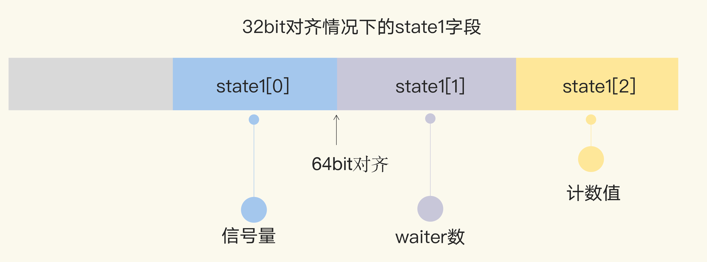

它要解决的就是并发 - 等待的问题：现在有一个 goroutine A 在检查点（checkpoint）等待一组 goroutine 全部完成，如果在执行任务的这些 goroutine 还没全部完成，那么 goroutine A 就会阻塞在检查点，直到所有 goroutine 都完成后才能继续执行。

# 基本用法

```go
    func (wg *WaitGroup) Add(delta int)
    func (wg *WaitGroup) Done()
    func (wg *WaitGroup) Wait()
```

+ Add，用来设置 WaitGroup 的计数值；
+ Done，用来将 WaitGroup 的计数值减 1，其实就是调用了 Add(-1)；
+ Wait，调用这个方法的 goroutine 会一直阻塞，直到 WaitGroup 的计数值变为 0。

```go
// 线程安全的计数器
type Counter struct {
    mu    sync.Mutex
    count uint64
}
// 对计数值加一
func (c *Counter) Incr() {
    c.mu.Lock()
    c.count++
    c.mu.Unlock()
}
// 获取当前的计数值
func (c *Counter) Count() uint64 {
    c.mu.Lock()
    defer c.mu.Unlock()
    return c.count
}
// sleep 1秒，然后计数值加1
func worker(c *Counter, wg *sync.WaitGroup) {
    defer wg.Done()
    time.Sleep(time.Second)
    c.Incr()
}

func main() {
    var counter Counter
    
    var wg sync.WaitGroup
    wg.Add(10) // WaitGroup的值设置为10

    for i := 0; i < 10; i++ { // 启动10个goroutine执行加1任务
        go worker(&counter, &wg)
    }
    // 检查点，等待goroutine都完成任务
    wg.Wait()
    // 输出当前计数器的值
    fmt.Println(counter.Count())
}
```

# WaitGroup 的实现

首先，我们看看 WaitGroup 的数据结构。它包括了一个 noCopy 的辅助字段，一个 state1 记录 WaitGroup 状态的数组。

+ noCopy 的辅助字段，主要就是辅助 vet 工具检查是否通过 copy 赋值这个 WaitGroup 实例
+ state1，一个具有复合意义的字段，包含 WaitGroup 的计数、阻塞在检查点的 waiter 数和信号量。

```go
type WaitGroup struct {
    // 避免复制使用的一个技巧，可以告诉vet工具违反了复制使用的规则
    noCopy noCopy
    // 64bit(8bytes)的值分成两段，高32bit是计数值，低32bit是waiter的计数
    // 另外32bit是用作信号量的
    // 因为64bit值的原子操作需要64bit对齐，但是32bit编译器不支持，所以数组中的元素在不同的架构中不一样，具体处理看下面的方法
    // 总之，会找到对齐的那64bit作为state，其余的32bit做信号量
    state1 [3]uint32
}


// 得到state的地址和信号量的地址
func (wg *WaitGroup) state() (statep *uint64, semap *uint32) {
    if uintptr(unsafe.Pointer(&wg.state1))%8 == 0 {
        // 如果地址是64bit对齐的，数组前两个元素做state，后一个元素做信号量
        return (*uint64)(unsafe.Pointer(&wg.state1)), &wg.state1[2]
    } else {
        // 如果地址是32bit对齐的，数组后两个元素用来做state，它可以用来做64bit的原子操作，第一个元素32bit用来做信号量
        return (*uint64)(unsafe.Pointer(&wg.state1[1])), &wg.state1[0]
    }
}
```

因为对 64 位整数的原子操作要求整数的地址是 64 位对齐的，所以针对 64 位和 32 位环境的 state 字段的组成是不一样的。

在 64 位环境下，state1 的第一个元素是 waiter 数，第二个元素是 WaitGroup 的计数值，第三个元素是信号量。


在 32 位环境下，如果 state1 不是 64 位对齐的地址，那么 state1 的第一个元素是信号量，后两个元素分别是 waiter 数和计数值。



> 首先要理解的是**内存对齐**，32 位机和 64 位机的差别在于每次读取的块大小不同，前者一次读取 4 字节的块，后者一次读取 8 字节的块。
>
>   `WaitGroup` 的大小是 12 字节，接下来我声明了一个 `var wg sync.WaitGroup`，假设此处 wg 的内存地址是 0xc420016240，此时这个地址是 64bit 对齐的，因此这里的重点是**不论是 32 位机器还是 64 位机器，state1 的元素排列都是 `waiter,counter,sem`**。wg 的地址空间是 `0xc420016240~0xc42001624c`，因此如果此时是 64 位机的话还有4字节的空间可以分配给其他大小合适的变量。那此时 state1 的排列能不能是 `sem,waiter,counter` 呢？不能，因为 64 bit 值的原子操作必须 64 bit 对齐。 
>
> 对于 32 位机器就会有一种**特殊情况**，那就是 wg 的内存地址起始被分配到了 0xc420016244，此时这个地址不是 64 bit 对齐的，因此这个时候排列变成了 `sem,waiter,counter`，这样的话，`waiter` 的起始地址变成了 0xc420016248，可以使用 64 bit 值的原子操作。 

除了这些方法本身的实现外，还会有一些额外的代码，主要是 race 检查和异常检查的代码。其中，有几个检查非常关键，如果检查不通过，会出现 panic。

Add 方法主要操作的是 state 的计数部分。你可以为计数值增加一个 delta 值，内部通过原子操作把这个值加到计数值上。需要注意的是，这个 delta 也可以是个负数，相当于为计数值减去一个值，Done 方法内部其实就是通过 Add(-1) 实现的。

```go
func (wg *WaitGroup) Add(delta int) {
    statep, semap := wg.state()
    // 高32bit是计数值v，所以把delta左移32，增加到计数上
    state := atomic.AddUint64(statep, uint64(delta)<<32)
    v := int32(state >> 32) // 当前计数值
    w := uint32(state) // waiter count

    if v > 0 || w == 0 {
        return
    }

    // 如果计数值v为0并且waiter的数量w不为0，那么state的值就是waiter的数量
    // 将waiter的数量设置为0，因为计数值v也是0,所以它们俩的组合*statep直接设置为0即可。此时需要并唤醒所有的waiter
    *statep = 0
    for ; w != 0; w-- {
        runtime_Semrelease(semap, false, 0)
    }
}


// Done方法实际就是计数器减1
func (wg *WaitGroup) Done() {
    wg.Add(-1)
}
```

Wait 方法的实现逻辑是：不断检查 state 的值。如果其中的计数值变为了 0，那么说明所有的任务已完成，调用者不必再等待，直接返回。如果计数值大于 0，说明此时还有任务没完成，那么调用者就变成了等待者，需要加入 waiter 队列，并且阻塞住自己。

```go
func (wg *WaitGroup) Wait() {
    statep, semap := wg.state()
    
    for {
        state := atomic.LoadUint64(statep)
        v := int32(state >> 32) // 当前计数值
        w := uint32(state) // waiter的数量
        if v == 0 {
            // 如果计数值为0, 调用这个方法的goroutine不必再等待，继续执行它后面的逻辑即可
            return
        }
        // 否则把waiter数量加1。期间可能有并发调用Wait的情况，所以最外层使用了一个for循环
        if atomic.CompareAndSwapUint64(statep, state, state+1) {
            // 阻塞休眠等待
            runtime_Semacquire(semap)
            // 被唤醒，不再阻塞，返回
            return
        }
    }
}
```

# 使用 WaitGroup 时的常见错误

## 计数器设置为负值

WaitGroup 的计数器的值**必须大于等于 0**。我们在更改这个计数值的时候，WaitGroup 会先做检查，如果计数值被设置为负数，就会导致 panic。

一般情况下，有两种方法会导致计数器设置为负数。

第一种方法是：调用 Add 的时候传递一个负数。如果你能保证当前的计数器加上这个负数后还是大于等于 0 的话，也没有问题，否则就会导致 panic。

第二个方法是：**调用 Done 方法的次数过多，超过了 WaitGroup 的计数值。**

**使用 WaitGroup 的正确姿势是，预先确定好 WaitGroup 的计数值，然后调用相同次数的 Done 完成相应的任务。**比如，在 WaitGroup 变量声明之后，就立即设置它的计数值，或者在 goroutine 启动之前增加 1，然后在 goroutine 中调用 Done。

## 不期望的 Add 时机

在使用 WaitGroup 的时候，你一定要遵循的原则就是，**等所有的 Add 方法调用之后再调用 Wait**，否则就可能导致 panic 或者不期望的结果。

我们构造这样一个场景：只有部分的 Add/Done 执行完后，Wait 就返回。我们看一个例子：启动四个 goroutine，每个 goroutine 内部调用 Add(1) 然后调用 Done()，主 goroutine 调用 Wait 等待任务完成。

```go
func main() {
    var wg sync.WaitGroup
    go dosomething(100, &wg) // 启动第一个goroutine
    go dosomething(110, &wg) // 启动第二个goroutine
    go dosomething(120, &wg) // 启动第三个goroutine
    go dosomething(130, &wg) // 启动第四个goroutine

    wg.Wait() // 主goroutine等待完成
    fmt.Println("Done")
}

func dosomething(millisecs time.Duration, wg *sync.WaitGroup) {
    duration := millisecs * time.Millisecond
    time.Sleep(duration) // 故意sleep一段时间

    wg.Add(1)
    fmt.Println("后台执行, duration:", duration)
    wg.Done()
}
```

我们原本设想的是，等四个 goroutine 都执行完毕后输出 Done 的信息，但是它的错误之处在于，将 WaitGroup.Add 方法的调用放在了子 gorotuine 中。等主 goorutine 调用 Wait 的时候，因为四个任务 goroutine 一开始都休眠，所以可能 WaitGroup 的 Add 方法还没有被调用，WaitGroup 的计数还是 0，所以它并没有等待四个子 goroutine 执行完毕才继续执行，而是立刻执行了下一步。

要解决这个问题，一个方法是，预先设置计数值：

```go
func main() {
    var wg sync.WaitGroup
    wg.Add(4) // 预先设定WaitGroup的计数值

    go dosomething(100, &wg) // 启动第一个goroutine
    go dosomething(110, &wg) // 启动第二个goroutine
    go dosomething(120, &wg) // 启动第三个goroutine
    go dosomething(130, &wg) // 启动第四个goroutine

    wg.Wait() // 主goroutine等待
    fmt.Println("Done")
}

func dosomething(millisecs time.Duration, wg *sync.WaitGroup) {
    duration := millisecs * time.Millisecond
    time.Sleep(duration)

    fmt.Println("后台执行, duration:", duration)
    wg.Done()
}
```

另一种方法是在启动子 goroutine 之前才调用 Add：

```go
func main() {
    var wg sync.WaitGroup

    dosomething(100, &wg) // 调用方法，把计数值加1，并启动任务goroutine
    dosomething(110, &wg) // 调用方法，把计数值加1，并启动任务goroutine
    dosomething(120, &wg) // 调用方法，把计数值加1，并启动任务goroutine
    dosomething(130, &wg) // 调用方法，把计数值加1，并启动任务goroutine

    wg.Wait() // 主goroutine等待，代码逻辑保证了四次Add(1)都已经执行完了
    fmt.Println("Done")
}

func dosomething(millisecs time.Duration, wg *sync.WaitGroup) {
    wg.Add(1) // 计数值加1，再启动goroutine

    go func() {
        duration := millisecs * time.Millisecond
        time.Sleep(duration)
        fmt.Println("后台执行, duration:", duration)
        wg.Done()
    }()
}

```

## 前一个 Wait 还没结束就重用 WaitGroup

**WaitGroup 是可以重用的。**只要 WaitGroup 的计数值恢复到零值的状态，那么它就可以被看作是新创建的 WaitGroup，被重复使用。

但是，如果我们在 WaitGroup 的计数值还没有恢复到零值的时候就重用，就会导致程序 panic。

```go
func main() {
    var wg sync.WaitGroup
    wg.Add(1)
    go func() {
        time.Sleep(time.Millisecond)
        wg.Done() // 计数器减1  （第6行）
        wg.Add(1) // 计数值加1  （第7行）
    }()
    wg.Wait() // 主goroutine等待，有可能和第7行并发执行  （第9行）
}
```

初始设置 WaitGroup 的计数值为 1，启动一个 goroutine 先调用 Done 方法，接着就调用 Add 方法，Add 方法有可能和主 goroutine 并发执行。

第 6 行虽然让 WaitGroup 的计数恢复到 0，但是因为第 9 行有个 waiter 在等待，如果等待 Wait 的 goroutine，刚被唤醒就和 Add 调用（第 7 行）有并发执行的冲突，所以就会出现 panic。

> GO 1.14.2的版本中，WaitGroup中的Wait()方法其中有一段代码是这样写的： runtime_Semacquire(semap) if *statep != 0 { panic("sync: WaitGroup is reused before previous Wait has returned") } 也就是说，当当前的waiter被唤醒了，他会再去检查一遍状态量statep，如果此时状态量不是为0，那么不符合预期，因为只有当状态量的计数值为0时才能够唤醒waiter，而此时检查到状态量不为0，因此会panic。 所以如果当Wait方法与Add方法并发执行时，确实有可能会导致这个panic发生。

WaitGroup 虽然可以重用，但是是有一个前提的，那就是必须等到上一轮的 Wait 完成之后，才能重用 WaitGroup 执行下一轮的 Add/Wait，如果你在 Wait 还没执行完的时候就调用下一轮 Add 方法，就有可能出现 panic。


# noCopy：辅助 vet 检查

它就是指示 vet 工具在做检查的时候，这个数据结构不能做值复制使用。更严谨地说，**是不能在第一次使用之后复制使用** ( must not be copied after first use)。

noCopy 是一个通用的计数技术，其他并发原语中也会用到，所以单独介绍有助于你以后在实践中使用这个技术。

vet 会对实现 Locker 接口的数据类型做静态检查，一旦代码中有复制使用这种数据类型的情况，就会发出警告。但是，WaitGroup 同步原语不就是 Add、Done 和 Wait 方法吗？vet 能检查出来吗？

其实是可以的。通过给 WaitGroup 添加一个 noCopy 字段，我们就可以为 WaitGroup 实现 Locker 接口，这样 vet 工具就可以做复制检查了。而且因为 noCopy 字段是未输出类型，所以 WaitGroup 不会暴露 Lock/Unlock 方法。

noCopy 字段的类型是 noCopy，它只是一个辅助的、用来帮助 vet 检查用的类型:

```go
type noCopy struct{}

// Lock is a no-op used by -copylocks checker from `go vet`.
func (*noCopy) Lock()   {}
func (*noCopy) Unlock() {}
```

如果你想要自己定义的数据结构不被复制使用，或者说，不能通过 vet 工具检查出复制使用的报警，就可以通过嵌入 noCopy 这个数据类型来实现。

# 总结

+ 不重用 WaitGroup。新建一个 WaitGroup 不会带来多大的资源开销，重用反而更容易出错。
+ 保证所有的 Add 方法调用都在 Wait 之前。
+ 不传递负数给 Add 方法，只通过 Done 来给计数值减 1。
+ 不做多余的 Done 方法调用，保证 Add 的计数值和 Done 方法调用的数量是一样的。
+ 不遗漏 Done 方法的调用，否则会导致 Wait hang 住无法返回。