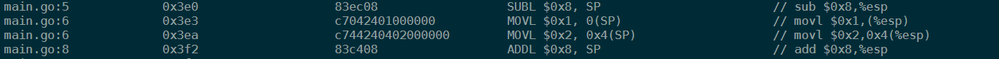
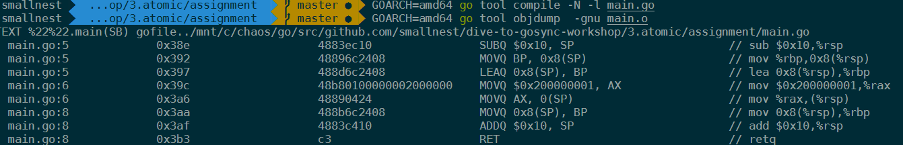

# 原子操作的基础知识

Package sync/atomic 实现了同步算法底层的原子的内存操作原语，我们把它叫做原子操作原语，它提供了一些实现原子操作的方法。

之所以叫原子操作，是因为一个原子在执行的时候，**其它线程不会看到执行一半的操作结果**。在其它线程看来，原子操作要么执行完了，要么还没有执行，就像一个最小的粒子 - 原子一样，不可分割。

**对于单处理器单核系统来说，如果一个操作是由一个 CPU 指令来实现的，那么它就是原子操作**，比如它的 XCHG 和 INC 等指令。如果操作是基于多条指令来实现的，那么，执行的过程中可能会被中断，并执行上下文切换，这样的话，原子性的保证就被打破了，因为这个时候，操作可能只执行了一半。

在多处理器多核系统中，原子操作的实现就比较复杂了。

由于 cache 的存在，单个核上的单个指令进行原子操作的时候，你要确保其它处理器或者核不访问此原子操作的地址，或者是确保其它处理器或者核总是访问原子操作之后的最新的值。x86 架构中提供了**指令前缀 LOCK**，LOCK 保证了指令（比如 LOCK CMPXCHG op1、op2）**不会受其它处理器或 CPU 核的影响**，有些指令（比如 XCHG）本身就提供 Lock 的机制。不同的 CPU 架构提供的原子操作指令的方式也是不同的，比如对于多核的 MIPS 和 ARM，提供了 LL/SC（Load Link/Store Conditional）指令，可以帮助实现原子操作（ARMLL/SC 指令 LDREX 和 STREX）。

**因为不同的 CPU 架构甚至不同的版本提供的原子操作的指令是不同的，所以，要用一种编程语言实现支持不同架构的原子操作是相当有难度的**。不过，还好这些都不需要你操心，因为 Go 提供了一个通用的原子操作的 API，**将更底层的不同的架构下的实现封装成 atomic 包**，提供了修改类型的原子操作（[atomic read-modify-write](https://preshing.com/20150402/you-can-do-any-kind-of-atomic-read-modify-write-operation/)，RMW）和加载存储类型的原子操作（[Load 和 Store](https://preshing.com/20130618/atomic-vs-non-atomic-operations/)）的 API。

有的代码也会因为架构的不同而不同。有时看起来貌似一个操作是原子操作，但实际上，对于不同的架构来说，情况是不一样的。比如下面的代码的第 4 行，是将一个 64 位的值赋值给变量 i：

```go
const x int64 = 1 + 1<<33

func main() {
    var i = x  // 第 4 行
    _ = i
}
```

如果你使用 **GOARCH=386** 的架构去编译这段代码，那么，**第 5 行其实是被拆成了两个指令**，分别操作低 32 位和高 32 位（使用 GOARCH=386 go tool compile -N -l test.go；GOARCH=386 go tool objdump -gnu test.o 反编译试试）：



如果 GOARCH=amd64 的架构去编译这段代码，那么，第 5 行其中的赋值操作其实是一条指令：



所以，如果要想保证原子操作，切记一定要使用 atomic 提供的方法。

# atomic 原子操作的应用场景

使用 atomic 的一些方法，我们可以实现更底层的一些优化。

举个例子：假设你想在程序中使用一个标志（flag，比如一个 bool 类型的变量），来标识一个定时任务是否已经启动执行了，你会怎么做呢？

我们先来看看加锁的方法。如果使用 Mutex 和 RWMutex，在读取和设置这个标志的时候加锁，是可以做到互斥的、保证同一时刻只有一个定时任务在执行的，所以使用 Mutex 或者 RWMutex 是一种解决方案。

其实，这个场景中的问题**不涉及到对资源复杂的竞争逻辑，只是会并发地读写这个标志，这类场景就适合使用 atomic 的原子操作**。具体怎么做呢？你可以使用一个 uint32 类型的变量，如果这个变量的值是 0，就标识没有任务在执行，如果它的值是 1，就标识已经有任务在完成了。你看，是不是很简单呢？

再来看一个例子。假设你在开发应用程序的时候，需要从配置服务器中读取一个节点的配置信息。而且，在这个节点的配置发生变更的时候，你需要重新从配置服务器中拉取一份新的配置并更新。你的程序中可能有多个 goroutine 都依赖这份配置，涉及到对这个配置对象的并发读写，你可以使用读写锁实现对配置对象的保护。在大部分情况下，你也可以利用 atomic 实现配置对象的更新和加载。

**有时候，你也可以使用 atomic 实现自己定义的基本并发原语**，比如 Go issue 有人提议的 CondMutex、Mutex.LockContext、WaitGroup.Go 等，我们可以使用 atomic 或者基于它的更高一级的并发原语去实现。我先前讲的几种基本并发原语的底层（比如 Mutex），就是基于通过 atomic 的方法实现的。

除此之外，**atomic 原子操作还是实现 lock-free 数据结构的基石**。


