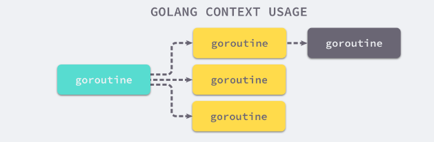

# Context 的作用和争执

上下文：在 API 之间或者方法调用之间，所传递的**除了业务参数之外的额外信息**。

比如，服务端接收到客户端的 HTTP 请求之后，可以把客户端的 IP 地址和端口、客户端的身份信息、请求接收的时间、Trace ID 等信息放入到上下文中，这个上下文可以在后端的方法调用中传递，后端的业务方法除了利用正常的参数做一些业务处理（如订单处理）之外，还可以从上下文读取到消息请求的时间、Trace  ID 等信息，把服务处理的时间推送到 Trace 服务中。Trace 服务可以把同一 Trace ID 的不同方法的调用顺序和调用时间展示成流程图，方便跟踪。

Go 1.7 标准库引入 context，中文译作“上下文”，准确说它是 goroutine 的上下文，包含 goroutine 的运行状态、环境、现场等信息。

context 主要用来在 goroutine 之间传递上下文信息，包括：取消信号、超时时间、截止时间、k-v 等。

<span style="color:red;font-weight:bold;">context 用来解决 goroutine 之间退出通知、元数据传递的功能。</span>

Context类型可以提供一类代表上下文的值。此类值是<span style="color:red;font-weight:bold;">并发安全</span>的，也就是说它可以被传播给多个 goroutine。

由于Context类型实际上是一个接口类型，而context包中实现该接口的所有私有类型，都是基于某个数据类型的 <span style="color:red;font-weight:bold;">指针类型</span> 指针，所以，如此传播并不会影响该类型值的功能和安全。

Context类型的值（以下简称Context值）是可以繁衍的，这意味着我们可以通过一个Context值产生出任意个子值。这些子值可以携带其父值的属性和数据，也可以响应我们通过其父值传达的信号。

正因为如此，所有的Context值共同构成了一颗<span style="color:red;font-weight:bold;">代表了上下文全貌的树形结构</span>。这棵树的树根（或者称上下文根节点）是一个已经在context包中预定义好的Context值，它是全局唯一的。通过调用 context.Background 函数，我们就可以获取到它。

这里注意一下，这个上下文根节点仅仅是一个最基本的支点，它不提供任何额外的功能。也就是说，它既不可以被撤销（cancel），也不能携带任何数据。



每一个 context.Context 都会从最顶层的 Goroutine 一层一层传递到最下层。context.Context 可以在上层 Goroutine 执行出现错误时，将信号<span style="color:red;font-weight:bold;">及时同步</span>给下层。

context 包中的 Context 不仅仅传递上下文信息，还有 timeout 等其它功能，是不是过于冗杂了呢？

其实啊，这也是这个 Context 的一个问题，比较容易误导人，Go 布道师 Dave Cheney 还专门写了一篇文章讲述这个问题：[Context isn’t for cancellation](https://dave.cheney.net/2017/08/20/context-isnt-for-cancellation)。

同时，也有一些批评者针对 Context 提出了批评：[Context should go away for Go 2](https://faiface.github.io/post/context-should-go-away-go2/)，这篇文章把 Context 比作病毒，病毒会传染，结果把所有的方法都传染上了病毒（加上 Context 参数），绝对是视觉污染。

Go 的开发者也注意到了“关于 Context，存在一些争议”这件事儿，所以，Go 核心开发者 Ian Lance Taylor 专门开了一个[issue 28342](https://github.com/golang/go/issues/28342)，用来记录当前的 Context 的问题：

+ Context 包名导致使用的时候重复 ctx context.Context；
+ Context.WithValue 可以接受任何类型的值，非类型安全；
+ Context 包名容易误导人，实际上，Context 最主要的功能是取消 goroutine 的执行；
+ Context 漫天飞，函数污染。


# Context 基本使用方法

context.Context 是一个接口，定义了4个方法，它们都是<span style="color:red;font-weight:bold;">幂等</span>的。也就是连续多次调用同一个方法，得到的结果都是相同的。

```go

type Context interface {
  Deadline() (deadline time.Time, ok bool) 
  Done() <-chan struct{}
  Err() error
  Value(key any) any 
}
```

+ Deadline(): 第一个返回值为设置的截止时间，到了这个截止时间，Context 会自动发起取消请求；第二个返回值 ok == false 时表示没有设置截止时间，如果需要取消的话，需要调用取消函数进行取消。
+ Done(): 该方法返回一个用于探测 Context 是否取消的 只读 channel，当 Context 取消时会自动将该 channel 关闭。即在 goroutine 中，如果该方法返回的 chan 可读，则意味着 parent context 已经发起了取消请求，通过 Done 方法收到这个信号后，应该做清理工作，然后退出 goroutine， 释放资源。**如果 Done 没有被 close，Err 方法返回 nil；如果 Done 被 close，Err 方法会返回 Done 被 close 的原因。**需要注意的是，对于不支持取消的 Context ，该方法可能会返回 nil，例如 context.Background。
+ Err(): 返回 context.Context 结束的原因，它只会在 Done 方法对应的 chan 关闭时返回非空的值；当 Context 还没有关闭时候，返回 nil 。
+ Value():  获取该 Context 上绑定的值，是一个键值对，所以要通过一个 Key 才可以获取对应的值，这个值一般是**线程安全**的。

Context 中实现了 2 个常用的生成顶层 Context 的方法。

+ context.Background()：返回一个非 nil 的、空的 Context，没有任何值，不会被 cancel，不会超时，没有截止日期。一般用在主函数、初始化、测试以及创建根 Context 的时候。
+ context.TODO()：返回一个非 nil 的、空的 Context，没有任何值，不会被 cancel，不会超时，没有截止日期。当你不清楚是否该用 Context，或者目前还不知道要传递一些什么上下文信息的时候，就可以使用这个方法。

官方文档是这么讲的，你可能会觉得像没说一样，因为界限并不是很明显。其实，你根本不用费脑子去考虑，**可以直接使用 context.Background**。事实上，它们两个底层的实现是一模一样的：

```go

var (
    background = new(emptyCtx)
    todo       = new(emptyCtx)
)

func Background() Context {
    return background
}

func TODO() Context {
    return todo
}
```

在使用 Context 的时候，有一些约定俗成的规则。

+ 一般函数使用 Context 的时候，会把这个参数放在第一个参数的位置。
+ 从来不把 nil 当做 Context 类型的参数值，可以使用 context.Background() 创建一个空的上下文对象，也不要使用 nil。
+ Context 只用来**临时**做函数之间的上下文透传，不能持久化 Context 或者把 Context 长久保存。把 Context 持久化到数据库、本地文件或者全局变量、缓存中都是错误的用法。
+ key 的类型不应该是字符串类型或者其它内建类型，否则容易在包之间使用 Context 时候产生冲突。**使用 WithValue 时，key 的类型应该是自己定义的类型。**
+ 常常使用 struct{}作为底层类型定义 key 的类型。对于 exported key 的静态类型，常常是接口或者指针。这样可以尽量减少内存分配。