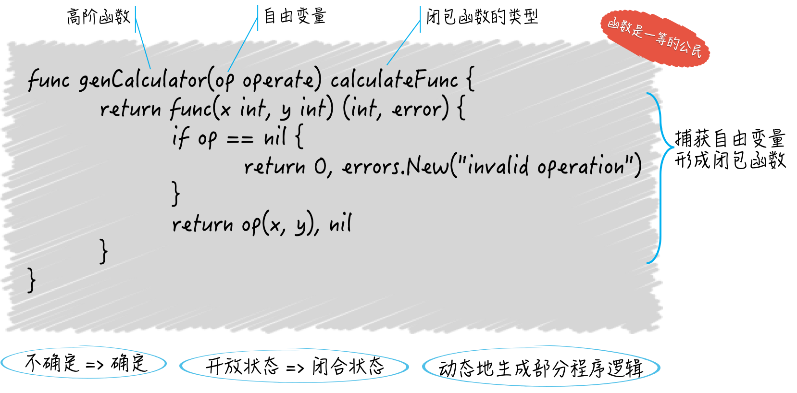

# 函数

在 Go 语言中，函数可是一等的（first-class）公民，函数类型也是一等的数据类型。

这意味着函数不但可以用于封装代码、分割功能、解耦逻辑，还可以化身为**普通的值**，在其他函数间传递、赋予变量、做类型判断和转换等等，就像切片和字典的值那样。

而更深层次的含义就是：函数值可以由此成为能够被**随意传播的独立逻辑组件**（或者说功能模块）。

> 函数的签名其实就是函数的**参数列表和结果列表**的统称，它定义了可用来鉴别不同函数的那些特征，同时也定义了我们与函数交互的方式。

注意，各个参数和结果的名称不能算作函数签名的一部分，甚至对于结果声明来说，没有名称都可以。

只要两个函数的参数列表和结果列表中的**元素顺序及其类型**是一致的，我们就可以说它们是一样的函数，或者说是实现了同一个函数类型的函数。

严格来说，函数的名称也不能算作函数签名的一部分，它只是我们在调用函数时，需要给定的标识符而已。

关于函数值和方法值的案例移步[function & method](../experiment/method_feature/)

**函数类型属于引用类型，它的值可以为nil，而这种类型的零值恰恰就是nil。**

# 高阶函数

简单地说，高阶函数可以满足下面的两个条件：

+ 接受其他的函数作为参数传入
+ 把其他的函数作为结果返回

只要满足了其中任意一个特点，我们就可以说这个函数是一个高阶函数。高阶函数也是函数式编程中的重要概念和特征。


# 闭包

**在一个函数中存在对外来标识符的引用。所谓的外来标识符，既不代表当前函数的任何参数或结果，也不是函数内部声明的，它是直接从外边拿过来的。**

还有个专门的术语称呼它，叫自由变量，可见它代表的肯定是个变量。实际上，如果它是个常量，那也就形成不了闭包了，因为常量是不可变的程序实体，而闭包体现的却是由“不确定”变为“确定”的一个过程。

我们说的这个函数（以下简称闭包函数）就是因为引用了自由变量，而呈现出了一种“不确定”的状态，也叫“开放”状态。

**它的内部逻辑并不是完整的，有一部分逻辑需要这个自由变量参与完成，而后者到底代表了什么在闭包函数被定义的时候却是未知的。**

即使对于像 Go 语言这种静态类型的编程语言而言，我们在定义闭包函数的时候**最多也只能知道自由变量的类型**。

```go
type operate func(x, y int) int

type calculateFunc func(x int, y int) (int, error)

func genCalculator(op operate) calculateFunc {
	return func(x int, y int) (int, error) {
		if op == nil {
			return 0, errors.New("invalid operation")
		}
		return op(x, y), nil
	}
}
```

genCalculator函数只做了一件事，那就是定义一个匿名的、calculateFunc类型的函数并把它作为结果值返回。

而这个匿名的函数就是一个闭包函数。它里面使用的变量 op 既不代表它的任何参数或结果也不是它自己声明的，而是定义它的 genCalculator 函数的参数，所以是一个自由变量。

这个自由变量究竟代表了什么，这一点并不是在定义这个闭包函数的时候确定的，而是在genCalculator函数**被调用的时候确定的**。只有给定了该函数的参数op，我们才能知道它返回给我们的闭包函数可以用于什么运算。



那么，实现闭包的意义又在哪里呢？表面上看，我们只是延迟实现了一部分程序逻辑或功能而已，但实际上，我们是在**动态地生成那部分程序逻辑**。


# 传入函数的那些参数值后来怎么样了

```go
package main

import "fmt"

func main() {
  array1 := [3]string{"a", "b", "c"}
  fmt.Printf("The array: %v\n", array1)
  array2 := modifyArray(array1)
  fmt.Printf("The modified array: %v\n", array2)
  fmt.Printf("The original array: %v\n", array1)
}

func modifyArray(a [3]string) [3]string {
  a[1] = "x"
  return a
}
```

**所有传给函数的参数值都会被复制，函数在其内部使用的并不是参数值的原值，而是它的副本。**

由于数组是值类型，所以每一次复制都会拷贝它，以及它的所有元素值。我在modify函数中修改的只是原数组的副本而已，并不会对原数组造成任何影响。

注意，对于引用类型，比如：切片、字典、通道，像上面那样复制它们的值，**只会拷贝它们本身而已，并不会拷贝它们引用的底层数据。也就是说，这时只是浅表复制，而不是深层复制**。

以切片值为例，如此复制的时候，只是拷贝了它指向底层数组中某一个元素的指针，以及它的长度值和容量值，而它的底层数组并不会被拷贝。

```go
complexArray1 := [3][]string{
  []string{"d", "e", "f"},
  []string{"g", "h", "i"},
  []string{"j", "k", "l"},
}
```

虽然complexArray1本身是一个数组，但是其中的元素却都是切片。如果对complexArray1中的元素进行增减，那么原值就不会受到影响。但若要修改它已有的元素值，那么原值也会跟着改变。

**函数真正拿到的参数值其实只是它们的副本，函数返回给调用方的结果值也会被复制。**不过，在一般情况下，我们不用太在意。但如果函数在返回结果值之后依然保持执行并会对结果值进行修改，那么我们就需要注意了。

比如在 Go 语言中的 goroutine。在这种情况下，可以有一种场景，即函数返回一个指向某个值的指针或者是引用类型（如切片，映射或通道），然后在另一个 goroutine 中修改这个值。这种情况下，即使函数已经返回，但在另一个 goroutine 中对这个值的修改仍然会影响到函数返回的结果。

```go
func createSlice() []int {
	slice := make([]int, 5)
	go func() {
		for i := range slice {
			slice[i] = i
			time.Sleep(1 * time.Second)
		}
	}()
	return slice
}

func main() {
	slice := createSlice()
	time.Sleep(3 * time.Second)
	fmt.Println(slice) // 输出: [0 1 2 0 0]
	time.Sleep(3 * time.Second)
	fmt.Println(slice) // 输出: [0 1 2 3 4]
}
```

