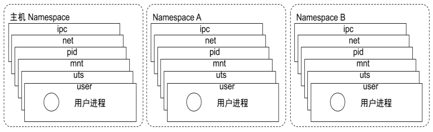

# Namespace 是什么

我们引用 [wiki](https://link.segmentfault.com/?enc=tBsaB0o9oZ7h7HEpxgH3eA%3D%3D.eEW2qwGm4DG1qB6R6D%2BGIdlNlqtMoqiftJZxyeGcQHJ1XgAKxC3044%2BUreQxbhkV) 上对 namespace 的定义：

> Namespace are a feature of the Linux kernel that partitions kernel resources such that one set of processes sees one set of resources while another set of processes sees a different set of resources. The feature works by having the same namespace for a set of resources and processes, but those namespace refer to distinct resources.
>
> namespace 是 Linux 内核的一项特性，它可以对内核资源进行分区，使得一组进程可以看到一组资源；而另一组进程可以看到另一组不同的资源。该功能的原理是为一组资源和进程使用相同的 namespace，但是这些 namespace 实际上引用的是不同的资源。

即 namespace 是由 Linux 内核提供的，用于**进程间资源隔离**的一种技术。将全局的系统资源包装在一个抽象里，让进程（看起来）拥有独立的全局资源实例。同时 Linux 也默认提供了多种 namespace，用于对多种不同资源进行隔离。

+ 系统可以为进程分配不同的 Namespace；
+ 并保证不同的 Namespace 资源独立分配、进程彼此隔离，即不同的 Namespace 下的进程互不干扰 。

# Linux 内核代码中 Namespace 的实现

+ 进程数据结构

```c
struct task_struct {
...
/* namespaces */
struct nsproxy *nsproxy;
...
}
```

+ Namespace 数据结构

```c
struct nsproxy {
atomic_t count;
struct uts_namespace *uts_ns;
struct ipc_namespace *ipc_ns;
struct mnt_namespace *mnt_ns;
struct pid_namespace *pid_ns_for_children;
struct net *net_ns;
}
```

可见 namespace 即是进程/线程的字段属性。


# Namespace 类型

|  类型   |                           隔离资源                           |   使用的标识    |
| :-----: | :----------------------------------------------------------: | :-------------: |
| Cgroup  |           Cgroup root directory （cgroup 根目录）            | CLONE_NEWCGROUP |
|   IPC   |      System V IPC，POSIX message queues信号量，消息队列      |  CLONE_NEWIPC   |
| Network | Network devices stacks, ports, etc.网络设备，协议栈，端口等等 |  CLONE_NEWNET   |
|  Mount  |                      Mount points挂载点                      |   CLONE_NEWNS   |
|   PID   |                      Process IDs进程号                       |  CLONE_NEWPID   |
|  User   |                         用户和组 ID                          |  CLONE_NEWUSER  |
|   UTS   | 系统主机名和 NIS(Network Information Service) 主机名（有时称为域名） |  CLONE_NEWUTS   |
|  Time   |                             时钟                             |  CLONE_NEWTIME  |





## Cgroup namespace

Cgroup namespace 是进程的 cgroups 的虚拟化视图，通过 **/proc/[pid]/cgroup** 和 **/proc/[pid]/mountinfo** 展示。

使用 cgroup namespace 需要内核开启 CONFIG_CGROUPS 选项。可通过以下方式验证：

```bash
grep CONFIG_CGROUPS /boot/config-$(uname -r)
CONFIG_CGROUPS=y
```


## pid namespace

在 Linux 系统中，每个进程都会有自己的独立的 PID，而 PID namespace 主要是用于隔离进程号。即，在不同的 PID namespace 中可以包含相同的进程号。

每个 PID namespace 中进程号都是从 1 开始的，在此 PID namespace 中可通过调用 `fork(2)`, `vfork(2)`和 `clone(2)` 等系统调用来创建其他拥有独立 PID 的进程。

+ 不同用户的进程就是通过 Pid namespace 隔离开的，且不同 namespace 中可以有相同 Pid。
+ 有了 Pid namespace, 每个 namespace 中的 Pid 能够相互隔离。

## network namespace

+ 网络隔离是通过 net namespace 实现的， 每个 net namespace 有独立的 network devices, IP addresses, IP routing tables, /proc/net 目录
+ Docker 默认采用 veth 的方式将 container 中的虚拟网卡同 host 上的一个 docker bridge: docker0 连接 在一起

使用 Network namespaces 需要内核支持 CONFIG_NET_NS 选项。如下：

```bash
grep CONFIG_NET_NS /boot/config-$(uname -r)
CONFIG_NET_NS=y
```

一个物理网络设备只能存在于一个 Network namespace 中。当一个 Network namespace 被释放时（空间里的最后一个进程都被停止删除时），物理网络设备将被移动到初始的 Network namespace 而不是上层的 Network namespace。

一个虚拟的网络设备(veth(4)) ，在 Network namespace 间通过一个类似管道的方式进行连接。这使得它能存在于多个 Network namespace，但是，当 Network namespace 被摧毁时，该空间下包含的 veth(4) 设备可能被破坏。

## IPC namespace

每个 IPC namespace 都有着自己的一组 System V IPC 标识符，以及 POSIX 消息队列系统。

+ Container 中进程交互还是采用 linux 常见的进程间交互方法 （interprocess communication – IPC）, 包 括常见的信号量、消息队列和共享内存。
+ Container 的进程间交互实际上还是 host上 具有相同 Pid namespace 中的进程间交互，因此需要在 IPC 资源申请时加入 namespace 信息 - 每个 IPC 资源有一个唯一的 32 位 ID。

使用 IPC namespace 需要内核支持 CONFIG_IPC_NS 选项。如下：

```bash
grep CONFIG_IPC_NS /boot/config-$(uname -r)
CONFIG_IPC_NS=y
```

可以在 IPC namespace 中设置以下 /proc 接口：

+ /proc/sys/fs/mqueue - POSIX 消息队列接口
+ /proc/sys/kernel - System V IPC 接口 （msgmax, msgmnb, msgmni, sem, shmall, shmmax, shmmni, shm_rmid_forced）
+ /proc/sysvipc - System V IPC 接口

当 IPC namespace 被销毁时（空间里的最后一个进程都被停止删除时），在 IPC namespace 中创建的 object 也会被销毁。

## mnt namespace

Mount namespaces 隔离了各空间中挂载的进程实例。每个 mount namespace 的实例下的进程会看到**不同的目录层次结构**，这样每个 namespace 中的进程所看到的文件目录就被隔离开了。

每个进程在 mount namespace 中的描述可以在下面的文件视图中看到：

+ /proc/[pid]/mounts
+ /proc/[pid]/mountinfo
+ /proc/[pid]/mountstats

一个新的 Mount namespace 的创建标识是 CLONE_NEWNS ，使用了 clone(2) 或者 unshare(2) 。

- 如果 Mount namespace 用 clone(2) 创建，子 namespace 的挂载列表是从父进程的 mount namespace 拷贝的。
- 如果 Mount namespace 用 unshare(2) 创建，新 namespace 的挂载列表是从调用者之前的 moun namespace 拷贝的。

如果 mount namespace 发生了修改，会引起什么样的连锁反应？

每个 mount 都被可以有如下标记 ：

- MS_SHARED - 与组内每个成员分享 events 。也就是说相同的 mount 或者 unmount 将自动发生在组内其他的 mounts 中。反之，mount 或者 unmount 事件 也会影响这次的 event 动作。
- MS_PRIVATE - 这个 mount 是私有的。mount 或者 unmount events 都不会影响这次的 event 动作。
- MS_SLAVE - mount 或者 unmount events 会从 master 节点传入影响该节点。但是这个节点下的 mount 或者 unmount events 不会影响组内的其他节点。
- MS_UNBINDABLE - 这也是个私有的 mount 。任何尝试绑定的 mount 在这个设置下都将失败。

在文件 /proc/[pid]/mountinfo 中可以看到 propagation 类型的字段。每个对等组都会由内核生成唯一的 ID ，同一对等组的 mount 都是这个 ID（即，下文中的 X ）。

```bash
cat /proc/self/mountinfo  |grep root  
65 1 0:33 /root / rw,relatime shared:1 - btrfs /dev/nvme0n1p6 rw,seclabel,compress=zstd:1,ssd,space_cache,subvolid=256,subvol=/root
1210 65 0:33 /root/var/lib/docker/btrfs /var/lib/docker/btrfs rw,relatime shared:1 - btrfs /dev/nvme0n1p6 rw,seclabel,compress=zstd:1,ssd,space_cache,subvolid=256,subvol=/root
```

- shared:X - 在组 X 中共享。
- master:X - 对于组 X 而言是 slave，即，从属于 ID 为 X 的主。
- propagate_from:X - 接收从组 X 发出的共享 mount。这个标签总是个 master:X 一同出现。
- unbindable - 表示不能被绑定，即，不与其他关联从属。

新 mount namespace 的传播类型取决于它的父节点。如果父节点的传播类型是 MS_SHARED ，那么新 mount namespace 的传播类型是 MS_SHARED ，不然会默认为 MS_PRIVATE。

关于 mount namespaces 我们还需要注意以下几点：

+ 每个 mount namespace 都有一个 owner user namespace。如果新的 mount namespace 和拷贝的 mount namespace 分属于不同的 user namespace ，那么，新的 mount namespace 优先级低。

+ 当创建的 mount namespace 优先级低时，那么，slave 的 mount events 会优先于 shared 的 mount events。

+ 高优先级和低优先级的 mount namespace 有关联被锁定在一起时，他们都不能被单独卸载。

+ mount(2) 标识和 atime 标识会被锁定，即，不能被传播影响而修改。

## uts namespace

+ UTS(“UNIX Time-sharing System”) namespace允许每个 container 拥有独立的 hostname 和 domain name, 使其在网络上可以被视作一个独立的节点而非 Host 上的一个进程。

## user namespace

+ 每个 container 可以有不同的 user 和 group id, 也就是说可以在 container 内部用 container 内部的用户 执行程序而非 Host 上的用户。

# Linux 对 namespace 的操作方法

