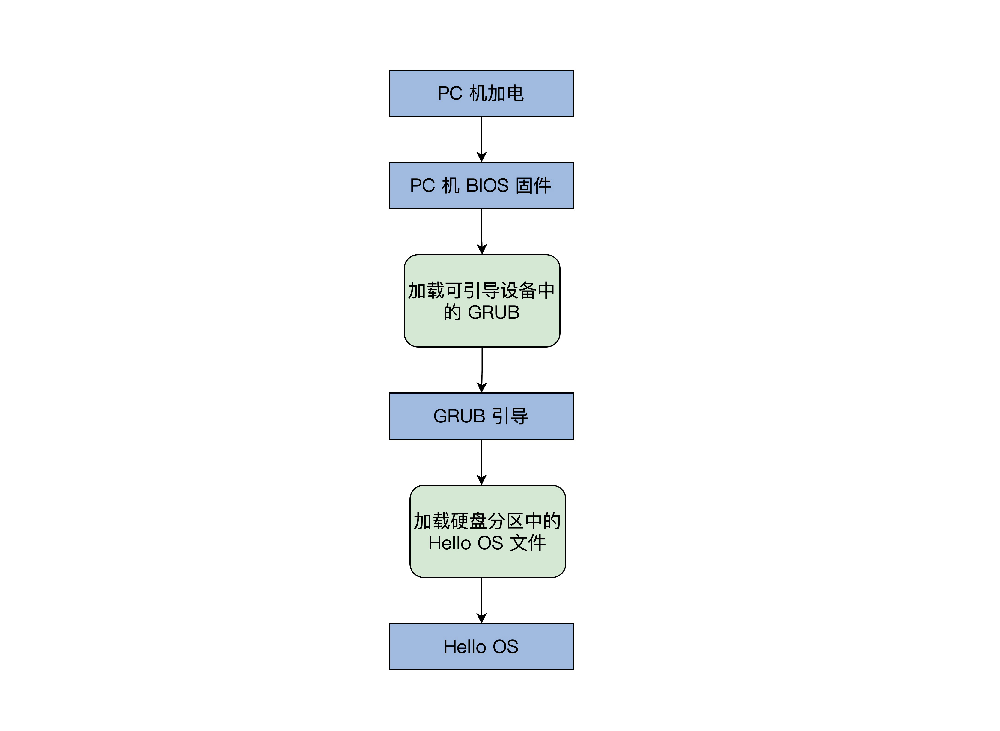

基于硬件，写一个最小的操作系统——Hello OS。

# PC 机引导流程

借用 GRUB 引导程序，只要我们的PC机上安装了Ubuntu Linux操作系统，GRUB就已经存在了。

那在写Hello OS之前，我们先要搞清楚Hello OS的引导流程，如下图所示：



PC机BIOS固件是固化在PC机主板上的ROM芯片中的，掉电也能保存，PC机上电后的第一条指令就是BIOS固件中的，它负责**检测和初始化CPU、内存及主板平台**，然后加载引导设备（大概率是硬盘）中的第一个扇区数据，到0x7c00地址开始的内存空间，再接着跳转到0x7c00处执行指令，在我们这里的情况下就是GRUB引导程序。

当然，更先进的[UEFI BIOS](https://www.uefi.org/)则不同，这里就不深入其中了，你可以通过链接自行了解。

# Hello OS 引导汇编代码

我们先来写一段汇编代码。这里我要特别说明一个问题：为什么不能直接用C？

**C作为通用的高级语言，不能直接操作特定的硬件，而且C语言的函数调用、函数传参，都需要用栈。**

栈简单来说就是一块内存空间，其中数据满足**后进先出**的特性，它由CPU特定的栈寄存器指向，所以我们要先用汇编代码处理好这些C语言的工作环境。

```assembly
MBT_HDR_FLAGS EQU 0x00010003
MBT_HDR_MAGIC EQU 0x1BADB002 ;多引导协议头魔数
MBT_HDR2_MAGIC EQU 0xe85250d6 ;第二版多引导协议头魔数
global _start ;导出_start符号
extern main ;导入外部的main函数符号
[section .start.text] ;定义.start.text代码节
[bits 32] ;汇编成32位代码
_start:
jmp _entry
ALIGN 8
mbt_hdr:
dd MBT_HDR_MAGIC
dd MBT_HDR_FLAGS
dd -(MBT_HDR_MAGIC+MBT_HDR_FLAGS)
dd mbt_hdr
dd _start
dd 0
dd 0
dd _entry
;以上是GRUB所需要的头
ALIGN 8
mbt2_hdr:
DD MBT_HDR2_MAGIC
DD 0
DD mbt2_hdr_end - mbt2_hdr
DD -(MBT_HDR2_MAGIC + 0 + (mbt2_hdr_end - mbt2_hdr))
DW 2, 0
DD 24
DD mbt2_hdr
DD _start
DD 0
DD 0
DW 3, 0
DD 12
DD _entry
DD 0
DW 0, 0
DD 8
mbt2_hdr_end:
;以上是GRUB2所需要的头
;包含两个头是为了同时兼容GRUB、GRUB2
ALIGN 8
_entry:
;关中断
cli
;关不可屏蔽中断
in al, 0x70
or al, 0x80
out 0x70,al
;重新加载GDT
lgdt [GDT_PTR]
jmp dword 0x8 :_32bits_mode
_32bits_mode:
;下面初始化C语言可能会用到的寄存器
mov ax, 0x10
mov ds, ax
mov ss, ax
mov es, ax
mov fs, ax
mov gs, ax
xor eax,eax
xor ebx,ebx
xor ecx,ecx
xor edx,edx
xor edi,edi
xor esi,esi
xor ebp,ebp
xor esp,esp
;初始化栈，C语言需要栈才能工作
mov esp,0x9000
;调用C语言函数main
call main
;让CPU停止执行指令
halt_step:
halt
jmp halt_step
GDT_START:
knull_dsc: dq 0
kcode_dsc: dq 0x00cf9e000000ffff
kdata_dsc: dq 0x00cf92000000ffff
k16cd_dsc: dq 0x00009e000000ffff
k16da_dsc: dq 0x000092000000ffff
GDT_END:
GDT_PTR:
GDTLEN dw GDT_END-GDT_START-1
GDTBASE dd GDT_START
```

以上的汇编代码（/lesson01/HelloOS/entry.asm）分为4个部分：

1. 代码1~40行，用汇编定义的GRUB的多引导协议头，其实就是一定格式的数据，我们的Hello OS是用GRUB引导的，当然要遵循**GRUB的多引导协议标准**，让GRUB能识别我们的Hello OS。之所以有两个引导头，是为了兼容GRUB1和GRUB2。
2. 代码44~52行，关掉中断，设定CPU的工作模式。
3. 代码54~73行，初始化CPU的寄存器和C语言的运行环境。
4. 代码78~87行，GDT_START开始的，是CPU工作模式所需要的数据。

# Hello OS 主函数

上面的汇编代码调用了main函数，而在其代码中并没有看到其函数体，而是从外部引入了一个符号。

那是因为这个函数是用C语言写的在（/lesson01/HelloOS/main.c）中，最终它们分别由nasm和GCC编译成可链接模块，由LD链接器链接在一起，形成可执行的程序文件：

```c
#include "vgastr.h"
void main()
{
  printf("Hello OS!");
  return;
} 
```

这不是应用程序的main函数，而是Hello OS的main函数。

其中的printf也不是应用程序库中的那个printf了，而是需要我们自己实现了。

# 控制计算机屏幕

计算机屏幕显示往往是显卡的输出，显卡有很多形式：集成在主板的叫集显，做在CPU芯片内的叫核显，独立存在通过PCIE接口连接的叫独显，性能依次上升，价格也是。

我们要在屏幕上显示字符，就要编程操作显卡。

其实无论我们PC上是什么显卡，它们都支持一种叫**VESA**的标准，这种标准下有两种工作模式：字符模式和图形模式。显卡们为了兼容这种标准，不得不自己提供一种叫VGABIOS的固件程序。

下面，我们来看看显卡的字符模式的工作细节。

它把屏幕分成24行，每行80个字符，把这（24*80）个位置映射到以0xb8000地址开始的内存中，每两个字节对应一个字符，其中一个字节是字符的ASCII码，另一个字节为字符的颜色值。如下图所示：


**C语言字符串是以0结尾的，其字符编码通常是utf8，而utf8编码对ASCII字符是兼容的，即英文字符的ASCII编码和utf8编码是相等的**

```c
void _strwrite(char* string)
{
  char* p_strdst = (char*)(0xb8000);//指向显存的开始地址
  while (*string)
  {
    *p_strdst = *string++;
    p_strdst += 2;
  }
  return;
}

void printf(char* fmt, ...)
{
  _strwrite(fmt);
  return;
}
```

printf函数直接调用了 _ strwrite 函数，而 _ strwrite函数正是将字符串里每个字符依次定入到0xb8000地址开始的显存中，而p_strdst每次加2，这也是为了跳过字符的颜色信息的空间。

# 编译和安装Hello OS

在安装之前，我们要进行系统编译，即把每个代码模块编译最后链接成可执行的二进制文件。

## make 工具

在软件开发中，make是一个工具程序，它读取一个叫“makefile”的文件，也是一种文本文件，这个文件中写好了构建软件的规则，它能根据这些规则自动化构建软件。

makefile文件中规则是这样的：首先有一个或者多个构建目标称为“target”；目标后面紧跟着用于构建该目标所需要的文件，目标下面是构建该目标所需要的命令及参数。

与此同时，它也检查文件的依赖关系，如果需要的话，它会调用一些外部软件来完成任务。

第一次构建目标后，下一次执行make时，它会根据该目标所依赖的文件是否更新决定是否编译该目标，如果所依赖的文件没有更新且该目标又存在，那么它便不会构建该目标。这种特性非常有利于编译程序源代码。

任何一个Linux发行版中都默认自带这个make程序，所以不需要额外的安装工作，我们直接使用即可。

```makefile
CC = gcc #定义一个宏CC 等于gcc
CFLAGS = -c #定义一个宏 CFLAGS 等于-c
OBJS_FILE = file.c file1.c file2.c file3.c file4.c #定义一个宏
.PHONY : all everything #定义两个伪目标all、everything
all:everything #伪目标all依赖于伪目标everything
everything :$( OBJS_FILE) #伪目标everything依赖于OBJS_FILE，而OBJS_FILE是宏会被
#替换成file.c file1.c file2.c file3.c file4.c
%.o : %.c
$(CC) $(CFLAGS) -o $@ $<
```

## 编译

下面用一张图来描述 Hello OS的编译过程，如下所示：


## 安装Hello OS

经过上述流程，我们就会得到Hello OS.bin文件，但是我们还要让GRUB能够找到它，才能在计算机启动时加载它。这个过程我们称为安装，不过这里没有写安装程序，得我们手动来做。

经研究发现，GRUB在启动时会加载一个grub.cfg的文本文件，根据其中的内容执行相应的操作，其中一部分内容就是启动项。

GRUB首先会显示启动项到屏幕，然后让我们选择启动项，最后GRUB根据启动项对应的信息，加载OS文件到内存。

下面来看看 Hello OS 的启动项：

```c
menuentry 'HelloOS' {
     insmod part_msdos #GRUB加载分区模块识别分区
     insmod ext2 #GRUB加载ext文件系统模块识别ext文件系统
     set root='hd0,msdos4' #注意boot目录挂载的分区，这是我机器上的情况
     multiboot2 /boot/HelloOS.bin #GRUB以multiboot2协议加载HelloOS.bin
     boot #GRUB启动HelloOS.bin
}
```

如果你不知道你的boot目录挂载的分区，可以在Linux系统的终端下输入命令：df /boot/，就会得到如下结果：

```bash
文件系统          1K-块    已用     可用      已用% 挂载点
/dev/sda4      48752308 8087584 38158536   18%    /
```

其中的“sda4”就是硬盘的第四个分区，但是GRUB的menuentry中不能写sda4，而是要写“hd0,msdos4”，这是GRUB的命名方式，hd0表示第一块硬盘，结合起来就是第一块硬盘的第四个分区。

把上面启动项的代码插入到你的Linux机器上的/boot/grub/grub.cfg文件中，然后把Hello OS.bin文件复制到/boot/目录下，最后重启计算机，你就可以看到Hello OS的启动选项了。

选择Hello OS，按下Enter键，这样就可以成功启动我们自己的Hello OS了。


# 总结

从按下PC机电源开关开始，PC机的引导过程。它从CPU上电，到加载BIOS固件，再由BIOS固件对计算机进行自检和默认的初始化，并加载GRUB引导程序，最后由GRUB加载具体的操作系统。

第一步，用汇编程序初始化CPU的寄存器、设置CPU的工作模式和栈，最重要的是**加入了GRUB引导协议头**；第二步，切换到C语言，用C语言写好了**主函数和控制显卡输出的函数**，其间还了解了显卡的一些工作细节。

最后，就是编译和安装Hello OS了。我们用了make工具编译整个代码，其实make会根据一些规则调用具体的nasm、gcc、ld等编译器，然后形成Hello OS.bin文件，你把这个文件写复制到boot分区，写好GRUB启动项，这样就好了。