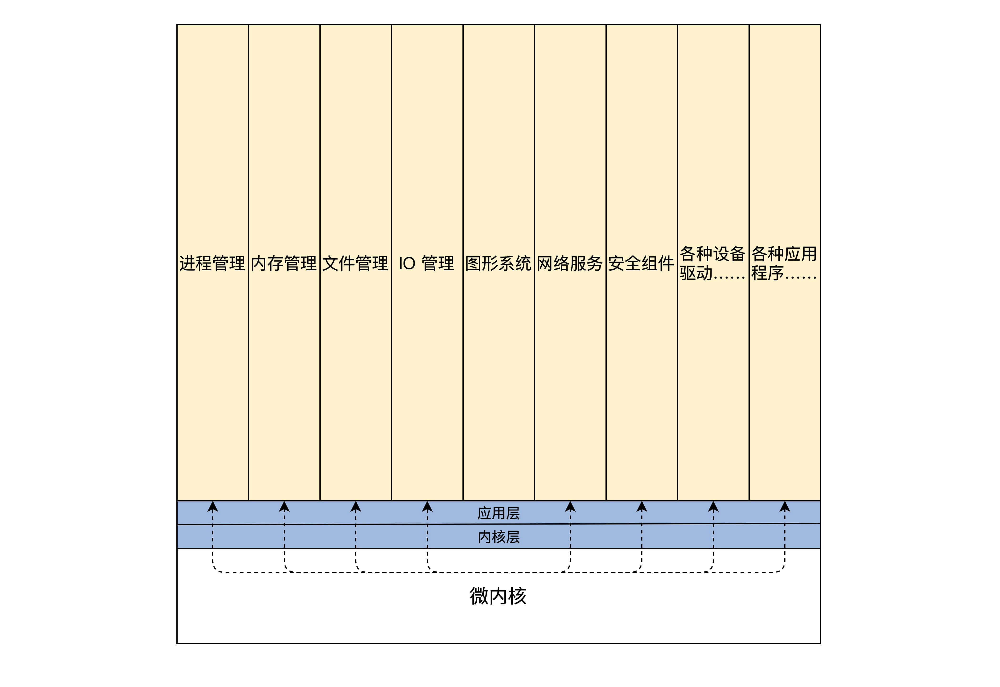

# 计算机资源

计算机中资源大致可以分为两类资源，一种是硬件资源，一种是软件资源。先来看看硬件资源有哪些，如下：

1. 总线，负责连接各种其它设备，是其它设备工作的基础。
2. CPU，即中央处理器，负责执行程序和处理数据运算。
3. 内存，负责储存运行时的代码和数据。
4. 硬盘，负责长久储存用户文件数据。
5. 网卡，负责计算机与计算机之间的通信。
6. 显卡，负责显示工作。
7. 各种I/O设备，如显示器，打印机，键盘，鼠标等。

而计算机中的软件资源，则可表示为计算机中的各种形式的数据。如各种文件、软件程序等。

内核作为硬件资源和软件资源的管理者，其内部组成在逻辑上大致如下：

1. **管理CPU，**由于CPU是执行程序的，而内核把运行时的程序抽象成进程，所以又称为进程管理。
2. **管理内存**，由于程序和数据都要占用内存，内存是非常宝贵的资源，所以内核要非常小心地分配、释放内存。
3. **管理硬盘**，而硬盘主要存放用户数据，而内核把用户数据抽象成文件，即管理文件，文件需要合理地组织，方便用户查找和读写，所以形成了文件系统。
4. **管理显卡**，负责显示信息，而现在操作系统都是支持GUI（图形用户接口）的，管理显卡自然而然地就成了内核中的图形系统。
5. **管理网卡**，网卡主要完成网络通信，网络通信需要各种通信协议，最后在内核中就形成了网络协议栈，又称网络组件。
6. **管理各种I/O设备**，我们经常把键盘、鼠标、打印机、显示器等统称为I/O（输入输出）设备，在内核中抽象成I/O管理器。

内核除了这些必要组件之外，根据功能不同还有安全组件等，最值得一提的是，各种计算机硬件的性能不同，硬件型号不同，硬件种类不同，硬件厂商不同，内核要想管理和控制这些硬件就要编写对应的代码，通常这样的代码我们称之为**驱动程序**。

硬件厂商就可以根据自己不同的硬件编写不同的驱动，加入到内核之中。

# 宏内核结构

宏内核就是把以上诸如管理进程的代码、管理内存的代码、管理各种I/O设备的代码、文件系统的代码、图形系统代码以及其它功能模块的代码，把这些所有的代码经过编译，最后链接在一起，形成一个大的可执行程序。

这个大程序里有实现支持这些功能的所有代码，向用户应用软件提供一些接口，这些接口就是常说的系统API函数。而这个大程序会在处理器的**特权模式**下运行，这个模式通常被称为宏内核模式。结构如下图所示。

尽管图中一层一层的，这并不是它们有层次关系，仅仅表示它们**链接**在一起。

为了理解宏内核的工作原理，我们来看一个例子，宏内核提供内存分配功能的服务过程，具体如下：

1. 应用程序调用内存分配的API（应用程序接口）函数。
2. 处理器切换到特权模式，开始运行内核代码。
3. 内核里的内存管理代码按照特定的算法，分配一块内存。
4. 把分配的内存块的首地址，返回给内存分配的API函数。
5. 内存分配的API函数返回，处理器开始运行用户模式下的应用程序，应用程序就得到了一块内存的首地址，并且可以使用这块内存了。

上面这个过程和一个实际的操作系统中的运行过程，可能有差异，但大同小异。当然，系统API和应用程序之间可能还有库函数，也可能只是分配了一个虚拟地址空间，但是我们关注的只是这个过程。

上图的宏内核结构有明显的缺点，因为它没有模块化，没有扩展性、没有移植性，高度耦合在一起，一旦其中一个组件有漏洞，内核中所有的组件可能都会出问题。

# 微内核结构

微内核架构正好与宏内核架构相反，它提倡内核功能尽可能少：仅仅只有进程调度、处理中断、内存空间映射、进程间通信等功能。

这样的内核是不能完成什么实际功能的，开发者们把实际的进程管理、内存管理、设备管理、文件管理等服务功能，做成一个个**服务进程**。和用户应用进程一样，只是它们很特殊，宏内核提供的功能，在微内核架构里由这些服务进程专门负责完成。

微内核定义了一种良好的进程间通信的机制——**消息**。应用程序要请求相关服务，就向微内核发送一条与此服务对应的消息，微内核再把这条消息转发给相关的服务进程，接着服务进程会完成相关的服务。服务进程的编程模型就是循环处理来自其它进程的消息，完成相关的服务功能。其结构如下所示：

为了理解微内核的工程原理，我们来看看微内核提供内存分配功能的服务过程，具体如下：

1. 应用程序发送内存分配的消息，这个发送消息的函数是微内核提供的，相当于系统API，微内核的API（应用程序接口）相当少，极端情况下仅需要两个，一个接收消息的API和一个发送消息的API。
2. 处理器切换到特权模式，开始运行内核代码。
3. 微内核代码让当前进程停止运行，并根据消息包中的数据，确定消息发送给谁，分配内存的消息当然是发送给内存管理服务进程。
4. 内存管理服务进程收到消息，分配一块内存。
5. 内存管理服务进程，也会通过消息的形式返回分配内存块的地址给内核，然后继续等待下一条消息。
6. 微内核把包含内存块地址的消息返回给发送内存分配消息的应用程序。
7. 处理器开始运行用户模式下的应用程序，应用程序就得到了一块内存的首地址，并且可以使用这块内存了。

微内核的架构实现虽然不同，但是大致过程和上面一样。同样是分配内存，在微内核下拐了几个弯，一来一去的消息带来了非常大的开销，当然各个服务进程的切换开销也不小。这样系统性能就大打折扣。

但是微内核有很多优点，首先，系统结构相当清晰利于协作开发。其次，系统有良好的移植性，微内核代码量非常少，就算重写整个内核也不是难事。最后，微内核有相当好的伸缩性、扩展性，因为那些系统功能只是一个进程，可以随时拿掉一个服务进程以减少系统功能，或者增加几个服务进程以增强系统功能。

微内核的代表作有MACH、MINIX、L4系统，这些系统都是微内核，但是它们不是商业级的系统，商业级的系统不采用微内核主要还是因为性能差。

# 分离硬件的相关性

我们会经常听说，Windows内核有什么HAL层、Linux内核有什么arch层。这些xx层就是Windows和Linux内核设计者，给他们的系统内核分的第一个层。

今天如此庞杂的计算机，其实也是一层一层地构建起来的，从硬件层到操作系统层再到应用软件层这样构建。分层的主要目的和好处在于**屏蔽底层细节，使上层开发更加简单。**

计算机领域的一个基本方法是增加一个抽象层，从而使得抽象层的上下两层独立地发展，所以在内核内部再分若干层也不足为怪。

分离硬件的相关性，就是要**把操作硬件和处理硬件功能差异的代码抽离出来**，形成一个独立的**软件抽象层**，对外提供相应的接口，方便上层开发。

为了让你更好理解，我们举进程管理中的一个模块实现细节的例子：进程调度模块。通过这个例子，来看看分层对系统内核的设计与开发有什么影响。

一般操作系统理论课程都会花大量篇幅去讲进程相关的概念，其实说到底，进程是操作系统开发者为了实现多任务而提出的，并让每个进程在CPU上运行一小段时间，这样就能实现多任务同时运行的假象。

当然，这种假象十分奏效。要实现这种假象，就要实现下面这两种机制：

1. **进程调度**，它的目的是要从众多进程中选择一个将要运行的进程，当然有各种选择的算法，例如，轮转算法、优先级算法等。
2. **进程切换**，它的目的是停止当前进程，运行新的进程，主要动作是保存当前进程的机器上下文，装载新进程的机器上下文。

我们不难发现，不管是在ARM硬件平台上还是在x86硬件平台上，选择一个进程的算法和代码是不容易发生改变的，需要改变的代码是进程切换的相关代码，因为不同的硬件平台的机器上下文是不同的。

所以，这时最好是将进程切换的代码放在一个独立的层中实现，比如硬件平台相关层，当操作系统要运行在不同的硬件平台上时，就只是需要修改硬件平台相关层中的相关代码，这样操作系统的**移植性**就大大增强了。

如果把所有硬件平台相关的代码，都抽离出来，放在一个独立硬件相关层中实现并且定义好相关的调用接口，再在这个层之上开发内核的其它功能代码，就会方便得多，结构也会清晰很多。操作系统的移植性也会大大增强，移植到不同的硬件平台时，就构造开发一个与之对应的硬件相关层。这就是分离硬件相关性的好处。

# 我们的设计

首先大致将我们的操作系统内核分为三个大层，分别是：

1. 内核接口层。
2. 内核功能层。
3. 内核硬件层。

内核接口层，定义了一系列接口，主要有两点内容，如下：

1. 定义了一套UNIX接口的子集，我们出于学习和研究的目的，使用UNIX接口的子集，优点之一是接口少，只有几个，并且这几个接口又能大致定义出操作系统的功能。
2. 这套接口的代码，就是检查其参数是否合法，如果参数有问题就返回相关的错误，接着调用下层完成功能的核心代码。

内核功能层，主要完成各种实际功能，这些功能按照其类别可以分成各种模块，当然这些功能模块最终会用具体的算法、数据结构、代码去实现它，内核功能层的模块如下：

1. 进程管理，主要是实现进程的创建、销毁、调度进程，当然这要设计几套数据结构用于表示进程和组织进程，还要实现一个简单的进程调度算法。
2. 内存管理，在内核功能层中只有内存池管理，分两种内存池：页面内存池和任意大小的内存池，你现在可能不明白什么是内存池，这里先有个印象就行，后面课程研究它的时候再详细介绍。
3. 中断管理，这个在内核功能层中非常简单：就是把一个中断回调函数安插到相关的数据结构中，一旦发生相关的中断就会调用这个函数。
4. 设备管理，这个是最难的，需要用一系列的数据结构表示驱动程序模块、驱动程序本身、驱动程序创建的设备，最后把它们组织在一起，还要实现创建设备、销毁设备、访问设备的代码，这些代码最终会调用设备驱动程序，达到操作设备的目的。

内核硬件层，主要包括一个具体硬件平台相关的代码，如下：

1. 初始化，初始化代码是内核被加载到内存中最先需要运行的代码，例如初始化少量的设备、CPU、内存、中断的控制、内核用于管理的数据结构等。
2. CPU控制，提供CPU模式设定、开、关中断、读写CPU特定寄存器等功能的代码。
3. 中断处理，保存中断时机器的上下文，调用中断回调函数，操作中断控制器等。
4. 物理内存管理，提供分配、释放大块内存，内存空间映射，操作MMU、Cache等。
5. 平台其它相关的功能，有些硬件平台上有些特殊的功能，需要额外处理一下。

如下所示，这里没有画出用户空间的应用进程，**API接口以下的为内核空间，这才是设计、开发内核的重点。**

从上述文字和图示，可以发现，我们的操作系统内核没有任何设备驱动程序，甚至没有文件系统和网络组件，内核所实现的功能很少。这吸取了微内核的优势，内核小出问题的可能性就少，扩展性就越强。

同时，我们把文件系统、网络组件、其它功能组件作为**虚拟设备**交由设备管理，比如需要文件系统时就写一个文件系统虚拟设备的驱动，完成文件系统的功能，需要网络时就开发一个网络虚拟设备的驱动，完成网络功能。

**这些驱动一旦被装载，就是内核的一部分了，并不是像微内核一样作为服务进程运行。这又吸取了宏内核的优势，代码高度耦合，性能强劲。**