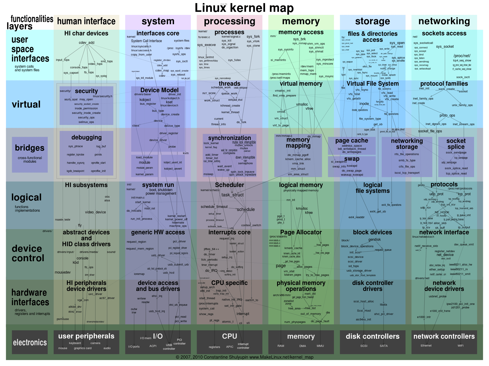

# Linux 内核

Linux的基本思想是一切都是文件：每个文件都有确定的用途，包括用户数据、命令、配置参数、硬件设备等对于操作系统内核而言，都被视为各种类型的文件。Linux支持多用户，各个用户对于自己的文件有自己特殊的权利，保证了各用户之间互不影响。多任务则是现代操作系统最重要的一个特点，Linux可以使多个程序同时并独立地运行。

上图仍然不足于描述Linux的全部，只是展示了重要且显而易见的部分。

上图中大致分为**五大重要组件**，每个组件又分成许多模块从上到下贯穿各个层次，每个模块中有重要的函数和数据结构。具体每个模块的主要功能。

Linux这么多模块挤在一起，之间的通信主要是函数调用，而且函数间的调用没有一定的层次关系，更加没有左右边界的限定。函数的调用路径是纵横交错的，从图中的线条可以得到印证。

继续深入思考你就会发现，这些纵横交错的路径上有一个函数出现了问题，就麻烦大了，它会波及到全部组件，导致整个系统崩溃。当然调试解决这个问题，也是相当困难的。同样，模块之间没有隔离，安全隐患也是巨大的。

当然，这种结构不是一无是处，它的性能极高，而性能是衡量操作系统的一个重要指标。这种结构就是传统的内核结构，也称为**宏内核架构**。

# Darwin-XNU内核

Darwin 使用了一种微内核（Mach）和相应的固件来支持不同的处理器平台，并提供操作系统原始的基础服务，上层的功能性系统服务和工具则是整合了BSD系统所提供的。苹果公司还为其开发了大量的库、框架和服务，不过它们都工作在用户态且闭源。

由于我们是研究Darwin内核，所以上图中我们只需要关注内核-用户转换层以下的部分即可。显然它有两个内核层——**Mach层与BSD层**。

Mach内核是卡耐基梅隆大学开发的经典微内核，意在提供最基本的操作系统服务，从而达到高性能、安全、可扩展的目的，而BSD则是伯克利大学开发的类UNIX操作系统，提供一整套操作系统服务。

应用会通过用户层的框架和库来请求Darwin系统的服务，即调用Darwin系统API。

在调用Darwin系统API时，会传入一个API号码，用这个号码去索引Mach陷入中断服务表中的函数。此时，API号码如果小于0，则表明请求的是Mach内核的服务，API号码如果大于0，则表明请求的是BSD内核的服务，它提供一整套标准的POSIX接口。

Mach中还有一个重要的组件Libkern，它是一个库，提供了很多底层的操作函数，同时支持C++运行环境。

如果你要详细了解Darwin内核的话，可以自行阅读[相应的代码](https://github.com/apple/darwin-xnu)。而在这里，你只要从全局认识一下它的结构就行了。

# Windows NT内核

微软自己在HAL层上是定义了一个小内核，小内核之下是硬件抽象层HAL，这个HAL存在的好处是：不同的硬件平台只要提供对应的HAL就可以移植系统了。小内核之上是各种内核组件，微软称之为内核执行体，它们完成进程、内存、配置、I/O文件缓存、电源与即插即用、安全等相关的服务。

每个执行体互相独立，只对外提供相应的接口，其它执行体要通过内核模式可调用接口和其它执行体通信或者请求其完成相应的功能服务。所有的设备驱动和文件系统都由I/O管理器统一管理，驱动程序可以堆叠形成I/O驱动栈，功能请求被封装成I/O包，在栈中一层层流动处理。Windows引以为傲的图形子系统也在内核中。

显而易见，NT内核中各层次分明，各个执行体互相独立，这种“高内聚、低偶合”的特性，正是检验一个软件工程是否优秀的重要标准。而这些你都可以通过微软公开的WRK代码得到佐证，如果你觉得WRK代码量太少，也可以看一看[REACT OS](https://reactos.org/)这个号称“开源版”的NT。
