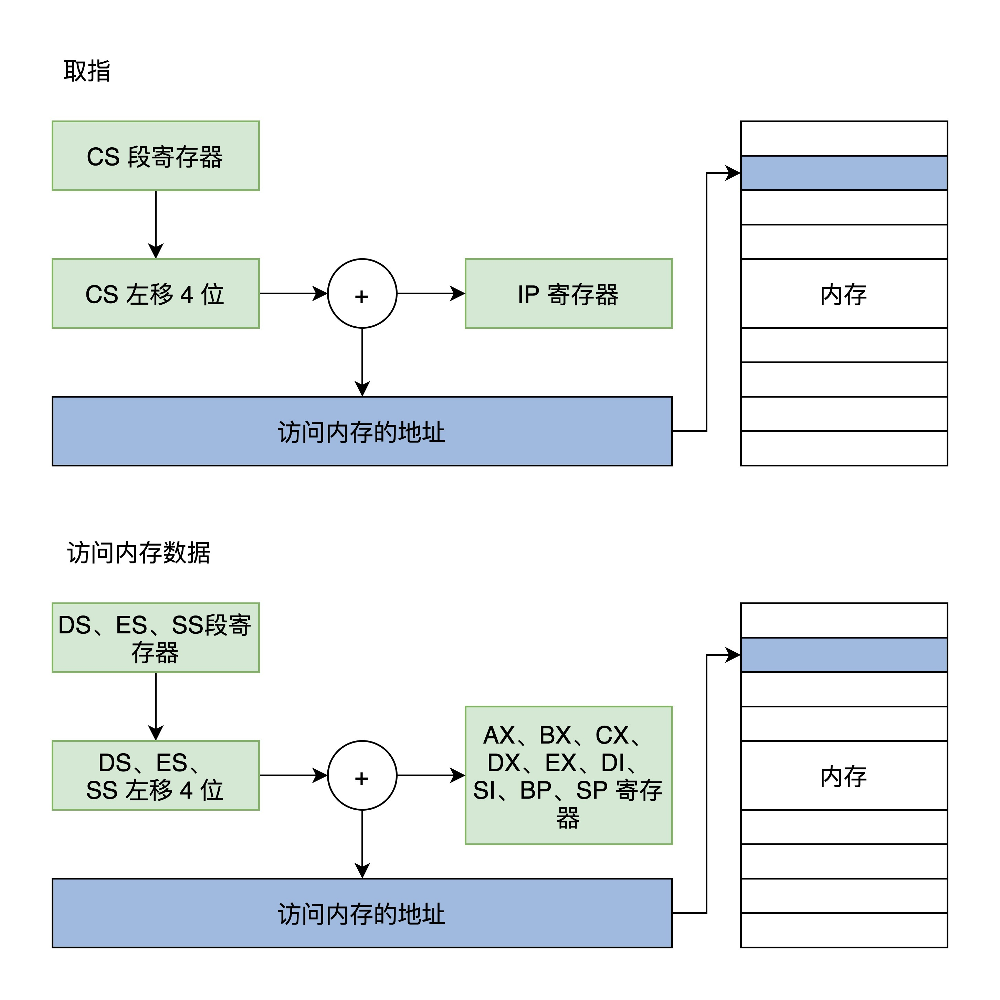
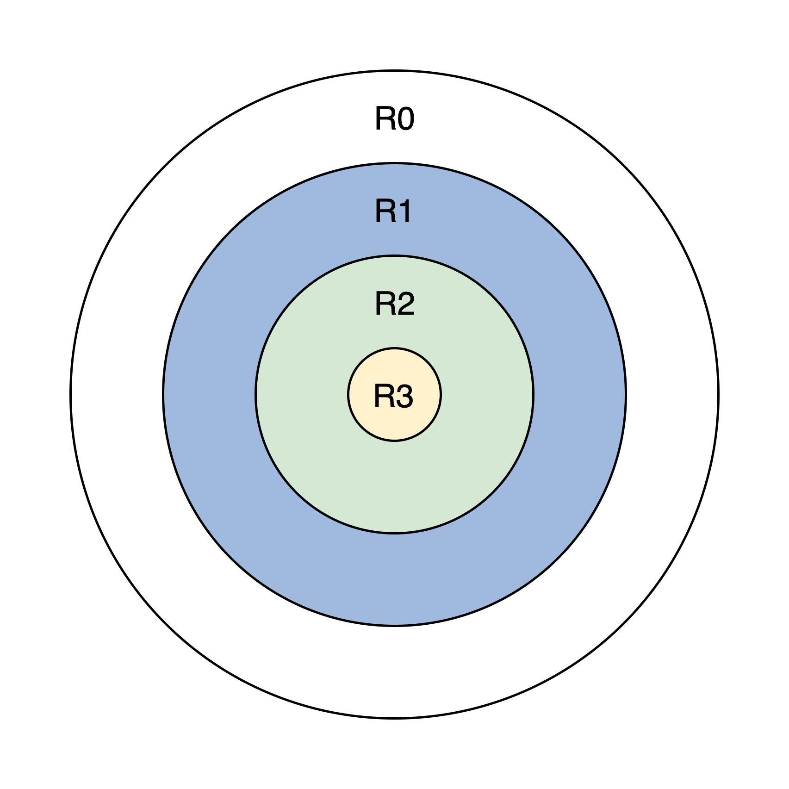
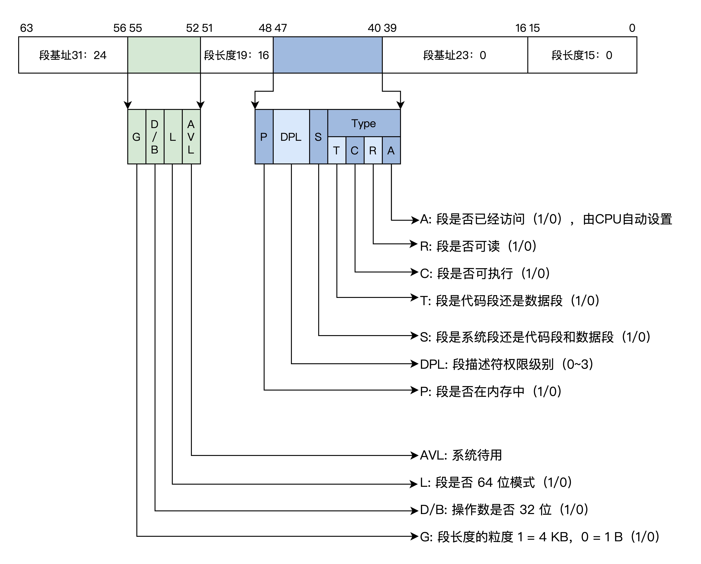
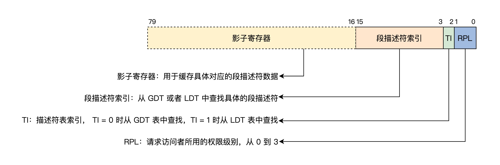
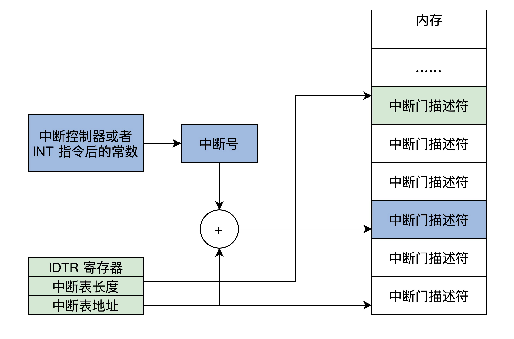

按照CPU功能升级迭代的顺序，CPU的工作模式有**实模式**、**保护模式**、**长模式**，这几种工作模式下CPU执行程序的方式截然不同。

# 从一段死循环的代码说起

```c
int main()
{
    int* addr = (int*)0;
    cli(); //关中断
    while(1)
    {
        *addr = 0;
        addr++;
    }
    return 0;
}
```

上述代码首先关掉了CPU中断，让CPU停止响应中断信号，然后进入死循环，最后从内存0地址开始写入0。你马上就会想到，这段代码只做了两件事：一是锁住了CPU，二是清空了内存，你也许会觉得如果这样的代码能正常运行，那简直太可怕了。

不过如果是在**实模式**下，这样的代码确实是能正常运行。因为在很久以前，计算机资源太少，内存太小，都是单道程序执行，程序大多是由专业人员编写调试好了，才能预约到一个时间去上机运行，没有现代操作系统的概念。

# 实模式

实模式又称实地址模式，实，即真实，这个真实分为两个方面，一个方面是**运行真实的指令**，对指令的动作不作区分，**直接执行指令的真实功能**，另一方面是**发往内存的地址是真实的**，对任何地址**不加限制**地发往内存。

## 实模式寄存器

由于CPU是根据指令完成相应的功能，举个例子：ADD AX,CX；这条指令完成加法操作，AX、CX为ADD指令的操作数，可以理解为ADD函数的两个参数，其功能就是把AX、CX中的数据相加。

指令的操作数，可以是寄存器、内存地址、常数，其实**通常情况下是寄存器**，AX、CX就是x86 CPU中的寄存器。

下面我们就去看看x86 CPU在实模式下的寄存器。表中每个寄存器都是16位的。


## 实模式下访问内存

虽然有了寄存器，但是数据和指令都是存放在内存中的。通常情况下，需要把数据装载进寄存器中才能操作，还要有获取指令的动作，这些都要访问内存才行，而我们知道访问内存靠的是地址值。



**所有的内存地址都是由段寄存器左移4位，再加上一个通用寄存器中的值或者常数形成地址，然后由这个地址去访问内存。**这就是大名鼎鼎的分段内存管理模型。

只不过这里要特别注意的是，**代码段是由CS和IP确定的，而栈段是由SS和SP段确定的。**

下面我们写一个DOS下的Hello World应用程序，这是一个工作在实模式下的汇编代码程序，一共16位，具体代码如下：

```assembly
data SEGMENT ;定义一个数据段存放Hello World!
    hello  DB 'Hello World!$' ;注意要以$结束
data ENDS
code SEGMENT ;定义一个代码段存放程序指令
    ASSUME CS:CODE,DS:DATA ;告诉汇编程序，DS指向数据段，CS指向代码段
start:
    MOV AX,data  ;将data段首地址赋值给AX                
    MOV DS,AX    ;将AX赋值给DS，使DS指向data段
    LEA DX,hello ;使DX指向hello首地址
    MOV AH,09h   ;给AH设置参数09H，AH是AX高8位，AL是AX低8位，其它类似
    INT 21h      ;执行DOS中断输出DS指向的DX指向的字符串hello
    MOV AX,4C00h ;给AH设置参数4C00h
    INT 21h      ;调用4C00h号功能，结束程序
code ENDS
END start
```

上述代码中的结构模型，也是符合CPU**实模式下分段内存管理模式**的，它们被汇编器转换成二进制数据后，也是以段的形式存在的。

## 实模式中断

**中断即中止执行当前程序，转而跳转到另一个特定的地址上，去运行特定的代码。**在实模式下它的实现过程是先保存CS和IP寄存器，然后装载新的CS和IP寄存器，那么中断是如何产生的呢？

+ 中断控制器给CPU发送了一个电子信号，CPU会对这个信号作出应答。随后中断控制器会将中断号发送给CPU，这是**硬件中断**。
+ CPU执行了**INT指令**，这个指令后面会跟随一个常数，这个常数即是软中断号。这种情况是**软件中断**。

为了实现中断，就需要在**内存中放一个中断向量表**，这个表的**地址和长度**由CPU的特定寄存器 **IDTR** 指向。实模式下，表中的一个条目由**代码段地址和段内偏移**组成。


有了中断号以后，CPU就能根据IDTR寄存器中的信息，计算出中断向量中的条目，进而装载CS（装入代码段基地址）、IP（装入代码段内偏移）寄存器，最终响应中断。

# 保护模式

随着软件的规模不断增加，需要更高的计算量、更大的内存容量。

内存一大，首先要解决的问题是**寻址问题**，因为16位的寄存器最多只能表示$2^{16}$个地址，所以CPU的寄存器和运算单元都要扩展成32位的。

不过，虽然扩展CPU内部器件的位数解决了计算和寻址问题，但仍然没有解决前面那个实模式场景下的问题，导致前面场景出问题的原因有两点。第一，CPU对任何指令不加区分地执行；第二，CPU对访问内存的地址不加限制。

基于这些原因，CPU实现了保护模式。

## 保护模式寄存器

保护模式相比于实模式，增加了一些控制寄存器和段寄存器，扩展通用寄存器的位宽，所有的通用寄存器都是32位的，还可以单独使用低16位，这个低16位又可以拆分成两个8位寄存器。


## 保护模式特权级

为了区分哪些指令（如in、out、cli）和哪些资源（如寄存器、I/O端口、内存地址）可以被访问，CPU实现了特权级。

特权级分为4级，R0~R3，每个特权级执行指令的数量不同，R0可以执行所有指令，R1、R2、R3依次递减，它们只能执行上一级指令数量的子集。而**内存的访问**则是靠**段描述符和特权级相互配合**去实现的。



**上面的圆环图，从外到内，既能体现权力的大小，又能体现各特权级对资源控制访问的多少，还能体现各特权级之间的包含关系。**R0拥有最大权力，可以访问低特权级的资源，反之则不行。

## 保护模式段描述符

目前为止，内存还是分段模型，要对内存进行保护，就可以转换成对段的保护。

由于CPU的扩展导致了32位的段基地址和段内偏移，还有一些其它信息，所以16位的段寄存器肯定放不下。放不下就要找内存借空间，然后把描述一个段的信息封装成特定格式的**段描述符**，**放在内存中**，其格式如下。



一个段描述符有64位8字节数据，里面包含了段基地址、段长度、段权限、段类型（可以是系统段、代码段、数据段）、段是否可读写，可执行等。虽然数据分布有点乱，这是由于历史原因造成的。

多个段描述符在内存中形成全局段描述符表，该表的基地址和长度由CPU和GDTR寄存器指示。如下图所示。


**段寄存器中不再存放段基地址，而是具体段描述符的索引**，访问一个内存地址时，段寄存器中的索引首先会结合GDTR寄存器找到**内存中的段描述符**，再根据其中的段信息判断能不能访问成功。

## 保护模式段选择子

如果你认为CS、DS、ES、SS、FS、GS这些段寄存器，里面存放的就是一个内存段的描述符索引，那你可就草率了，其实它们是由影子寄存器、段描述符索引、描述符表索引、权限级别组成的。如下图所示。



上图中**影子寄存器**是靠硬件来操作的，对系统程序员不可见，是硬件为了**减少性能损耗**而设计的一个**段描述符的高速缓存**，不然每次内存访问都要去内存中查表，那性能损失是巨大的，影子寄存器也正好是64位，里面存放了8字节段描述符数据。

低三位之所以能放TI和RPL，是因为段描述符8字节对齐，每个索引低3位都为0，我们不用关注LDT，只需要使用GDT全局描述符表，所以TI永远设为0。

通常情况下，CS和SS中RPL就组成了CPL（当前权限级别），所以常常是RPL=CPL，进而CPL就表示发起访问者要以什么权限去访问目标段，当CPL大于目标段DPL时，则CPU禁止访问，只有CPL小于等于目标段DPL时才能访问。

## 保护模式平坦模型

分段模型有很多缺陷，现代操作系统都会使用分页模型。但是x86 CPU并不能直接使用分页模型，而是要在分段模型的前提下，根据需要决定是否要开启分页。因为这是硬件的规定，程序员是无法改变的。但是我们可以简化设计，来使分段成为一种“虚设”，这就是保护模式的平坦模型。

CPU 32位的寄存器最多只能产生4GB大小的地址，而一个段长度也只能是4GB，所以我们把所有段的基地址设为0，段的长度设为0xFFFFF，段长度的粒度设为4KB，这样所有的段都指向同一个（0~4GB-1）字节大小的地址空间。

下面还是看一看前面Hello OS中段描述符表，

```assembly
GDT_START:
knull_dsc: dq 0
;第一个段描述符CPU硬件规定必须为0
kcode_dsc: dq 0x00cf9e000000ffff
;段基地址=0，段长度=0xfffff
;G=1,D/B=1,L=0,AVL=0 
;P=1,DPL=0,S=1
;T=1,C=1,R=1,A=0
kdata_dsc: dq 0x00cf92000000ffff
;段基地址=0，段长度=0xfffff
;G=1,D/B=1,L=0,AVL=0 
;P=1,DPL=0,S=1
;T=0,C=0,R=1,A=0
GDT_END:

GDT_PTR:
GDTLEN	dw GDT_END-GDT_START-1
GDTBASE	dd GDT_START
```

段长度需要和G位配合，若G位为1则段长度等于0xfffff个4KB。上面段描述符的DPL=0，这说明需要最高权限即CPL=0才能访问。

## 保护模式中断

实模式下CPU不需要做权限检查，所以它可以直接通过中断向量表中的值装载CS:IP寄存器就好了。

而保护模式下的中断要权限检查，还有特权级的切换，所以就需要扩展中断向量表的信息，即每个中断用一个**中断门描述符**来表示，也可以简称为中断门，中断门描述符依然有自己的格式，如下图所示。


同样的，保护模式要实现中断，也必须在内存中有一个中断向量表，同样是由IDTR寄存器指向，只不过中断向量表中的条目变成了中断门描述符，如下图所示。



产生中断后，CPU首先会检查中断号是否大于**最后一个中断门描述符**，x86 CPU最大支持256个中断源（即中断号：0~255），然后检查描述符类型（是否是中断门或者陷阱门）、是否为系统描述符，是不是存在于内存中。

接着，检查中断门描述符中的段选择子指向的段描述符。

最后做**权限检查**，如果CPL小于等于中断门的DPL并且CPL大于等于中断门中的段选择子，就指向段描述符的DPL。

进一步的，CPL等于中断门中的段选择子指向段描述符的DPL，则为同级权限不进行栈切换，否则进行栈切换。如果进行栈切换，还需要从TSS中加载具体权限的SS、ESP，当然也要对SS中段选择子指向的段描述符进行检查。

做完这一系列检查之后，CPU才会加载中断门描述符中目标代码段选择子到CS寄存器中，把目标代码段偏移加载到EIP寄存器中。

## 切换到保护模式

