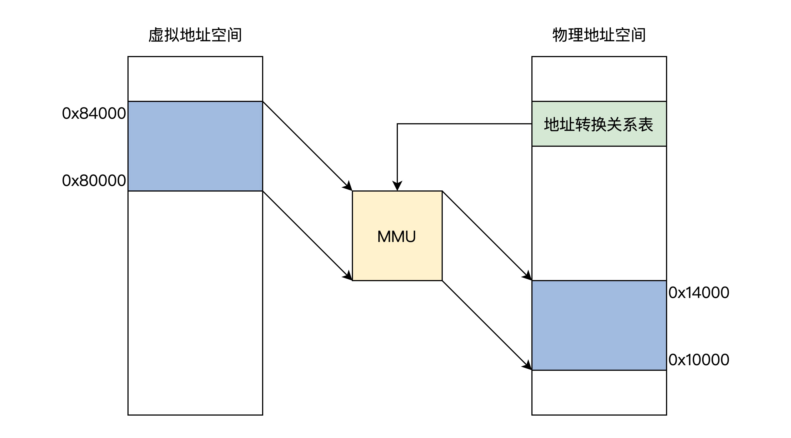
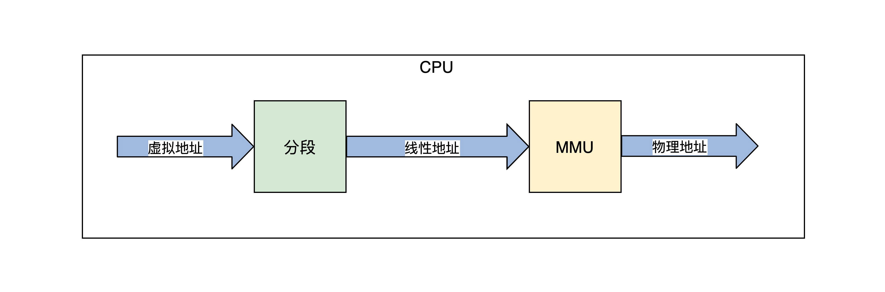

# 从一个多程序并发的场景说起

如果一台计算机的内存中只运行一个程序A，这种方式正好用前面CPU的 实模式 来运行，因为程序A的地址在链接时就可以确定，例如从内存地址0x8000开始，每次运行程序A都装入内存0x8000地址处开始运行，没有其它程序干扰。

现在改变一下，内存中又放一道程序B，程序A和程序B各自运行一秒钟，如此循环，直到其中之一结束。这个新场景下就会产生一些问题，当然这里我们只关心内存相关的这几个核心问题。

+ 谁来保证程序A跟程序B **没有内存地址的冲突**？换句话说，就是程序A、B各自放在什么内存地址，这个问题是由A、B程序协商，还是由操作系统决定。
+ 怎样保证程序A跟程序B **不会互相读写各自的内存空间**？这个问题相对简单，用保护模式就能解决。
+ 如何解决**内存容量**问题？程序A和程序B，在不断开发迭代中程序代码占用的空间会越来越大，导致内存装不下。
+ 还要考虑一个**扩展后的复杂情况**，如果不只程序A、B，还可能有程序C、D、E、F、G……它们分别由不同的公司开发，而每台计算机的内存容量不同。这时候，又对我们的内存方案有怎样的影响呢？

要想完美地解决以上最核心的4个问题，一个较好的方案是：让所有的程序都各自享有一个从0开始到最大地址的空间，这个地址空间是独立的，是该程序**私有**的，其它程序既看不到，也不能访问该地址空间，这个地址空间和其它程序无关，和具体的计算机也无关。

事实上，计算机科学家们早就这么做了，这个方案就是**虚拟地址**。

# 虚拟地址

虚拟地址是逻辑上存在的一个数据值，比如0~100就有101个整数值，这个0~100的区间就可以说是一个虚拟地址空间，该虚拟地址空间有101个地址。

我们再来看看最开始Hello World的例子，我们用objdump工具反汇编一下Hello World二进制文件，就会得到如下的代码片段：

```assembly
00000000000004e8 <_init>:
 4e8:	48 83 ec 08          	sub    $0x8,%rsp
 4ec:	48 8b 05 f5 0a 20 00 	mov    0x200af5(%rip),%rax        # 200fe8 <__gmon_start__>
 4f3:	48 85 c0             	test   %rax,%rax
 4f6:	74 02                	je     4fa <_init+0x12>
 4f8:	ff d0                	callq  *%rax
 4fa:	48 83 c4 08          	add    $0x8,%rsp
 4fe:	c3                   	retq 
```

上述代码中，左边第一列数据就是虚拟地址，第三列中是程序指令，如：“mov 0x200af5(%rip),%rax，je 4fa，callq *%rax”指令中的数据都是虚拟地址。

事实上，所有的应用程序开始的部分都是这样的。这正是因为每个应用程序的虚拟地址空间都是相同且独立的。

那么这个地址是由谁产生的呢？

答案是**链接器**，其实我们开发软件经过编译步骤后，就需要链接成可执行文件才可以运行，而链接器的主要工作就是把多个代码模块组装在一起，并解决模块之间的引用，即**处理程序代码间的地址引用，形成程序运行的静态内存空间视图**。

# 物理地址

虽然虚拟地址解决了很多问题，但是虚拟地址只是逻辑上存在的地址，无法作用于硬件电路的，程序装进内存中想要执行，就需要和内存打交道，从内存中取得指令和数据。而内存只认一种地址，那就是**物理地址**。

什么是物理地址呢？物理地址在逻辑上也是一个数据，只不过这个数据会被地址译码器等电子器件变成**电子信号**，放在**地址总线**上，地址总线电子信号的各种组合就可以选择到内存的储存单元了。

但是地址总线上的信号（即物理地址），也可以选择到别的设备中的储存单元，如显卡中的显存、I/O设备中的寄存器、网卡上的网络帧缓存器。不过如果不做特别说明，我们说的物理地址就是指**选择内存单元的地址**。


# 虚拟地址到物理地址的转换

用软件方式实现太低效，用硬件实现没有灵活性，最终就用了软硬件结合的方式实现，它就是 **MMU**（**内存管理单元**）。MMU可以接受软件给出的地址对应关系数据，进行地址转换。



上图中展示了MMU通过地址关系转换表，将0x80000~0x84000的虚拟地址空间转换成 0x10000~0x14000的物理地址空间，而**地址关系转换表本身则是放物理内存中**的。

下面我们不妨想一想地址关系转换表的实现. 如果在地址关系转换表中，这样来存放：一个虚拟地址对应一个物理地址。

那么问题来了，32 位地址空间下，4GB 虚拟地址的地址关系转换表就会把整个 32 位物理地址空间用完，这显然不行。

要是结合前面的保护模式下分段方式呢，地址关系转换表中存放：一个虚拟段基址对应一个物理段基址，这样看似可以，但是因为段长度各不相同，所以依然不可取。

综合刚才的分析，系统设计者最后采用一个折中的方案，即**把虚拟地址空间和物理地址空间都分成同等大小的块，也称为页，按照虚拟页和物理页进行转换**。根据软件配置不同，这个页的大小可以设置为 4KB、2MB、4MB、1GB，这样就进入了现代内存管理模式——**分页模型**。


个虚拟页可以对应到一个物理页，由于页大小一经配置就是固定的，所以在地址关系转换表中，只要存放**虚拟页地址对应的物理页地址**就行了。


# MMU

MMU即内存管理单元，是用硬件电路逻辑实现的一个地址转换器件，它负责接受虚拟地址和地址关系转换表，以及输出物理地址。

根据实现方式的不同，MMU可以是独立的芯片，也可以是集成在其它芯片内部的，比如集成在CPU内部，x86、ARM系列的CPU就是将MMU集成在CPU核心中的。

下面我们只研究x86 CPU中的MMU。x86 CPU要想开启MMU，就必须**先开启保护模式或者长模式**，实模式下是不能开启MMU的。

由于保护模式的内存模型是分段模型，它并不适合于MMU的分页模型，所以我们要使用保护模式的平坦模式，这样就绕过了分段模型。这个平坦模型和长模式下忽略段基址和段长度是异曲同工的。地址产生的过程如下所示。



程序代码中的虚拟地址，经过CPU的分段机制产生了线性地址，平坦模式和长模式下线性地址和虚拟地址是相等的。

如果不开启MMU，在保护模式下可以关闭MMU，这个线性地址就是物理地址。因为长模式下的分段**弱化了地址空间的隔离**，所以开启MMU是必须要做的，开启MMU才能内存地址空间保存。

## MMU 页表

现在我们开始研究地址关系转换表，其实它有个更加专业的名字——**页表**。它描述了虚拟地址到物理地址的转换关系，也可以说是虚拟页到物理页的映射关系，所以称为页表。

为了增加灵活性和节约物理内存空间（因为页表是放在物理内存中的），所以页表中并不存放虚拟地址和物理地址的对应关系，**只存放物理页面的地址**，MMU以虚拟地址为索引去查表返回物理页面地址，而且页表是**分级**的，总体分为三个部分：一个顶级页目录，多个中级页目录，最后才是页表，逻辑结构图如下.

