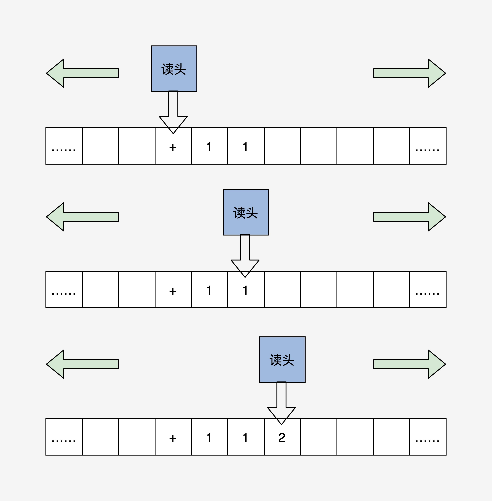
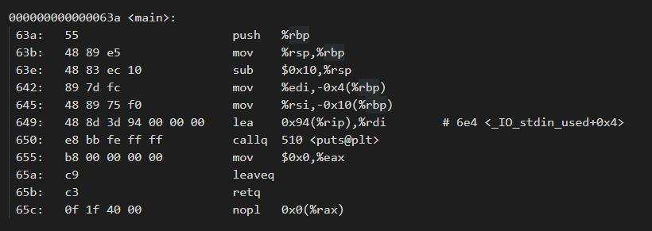
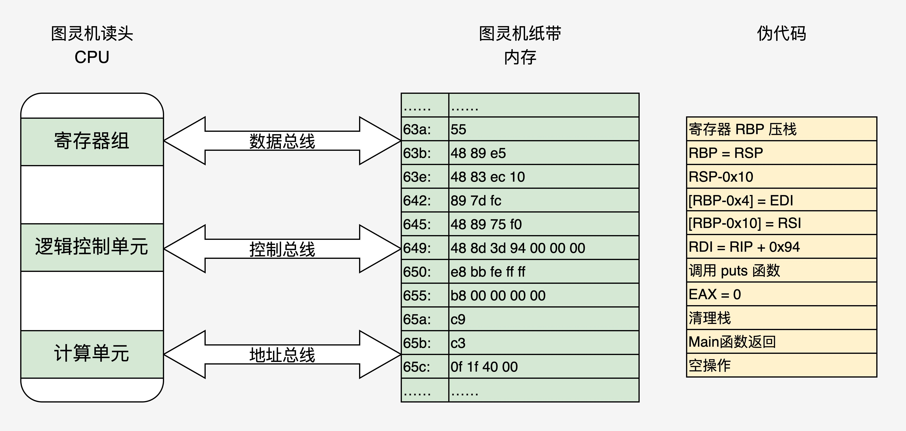

# 程序编译工程

约定使⽤GCC相 关的⼯具链来研究⼀下编译过程和硬件执⾏程序的过程。

使⽤命令：gcc HelloWorld.c -o HelloWorld 或者 gcc ./HelloWorld.c -o ./HelloWorld ，就可以编译 helloWorld 代码。其实，GCC只是完成编译⼯作的驱动程序，它会根据编译流程分别调⽤**预处理程序**、**编译程序**、**汇编程序**、**链接程序**来完成具体⼯作。

其实，我们也可以手动控制以上这个编译流程，从而留下中间文件方便研究：

- 源文件生成预处理文件： gcc -E HelloWorld.c -o HelloWorld.i
- 预处理文件生成编译文件： gcc -S HelloWorld.i -o HelloWorld.s
- 编译文件生成汇编文件： gcc -c HelloWorld.s -o HelloWorld.o
- 汇编文件生成可执行文件：gcc HelloWorld.o -o HelloWorld
- 源文件生成可执行文件：gcc HelloWorld.c -o HelloWorld

[汇编参考资料](https://blog.csdn.net/u013570834/article/details/108753839)

# 程序装载执行

从图灵机到冯诺依曼体系结构

根据冯诺依曼体系结构构成的计算机，必须具有如下功能：

- 把程序和数据装入到计算机中；
- 必须具有长期记住程序、数据的中间结果及最终运算结果；
- 完成各种算术、逻辑运算和数据传送等数据加工处理；
- 根据需要控制程序走向，并能根据指令控制机器的各部件协调操作；
- 能够按照要求将处理的数据结果显示给用户。

为了完成上述的功能，计算机必须具备五大基本组成部件：

- 装载数据和程序的输入设备；
- 记住程序和数据的存储器；
- 完成数据加工处理的运算器；
- 控制程序执行的控制器；
- 显示处理结果的输出设备。

根据冯诺依曼的理论，我们只要把图灵机的几个部件换成电子设备，就可以变成一个最小核心的电子计算机，如下图：

此时读头不再来回移动了，而是靠地址总线寻找对应的“纸带格子”。读取写入数据由数据总线完成，而动作的控制就是控制总线的职责了。

# 更形象地将 HelloWorld 程序装入原型计算机

在装入之前，我们先要搞清楚 HelloWorld 程序中有什么。

我们可以通过 gcc -c -S HelloWorld 得到（只能得到其汇编代码，而不能得到二进制数据）。我们用 objdump -d HelloWorld程序，得到 /lesson01/HelloWorld.dump，其中有很多库代码（只需关注main函数相关的代码），如下图：

以上图中，分成四列：第一列为**地址**；第二列为十六进制，表示真正装入机器中的**代码数据**；第三列是对应的**汇编代码**；第四列是相关代码的**注释**。这是x86_64体系的代码，由此可以看出x86 CPU是变长指令集。

把这段代码数据装入最小电子计算机，状态如下图：

# 总结

**现代电子计算机正是通过内存中的信息（指令和数据）做出相应的操作，并通过内存地址的变化，达到程序读取数据，控制程序流程（顺序、跳转对应该图灵机的读头来回移动）的功能。**